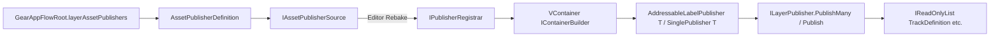

# Inline asset publishers (`AssetPublisherDefinition`)

Foundation bootstraps register **addressable or direct** ScriptableObject content into the same VContainer scope as navigation and events. Each row is an `AssetPublisherDefinition` on `GearAppFlowRoot`:

- **`source`** (`SerializeReference` `IAssetPublisherSource`) — author-time payload (e.g. `AddressableLabelSource` with label `liveops.tracks` + `TrackDefinition` AQN, or `AddressableSingleSource` for a monolithic SO).
- **`bakedRegistrar`** (`IPublisherRegistrar`) — closed-generic registration, produced in the editor via **Rebake** (or at runtime via `IAssetPublisherSource.TryCreateRuntimeBakedRegistrar()` when a scene was never saved with a bake).

`FoundationLayer` calls `def.Register(builder)` for each non-null row.

## Diagram (data flow)

## Custom source (sketch)

Implement `IAssetPublisherSource` in a runtime assembly, add a **Serializable** class, and (in **Editor** only) implement `IsConfigured` and `Bake()` returning a registrar that registers your `IAsyncInitializable` publisher. Expose `TryCreateRuntimeBakedRegistrar()` if player builds need a fallback when the embedded bake is missing.

Packages: `com.scaffold.appflow.publishers` (base + direct), `com.scaffold.appflow.publishers.addressables` (label + single addressable).

See also: `Assets/Packages/com.scaffold.appflow.publishers/README.md`.
