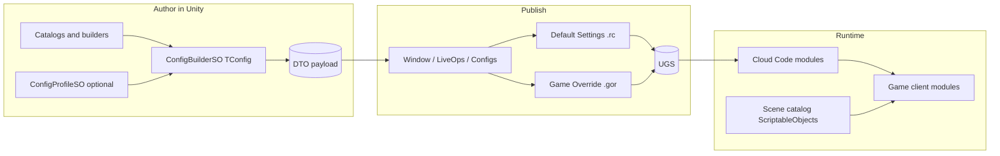

# LiveOps config authoring pipeline

This document describes the end-to-end flow from Unity assets to Remote Config and back at runtime. Server DTOs live under `LiveOps/LiveOps.DTO/`; Cloud Code modules read them via `IRemoteConfig` ([UnityRemoteConfig.cs](../../LiveOps/Deploy/Core/LiveOps.Core/DataCache/Implementation/Unity/UnityRemoteConfig.cs)).

## Flow

1. **Author** — Designers maintain ScriptableObject content and `ConfigBuilderSO<TConfig>` **Variants**. Leave **Profile** empty (or use a **default** `ConfigProfileSO`) to publish the environment **Settings** (legacy `.rc` one key per file). Point several builders at a **non-default** `ConfigProfileSO` to author a **Game Override** (aggregated in `Assets/LiveOps/RemoteConfig/_overrides/<ProfileId>.gor`). JEXL targeting is authored on the profile (see [RemoteConfig.md](RemoteConfig.md)).
2. **Publish** — **Window → LiveOps → Configs** runs `Build()` and writes disk: default Variants → `Assets/LiveOps/RemoteConfig/<Stem>.rc` (with `_contentHash` and `_deployedAt`); non-default → shared `.gor` per profile. Use **Deploy** (or **Deploy All**) to run `ugs deploy` on every touched `.rc` / `.gor` ([RemoteConfig.md](RemoteConfig.md)).
3. **Download** — Unchanged: Cloud Code `GameModule` types call `remoteConfig.Get(context, ConfigKey, new TConfig())`.
4. **Match config to assets** — Client modules keep an **injected** index (e.g. `TrackAssetIndex` for tracks) and resolve config ids with that type’s APIs (`GetTrack`, …). There is no shared engine `IAssetResolver` type; the pattern is convention-only (see `TracksClientModule`).

## Add a new module

1. Add DTO type under `LiveOps/LiveOps.DTO/Modules/<Area>/` with Newtonsoft `JsonProperty` attributes.
2. Add `ConfigKey` (usually `nameof(MyConfig)`) on the Cloud Code `GameModule` implementation.
3. Add `public const string ConfigKey` in the client if you expose it.
4. Create `MyConfigBuilderSO : ConfigBuilderSO<MyConfig>` in the appropriate game assembly (`Game.Campaign`, `Game.Cards`, …) and a **Create Asset Menu** entry. For an alternate **profile**, create a `ConfigProfileSO` (non-default, targeting as needed) and a second builder asset with the same `ConfigKey` but that profile.
5. Open **Window → LiveOps → Configs** → **Deploy** for that row (syncs then uploads), or call `RcSyncService.Sync` / `SyncForBuilder` for disk only.
6. Commit the updated `.rc` when promoting changes through source control.

## Package reference

Implementation lives in [com.scaffold.liveops.authoring](../../Assets/Packages/com.scaffold.liveops.authoring/README.md) (`ConfigBuilderSO`, `RcEnvelope`, **Window → LiveOps → Configs**).

## Default builder assets (repo)

Checked-in defaults live under [Assets/GearEngine/Data/LiveOps/Authoring/](../../Assets/GearEngine/Data/LiveOps/Authoring/) (see `README.md` there). **Window → LiveOps → Configs** discovers all `ConfigBuilderSOBase` assets project-wide, including these.

## Tests

- **dotnet**: `LiveOps.Tests` — `ConfigModuleKeyContractTests` (server `ConfigKey` vs DTO name).
- **Unity EditMode**: `Game.Campaign.Tests` — `LiveOpsConfigBuilderAndRcTests` (builder DTO under `entries.<ConfigKey>` matches committed `.rc`); `RcSyncServiceAndDiscoveryTests` (disk drift, duplicate variant keying, cloud JSON extraction, deployer interface).

Regenerate `.rc` files after changing defaults in a builder (**Deploy** from **Window → LiveOps → Configs**, or `RcSyncService.Sync` for disk-only).
