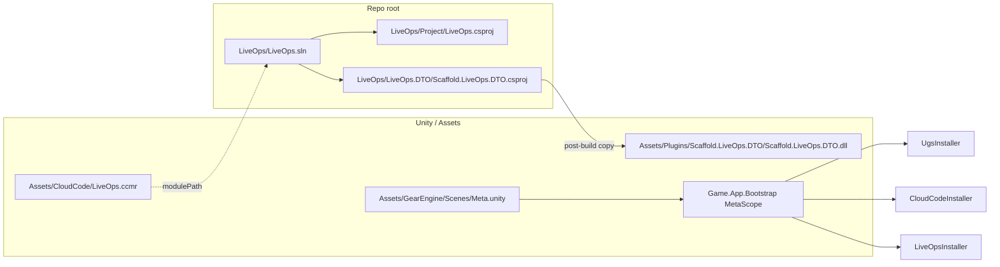
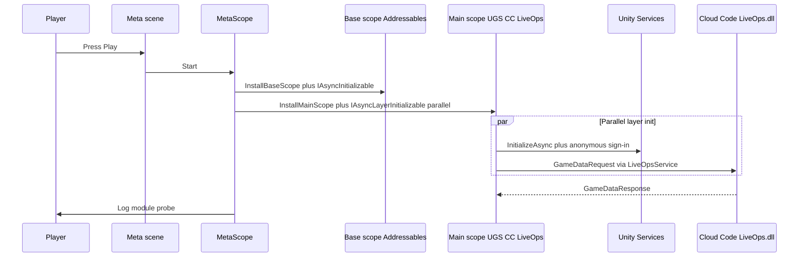

# LiveOps backend bootstrap (Gear-Engine)

This document describes how the **Cloud Code backend**, **shared DTO DLL**, **Unity module reference (`.ccmr`)**, and **Meta** startup harness fit together. It stops short of gameplay economy (e.g. Gold wallet); see a future Gold plan for that layer.

## TL;DR

| Piece | Location | Role |
|--------|-----------|------|
| Backend solution | [LiveOps/LiveOps.sln](../../LiveOps/LiveOps.sln) | Builds `LiveOps` (net6.0 Cloud Code module) + `Scaffold.LiveOps.DTO` (netstandard2.1) |
| DTO project | [LiveOps/LiveOps.DTO/Scaffold.LiveOps.DTO.csproj](../../LiveOps/LiveOps.DTO/Scaffold.LiveOps.DTO.csproj) | After **Build**, copies `Scaffold.LiveOps.DTO.dll` into [Assets/Plugins/Scaffold.LiveOps.DTO/](../../Assets/Plugins/Scaffold.LiveOps.DTO/) |
| Cloud Code module ref | [Assets/CloudCode/LiveOps.ccmr](../../Assets/CloudCode/LiveOps.ccmr) | Points Unity Cloud Code at `LiveOps.sln` for **Build** / publish |
| Meta harness | [Assets/GearEngine/Scenes/Meta.unity](../../Assets/GearEngine/Scenes/Meta.unity) + [MetaScope.cs](../../Assets/GearEngine/Scripts/App/Bootstrap/MetaScope.cs) | Standalone **UGS → Cloud Code → LiveOps** init (no Campaign / navigation) |
| Build order (Editor) | [ProjectSettings/EditorBuildSettings.asset](../../ProjectSettings/EditorBuildSettings.asset) | `Meta.unity` is **enabled** at index **0** for backend smoke tests |

## Flow (Meta scene)





## Building the backend

From the repository root:

```powershell
dotnet build LiveOps\LiveOps.sln -c Release
```

Expect:

- `LiveOps/LiveOps.DTO/bin/Release/netstandard2.1/Scaffold.LiveOps.DTO.dll`
- Copy to `Assets/Plugins/Scaffold.LiveOps.DTO/Scaffold.LiveOps.DTO.dll` (MSBuild target on the DTO project)
- `LiveOps/Project/bin/Release/net6.0/LiveOps.dll` (Cloud Code module assembly)

Publish to your UGS Cloud Code environment using the Unity **Services → Cloud Code** workflow; the `.ccmr` file tells the editor which solution to build.

## Unity packages (already in manifest)

No extra UPM entries were required for this milestone. [Packages/manifest.json](../../Packages/manifest.json) already includes `com.scaffold.cloudcode`, `com.scaffold.liveops`, `com.scaffold.ugs`, `com.scaffold.scope`, and `com.unity.services.cloudcode`.

[`MetaScope`](../../Assets/GearEngine/Scripts/App/Bootstrap/MetaScope.cs) registers `Unity.Services.CloudCode.ICloudCodeService` from `CloudCodeService.Instance` before `CloudCodeInstaller`, because VContainer otherwise resolves `CloudCodeSdkCallHandler` with the SDK ctor and nothing registered that interface.

## Meta scene prerequisites (Play Mode)

- Project linked to a **Unity Gaming Services** project / environment.
- **Cloud Code** module built from [LiveOps/LiveOps.sln](../../LiveOps/LiveOps.sln) and deployed to that environment.
- Without a deployed module, the initial `GameDataRequest` from `LiveOpsService` will fail (expected).

On success, the console should show `[MetaScope] Backend initialized. GoldGameData=present, AdData=present.` (module payloads depend on server `ModuleConfig` and Remote Config).

## Disabling Meta as entry

To return to another default scene, open **File → Build Settings**, disable **Meta** or move it down, and enable your gameplay scene. The Meta scene remains available for backend smoke tests.

## Changelog

- 2026-04-19: Initial LiveOps `.sln` / `.csproj`, `LiveOps.ccmr`, `Game.App.Bootstrap` + `MetaScope`, `Meta.unity` as first enabled build scene.
- 2026-04-19: Moved `Meta.unity` to `Assets/GearEngine/Scenes/` (same GUID) so it appears with other Gear Engine scenes in the Project window.
- 2026-04-19: Register Unity `ICloudCodeService` in `MetaScope` so Scaffold `CloudCodeSdkCallHandler` resolves under VContainer.
