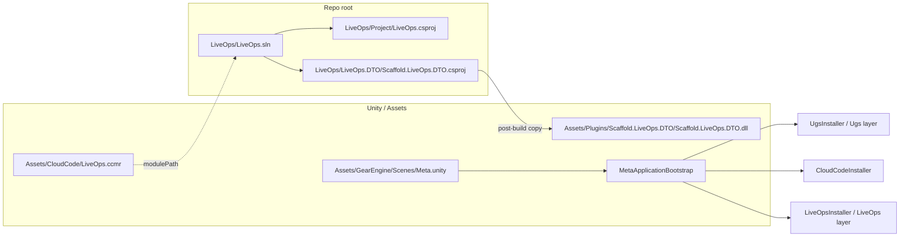
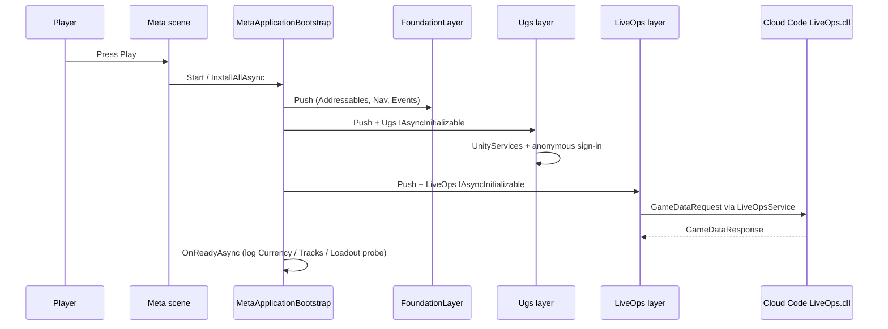

# LiveOps backend bootstrap (Gear-Engine)

This document describes how the **Cloud Code backend**, **shared DTO DLL**, **Unity module reference (`.ccmr`)**, and **Meta** startup harness fit together. Currency payloads are documented in [Currency.md](Currency.md).

## TL;DR

| Piece | Location | Role |
|--------|-----------|------|
| Backend solution | [LiveOps/LiveOps.sln](../../LiveOps/LiveOps.sln) | Builds `LiveOps` (net6.0 Cloud Code module) + `Scaffold.LiveOps.DTO` (netstandard2.1) |
| DTO project | [LiveOps/LiveOps.DTO/Scaffold.LiveOps.DTO.csproj](../../LiveOps/LiveOps.DTO/Scaffold.LiveOps.DTO.csproj) | After **Build**, copies `Scaffold.LiveOps.DTO.dll` into [Assets/Plugins/Scaffold.LiveOps.DTO/](../../Assets/Plugins/Scaffold.LiveOps.DTO/) |
| Cloud Code module ref | [Assets/CloudCode/LiveOps.ccmr](../../Assets/CloudCode/LiveOps.ccmr) | Points Unity Cloud Code at `LiveOps.sln` for **Build** / publish |
| Remote Config (`.rc`) | [Assets/LiveOps/RemoteConfig/](../../Assets/LiveOps/RemoteConfig/) | Per-module keys deployed via **Window → Deployment**; see [RemoteConfig.md](RemoteConfig.md) |
| Meta harness | [Assets/GearEngine/Scenes/Meta.unity](../../Assets/GearEngine/Scenes/Meta.unity) + [`MetaApplicationBootstrap`](../../Assets/GearEngine/Scripts/App/Bootstrap/MetaApplicationBootstrap.cs) | Standalone **UGS → Cloud Code → LiveOps** init via **LayeredScope** (see [Meta bootstrap](../Meta/Bootstrap.md)) |
| Build order (Editor) | [ProjectSettings/EditorBuildSettings.asset](../../ProjectSettings/EditorBuildSettings.asset) | `Meta.unity` is **enabled** at index **0** for backend smoke tests |

**Campaign (Main scene):** `ITrackService` is **`TracksClientModule` only**. Expect **UGS** + **Cloud Code** + deployed **Remote Config** (`TrackConfig` entry ids must match `TrackDefinition` asset names) for track progression and race rewards.

## Flow (Meta scene)





## Building the backend

From the repository root:

```powershell
dotnet build LiveOps\LiveOps.sln -c Release
```

Expect:

- `LiveOps/LiveOps.DTO/bin/Release/netstandard2.1/Scaffold.LiveOps.DTO.dll`
- Copy to `Assets/Plugins/Scaffold.LiveOps.DTO/Scaffold.LiveOps.DTO.dll` (MSBuild target on the DTO project)
- `LiveOps/Project/bin/Release/net6.0/LiveOps.dll` (Cloud Code module assembly)

Publish to your UGS Cloud Code environment using the Unity **Services → Cloud Code** workflow; the `.ccmr` file tells the editor which solution to build.

## Unity packages (manifest)

[Packages/manifest.json](../../Packages/manifest.json) pulls `com.scaffold.layeredscope`, `com.scaffold.cloudcode`, `com.scaffold.liveops`, `com.scaffold.ugs`, and `com.scaffold.navigation` from the [Scaffold](https://github.com/MgCohen/Scaffold) UPM git URLs (resolved under `Library/PackageCache` in this project). `com.scaffold.scope`, `com.unity.services.cloudcode`, `com.unity.remote-config`, `com.unity.services.deployment`, and other dependencies are listed there as well.

[`CloudCodeSdkCallHandler`](https://github.com/MgCohen/Scaffold/blob/main/Assets/Packages/com.scaffold.cloudcode/Runtime/Handlers/CloudCodeSdkCallHandler.cs) binds to `Unity.Services.CloudCode.CloudCodeService.Instance` by default; the Meta [`LiveOpsLayer`](../../Assets/GearEngine/Scripts/App/Bootstrap/Layers/LiveOpsLayer.cs) runs `CloudCodeInstaller` without a separate Unity SDK registration.

## Meta scene prerequisites (Play Mode)

- Project linked to a **Unity Gaming Services** project / environment.
- **Cloud Code** module built from [LiveOps/LiveOps.sln](../../LiveOps/LiveOps.sln) and deployed to that environment.
- **Remote Config** keys for LiveOps (see [RemoteConfig.md](RemoteConfig.md) — e.g. `CurrencyConfig`, `TrackConfig`, `CardConfig`, `LoadoutConfig`, `InventoryConfig`) authored under [Assets/LiveOps/RemoteConfig/](../../Assets/LiveOps/RemoteConfig/) and deployed to that environment with **Window → Deployment**.
- Without a deployed module, the initial `GameDataRequest` from `LiveOpsService` will fail (expected).

On success, the console should show `[Meta] LiveOps raw payloads: …` with `CurrencyGameData`, `TrackGameData`, and other active modules (exact payloads depend on server `ModuleConfig` and Remote Config).

## Disabling Meta as entry

To return to another default scene, open **File → Build Settings**, disable **Meta** or move it down, and enable your gameplay scene. The Meta scene remains available for backend smoke tests.

## Changelog

- 2026-04-19: Initial LiveOps `.sln` / `.csproj`, `LiveOps.ccmr`, `Game.App.Bootstrap` + `MetaScope`, `Meta.unity` as first enabled build scene.
- 2026-04-19: Moved `Meta.unity` to `Assets/GearEngine/Scenes/` (same GUID) so it appears with other Gear Engine scenes in the Project window.
- 2026-04-19: Register Unity `ICloudCodeService` in `MetaScope` so Scaffold `CloudCodeSdkCallHandler` resolves under VContainer.
- 2026-04-19: Replaced `MetaScope` / `MetaBootstrap` with `MetaApplicationBootstrap` + LayeredScope layers (`FoundationLayer`, `UgsLayer`, `LiveOpsLayer`); `com.scaffold.ugs`, `com.scaffold.liveops`, `com.scaffold.cloudcode`, and `com.scaffold.layeredscope` now ship from the Scaffold UPM repo with `IAsyncInitializable` (`Scaffold.LayeredScope`).
- 2026-04-19: Added Currency module (`CurrencyConfig` / `CurrencyPersistence` / `CurrencyGameData` + `CurrencyClientModule`) alongside the existing Gold module; `LiveOpsLayer` installs `CurrencyClientInstaller`; `MetaApplicationBootstrap` smoke log includes `CurrencyGameData` wallet count. See [Currency.md](Currency.md).
- 2026-04-19: Remote Config authoring moved to per-module `.rc` files under `Assets/LiveOps/RemoteConfig/` with `com.unity.services.deployment`; removed legacy `LiveOps/LiveOps.DTO/config/` CSV/JSON. See [RemoteConfig.md](RemoteConfig.md).
- 2026-04-19: Added Tracks, Loadout, Inventory, and Cards backend modules (`GameModule` + `IGameApiHandler`). **Client:** `CurrencyClientModule` installs from `LiveOpsLayer`; `TracksClientModule`, `LoadoutClientModule`, `InventoryClientModule`, and `CardsClientModule` register via **`LiveOpsLayer` constructor installers** (`CampaignTracksInstaller`, `CampaignGearCatalogInstaller`, `CampaignLoadoutInstaller`, `CampaignInventoryInstaller`, `CardsClientInstaller`) — Main scene uses authored catalogs; Meta uses empty runtime catalogs. Remote Config `Track.rc` + `Card.rc`. See [Tracks.md](Tracks.md), [Loadout.md](Loadout.md), [Inventory.md](Inventory.md), [Cards.md](Cards.md).
