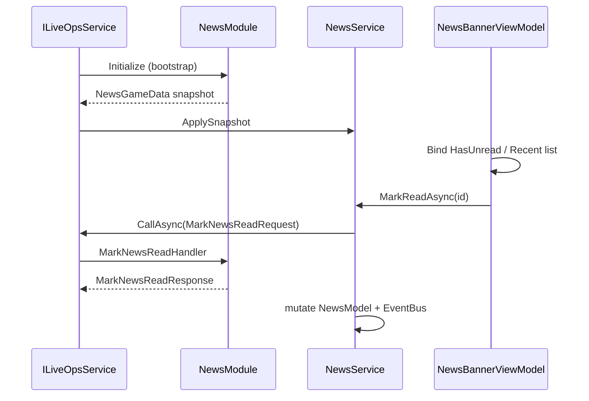

# News system — end-to-end sample (State & Services)

This guide is a **walkthrough with snippets only** (no production implementation). It follows the conventions in **[`Docs/Standards/State-and-Services-Standard.md`](Standards/State-and-Services-Standard.md)** (the authoritative standard under `Docs/Standards/`; not the separate legacy copy at `Docs/State-and-Services-Standard.md`) and the LiveOps wiring in [`Docs/LiveOps/NewApiAndServices.md`](LiveOps/NewApiAndServices.md).

## What we are modeling

- A **news item** is a short **message** with a **visible window** `[StartUtc, EndUtc]`.
- The client needs to know:
  - whether there is **unread** news (something active the player has not acknowledged), and
  - what counts as **recent** active news (in-window items, optionally sorted by start or publish time).

**Minimal data rule:** keep **player persistence** tiny: only what you cannot infer from the catalog + clock. Here we store **read state as a set of news ids** (small cardinality; if you have hundreds of items, prefer a single monotonic `LastAcknowledgedRevision` from the server instead — see the note at the end).

**Tier choice:** Tier 2 **service-gated domain** — visibility depends on time window, reads are ordered intents, and you may want `IEventBus` signals (for example `NewsMarkedReadEvent`) that views cannot infer without scanning lists.

---

## 1. Shared DTOs (catalog shape, snapshot, persistence wire)

Keep transport shapes **primitive** and **stable**. The catalog body can live in Remote Config on the server; the snapshot only ships **active** rows the player should see right now.

```csharp
using System;
using System.Collections.Generic;
using Newtonsoft.Json;

namespace GameModuleDTO.Modules.News
{
    /// <summary>One row of news as seen by clients after server filtering.</summary>
    public sealed class NewsItemDto
    {
        [JsonProperty("id")] public string Id { get; set; } = string.Empty;
        [JsonProperty("message")] public string Message { get; set; } = string.Empty;
        [JsonProperty("startUtc")] public DateTime StartUtc { get; set; }
        [JsonProperty("endUtc")] public DateTime EndUtc { get; set; }
    }

    /// <summary>Player-owned persistence; keep this as small as possible.</summary>
    public sealed class NewsPersistence
    {
        [JsonProperty("readNewsIds")] public List<string> ReadNewsIds { get; set; } = new();
    }
}
```

---

## 2. Requests and responses (delta-first GameApi)

Use **one intent per request**. Marking read is a single id. Avoid `SetAllNewsRequest(fullSnapshot)` unless you have an explicit waiver (see Rule 5 in the standard).

```csharp
using GameModuleDTO.GameApi;
using GameModuleDTO.ModuleRequests;
using GameModuleDTO.Modules.News;
using Newtonsoft.Json;

namespace GameModuleDTO.Modules.News
{
    public sealed class MarkNewsReadResponse : ModuleResponse
    {
        [JsonProperty("succeeded")] public bool Succeeded { get; set; }
    }
}

namespace GameModuleDTO.ModuleRequests
{
    [UsesGameApi]
    public sealed class MarkNewsReadRequest : ModuleRequest<MarkNewsReadResponse>
    {
        public MarkNewsReadRequest() { }

        public MarkNewsReadRequest(string newsId) => NewsId = newsId;

        [JsonProperty("newsId")] public string NewsId { get; set; } = string.Empty;
    }
}
```

**Bootstrap snapshot** (optional but typical): merge catalog + persistence into one module payload so the client hydrates once during LiveOps init.

```csharp
using System.Collections.Generic;
using GameModuleDTO.GameModule;
using Newtonsoft.Json;

namespace GameModuleDTO.Modules.News
{
    public sealed class NewsGameData : IGameModuleData
    {
        public string Key => nameof(NewsGameData);

        [JsonProperty("activeNews")] public List<NewsItemDto> ActiveNews { get; set; } = new();

        [JsonProperty("readNewsIds")] public List<string> ReadNewsIds { get; set; } = new();
    }
}
```

---

## 3. Client model (observable, read-only to callers, no rules)

The model holds **canonical client state** after hydration and successful commands. It does **not** decide if a row is “legal” to show; it only exposes what the service last applied.

Pure **queries** like `HasUnread` are allowed (no side effects, depend only on model fields).

```csharp
using System;
using System.Collections.Generic;
using System.Collections.ObjectModel;
using CommunityToolkit.Mvvm.ComponentModel;
using Scaffold.Core.Model;

namespace GearEngine.News
{
    public partial class NewsModel : Model
    {
        private readonly ObservableCollection<NewsItemDto> activeNews = new();
        private readonly HashSet<string> readNewsIds = new(StringComparer.Ordinal);

        public ReadOnlyObservableCollection<NewsItemDto> ActiveNews { get; }

        public NewsModel()
        {
            ActiveNews = new ReadOnlyObservableCollection<NewsItemDto>(activeNews);
        }

        /// <summary>Writable surface stays internal to the feature assembly.</summary>
        internal ObservableCollection<NewsItemDto> WritableActiveNews => activeNews;

        internal HashSet<string> WritableReadNewsIds => readNewsIds;

        public bool IsRead(string newsId) => readNewsIds.Contains(newsId);

        public bool HasUnread(DateTime utcNow)
        {
            for (int i = 0; i < activeNews.Count; i++)
            {
                NewsItemDto n = activeNews[i];
                if (n == null || string.IsNullOrEmpty(n.Id)) continue;
                if (utcNow < n.StartUtc || utcNow > n.EndUtc) continue;
                if (!readNewsIds.Contains(n.Id)) return true;
            }

            return false;
        }

        /// <summary>In-window items, newest first (example policy).</summary>
        public IReadOnlyList<NewsItemDto> RecentActive(DateTime utcNow, int maxCount = 8)
        {
            List<NewsItemDto> list = new();
            for (int i = 0; i < activeNews.Count; i++)
            {
                NewsItemDto n = activeNews[i];
                if (n == null || string.IsNullOrEmpty(n.Id)) continue;
                if (utcNow < n.StartUtc || utcNow > n.EndUtc) continue;
                list.Add(n);
            }

            list.Sort((a, b) => b.StartUtc.CompareTo(a.StartUtc));
            if (list.Count > maxCount) list.RemoveRange(maxCount, list.Count - maxCount);
            return list;
        }
    }
}
```

---

## 4. Client service (intent, rules, `ILiveOpsService`)

- **Hydrate** from `NewsGameData` on bootstrap (only “blob in” path).
- **`MarkReadAsync`** sends `MarkNewsReadRequest` and mutates the model only on success (pessimistic is fine for a tap).
- Optionally raise **`NewsMarkedReadEvent`** on `IEventBus` if another system (badge, analytics) cannot rely on binding alone.

```csharp
using System;
using System.Threading;
using System.Threading.Tasks;
using GameModuleDTO.ModuleRequests;
using GearEngine.Events;
using Scaffold.LiveOps;

namespace GearEngine.News
{
    public interface INewsService
    {
        NewsModel News { get; }

        void ApplySnapshot(/* NewsGameData */ object snapshot, DateTime utcNow);

        Task<bool> MarkReadAsync(string newsId, CancellationToken ct = default);
    }

    public sealed class NewsService : INewsService
    {
        private readonly NewsModel model;
        private readonly ILiveOpsService liveOps;
        private readonly IEventBus eventBus;

        public NewsService(NewsModel model, ILiveOpsService liveOps, IEventBus eventBus)
        {
            this.model = model;
            this.liveOps = liveOps;
            this.eventBus = eventBus;
        }

        public NewsModel News => model;

        public void ApplySnapshot(object snapshot, DateTime utcNow)
        {
            // Deserialize NewsGameData from snapshot in real code.
            // model.WritableActiveNews.Clear(); add rows…
            // model.WritableReadNewsIds.Clear(); union read ids…
        }

        public async Task<bool> MarkReadAsync(string newsId, CancellationToken ct = default)
        {
            if (string.IsNullOrEmpty(newsId)) throw new ArgumentException(nameof(newsId));

            MarkNewsReadResponse resp = await liveOps.CallAsync(new MarkNewsReadRequest(newsId), ct);
            if (!resp.Succeeded) return false;

            model.WritableReadNewsIds.Add(newsId);
            eventBus.Raise(new NewsMarkedReadEvent(newsId));
            return true;
        }
    }

    public readonly struct NewsMarkedReadEvent
    {
        public NewsMarkedReadEvent(string newsId) => NewsId = newsId;
        public string NewsId { get; }
    }
}
```

---

## 5. Usage (ViewModel binds to model; commands call service)

Tier 0 selection (which row is expanded) stays on the ViewModel. **Read state** comes from the service + model.

```csharp
using System;
using System.Threading;
using System.Threading.Tasks;
using CommunityToolkit.Mvvm.ComponentModel;
using CommunityToolkit.Mvvm.Input;
using Scaffold.Core.ViewModel;

namespace GearEngine.News.Ui
{
    public partial class NewsBannerViewModel : ViewModel
    {
        private readonly INewsService newsService;

        public NewsBannerViewModel(INewsService newsService) => this.newsService = newsService;

        /// <summary>Tier 0 — local only.</summary>
        [ObservableProperty] private string? expandedNewsId;

        public bool HasUnread => newsService.News.HasUnread(DateTime.UtcNow);

        public bool TryGetRecent(out GameModuleDTO.Modules.News.NewsItemDto? first)
        {
            var list = newsService.News.RecentActive(DateTime.UtcNow, 1);
            first = list.Count > 0 ? list[0] : null;
            return first != null;
        }

        [RelayCommand]
        private async Task MarkReadAsync(string newsId, CancellationToken ct)
        {
            await newsService.MarkReadAsync(newsId, ct);
            OnPropertyChanged(nameof(HasUnread));
        }
    }
}
```

---

## 6. Backend — `GameModule` snapshot (optional)

Build **`NewsGameData`** from Remote Config (catalog) + `NewsPersistence` (read ids). Only include rows whose window overlaps “now” on the server.

```csharp
using System;
using System.Collections.Generic;
using System.Threading.Tasks;
using GameModule.GameModule;
using GameModule.ModuleFetchData;
using GameModuleDTO.GameModule;
using GameModuleDTO.Modules.News;
using Unity.Services.CloudCode.Core;

namespace GameModule.Modules.News
{
    public sealed class NewsModule : GameModule<NewsGameData>
    {
        private const string PersistenceKey = nameof(NewsPersistence);

        public override async Task<IGameModuleData> Initialize(
            IExecutionContext context,
            IPlayerData player,
            IGameState gameState,
            IRemoteConfig remoteConfig)
        {
            NewsPersistence persistence = await player.Get(context, PersistenceKey, new NewsPersistence());
            DateTime now = DateTime.UtcNow;
            var active = new List<NewsItemDto>();
            // var catalog = await remoteConfig.Get(context, nameof(NewsCatalogConfig), new NewsCatalogConfig());
            // foreach catalog row: if now in [StartUtc, EndUtc] add to active

            return new NewsGameData
            {
                ActiveNews = active,
                ReadNewsIds = new List<string>(persistence.ReadNewsIds),
            };
        }
    }
}
```

Register the module in `ModuleConfig` when you add it for real (`RegisterModuleScoped<NewsModule>(config);` per NewApiAndServices).

---

## 7. Backend — GameApi handler (authoritative write)

The handler validates the id against the **same catalog rules** the module used, appends to read ids idempotently, and relies on the framework’s **post-GameApi flush** to persist `NewsPersistence`.

```csharp
using System.Threading.Tasks;
using GameModule.GameApi;
using GameModuleDTO.ModuleRequests;
using GameModuleDTO.Modules.News;

namespace GameModule.Modules.News
{
    public sealed class MarkNewsReadHandler : IGameApiHandler<MarkNewsReadRequest, MarkNewsReadResponse>
    {
        private readonly NewsModule newsModule;

        public MarkNewsReadHandler(NewsModule newsModule) => this.newsModule = newsModule;

        public async Task<MarkNewsReadResponse> HandleAsync(GameApiSession session, MarkNewsReadRequest request)
        {
            // Delegate to newsModule.TryMarkReadAsync(session, request.NewsId) in real code:
            // load NewsPersistence, validate id + window against catalog, persist, return Succeeded.
            await Task.CompletedTask;
            return new MarkNewsReadResponse { Succeeded = true };
        }
    }
}
```

Handlers are discovered from `LiveOps.dll` as described in [`Docs/LiveOps/NewApiAndServices.md`](LiveOps/NewApiAndServices.md); add the handler class under `LiveOps/Project` and rebuild.

---

## Flow (read path)



---

## Minimalism note

If read-state grows too large for Cloud Save, replace `ReadNewsIds` with a **single server-maintained revision**:

- bump **`NewsCatalogRevision`** whenever the active set changes;
- store **`LastAcknowledgedRevision`** on the player;
- **`HasUnread`** becomes `serverRevision > LastAcknowledgedRevision` for “there is something new since you last opened the inbox,” at the cost of per-item unread granularity.

Pick **per-id** vs **revision** based on product UX, not on convenience of the first implementation.

---

## Related

- [`Docs/Standards/State-and-Services-Standard.md`](Standards/State-and-Services-Standard.md) — Model / Service roles, tiers, delta requests, `CallAsync` / `BeginBatch` (canonical).
- [`Docs/LiveOps/NewApiAndServices.md`](LiveOps/NewApiAndServices.md) — `[UsesGameApi]`, DTO layout, handler registration, `GameModule` snapshots.
