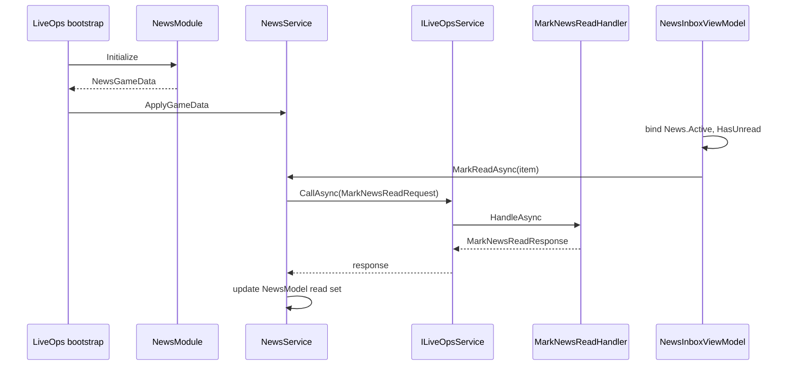

# Implementing a News feature (snippet guide)

This document is **documentation only**: illustrative snippets, not shipped code.

**Normative reference (state and services):** [`Docs/Standards/State-and-Services-Standard.md`](Standards/State-and-Services-Standard.md) — two roles (Model, Service), three tiers, `ILiveOpsService.CallAsync` / `BeginBatch`, delta-first wire requests, no repository layer, bind vs EventBus.

**Normative reference (LiveOps API):** [`Docs/LiveOps/NewApiAndServices.md`](../LiveOps/NewApiAndServices.md) — shared DTOs, `[UsesGameApi]`, `IGameApiHandler`, `GameModule<T>` snapshots.

---

## Problem shape

- **News item:** a **message** plus a visibility window **`[StartUtc, EndUtc]`**.
- **Unread:** at least one in-window item the player has not acknowledged.
- **Recent:** in-window items the UI can surface (for example sorted by `StartUtc` descending).

**Minimal player data:** persist only what you cannot derive from catalog + server clock + snapshot. A small set of **read news ids** is enough at low cardinality; at scale, prefer a single **acknowledged revision** (see end).

**Tier:** **Tier 2** (service-gated): time-window visibility and “mark read” are intents with rules; server may be authoritative on validity of ids.

**Typed reference (client):** per the standard, the service command surface should take a **live client ref** (here a thin `NewsItem`), not a bare string id, when the caller already has the row from the model. The **wire DTO** still carries **`newsId`** only.

---

## 1. Wire DTOs (shared assembly)

Shapes both client and server serialize. Keep fields primitive and stable.

```csharp
using System;
using System.Collections.Generic;
using Newtonsoft.Json;

namespace GameModuleDTO.Modules.News
{
    public sealed class NewsItemDto
    {
        [JsonProperty("id")] public string Id { get; set; } = string.Empty;
        [JsonProperty("message")] public string Message { get; set; } = string.Empty;
        [JsonProperty("startUtc")] public DateTime StartUtc { get; set; }
        [JsonProperty("endUtc")] public DateTime EndUtc { get; set; }
    }

    /// <summary>Cloud Save payload — keep small.</summary>
    public sealed class NewsPersistence
    {
        [JsonProperty("readNewsIds")] public List<string> ReadNewsIds { get; set; } = new();
    }
}
```

Bootstrap snapshot module (optional but typical for inbox-style UI):

```csharp
using System.Collections.Generic;
using GameModuleDTO.GameModule;
using Newtonsoft.Json;

namespace GameModuleDTO.Modules.News
{
    public sealed class NewsGameData : IGameModuleData
    {
        public string Key => nameof(NewsGameData);

        [JsonProperty("activeNews")] public List<NewsItemDto> ActiveNews { get; set; } = new();
        [JsonProperty("readNewsIds")] public List<string> ReadNewsIds { get; set; } = new();
    }
}
```

---

## 2. GameApi requests and responses

One **intent** per request (`MarkNewsReadRequest`). Do not add `SetNewsReadStateRequest(entireList)` as a default write; that is a blob and needs a waiver under Rule 5 in the standard.

```csharp
using GameModuleDTO.GameApi;
using GameModuleDTO.ModuleRequests;
using Newtonsoft.Json;

namespace GameModuleDTO.Modules.News
{
    public sealed class MarkNewsReadResponse : ModuleResponse
    {
        [JsonProperty("succeeded")] public bool Succeeded { get; set; }
    }
}

namespace GameModuleDTO.ModuleRequests
{
    [UsesGameApi]
    public sealed class MarkNewsReadRequest : ModuleRequest<MarkNewsReadResponse>
    {
        public MarkNewsReadRequest() { }

        public MarkNewsReadRequest(string newsId) => NewsId = newsId;

        [JsonProperty("newsId")] public string NewsId { get; set; } = string.Empty;
    }
}
```

---

## 3. Client model (Tier 2 — observable, read-only to external callers)

No validation of “can mark read” here; only state and **pure queries** (`HasUnread`, `RecentActive`) that depend on this model’s fields and `utcNow`.

```csharp
using System;
using System.Collections.Generic;
using System.Collections.ObjectModel;
using CommunityToolkit.Mvvm.ComponentModel;
using GameModuleDTO.Modules.News;
using Scaffold.Core.Model;

namespace YourGame.News
{
    /// <summary>Live row in the client snapshot (typed ref tier for the service).</summary>
    public sealed class NewsItem
    {
        public NewsItem(NewsItemDto dto)
        {
            Id = dto.Id;
            Message = dto.Message;
            StartUtc = dto.StartUtc;
            EndUtc = dto.EndUtc;
        }

        public string Id { get; }
        public string Message { get; }
        public DateTime StartUtc { get; }
        public DateTime EndUtc { get; }
    }

    public partial class NewsModel : Model
    {
        private readonly ObservableCollection<NewsItem> active = new();
        private readonly HashSet<string> readIds = new(StringComparer.Ordinal);

        public ReadOnlyObservableCollection<NewsItem> Active { get; }

        internal ObservableCollection<NewsItem> WritableActive => active;
        internal HashSet<string> WritableReadIds => readIds;

        public NewsModel() => Active = new ReadOnlyObservableCollection<NewsItem>(active);

        public bool IsRead(NewsItem item) => item != null && readIds.Contains(item.Id);

        public bool HasUnread(DateTime utcNow)
        {
            for (int i = 0; i < active.Count; i++)
            {
                NewsItem n = active[i];
                if (IsActive(n, utcNow) && !readIds.Contains(n.Id)) return true;
            }
            return false;
        }

        public IReadOnlyList<NewsItem> RecentActive(DateTime utcNow, int max = 8)
        {
            var list = new List<NewsItem>();
            for (int i = 0; i < active.Count; i++)
            {
                NewsItem n = active[i];
                if (IsActive(n, utcNow)) list.Add(n);
            }
            list.Sort((a, b) => b.StartUtc.CompareTo(a.StartUtc));
            if (list.Count > max) list.RemoveRange(max, list.Count - max);
            return list;
        }

        private static bool IsActive(NewsItem n, DateTime utcNow)
            => n != null && utcNow >= n.StartUtc && utcNow <= n.EndUtc;
    }
}
```

---

## 4. Client service (Tier 2 — rules, `CallAsync`, no repository)

- Hydrate from `NewsGameData` once (the standard’s allowed **snapshot in** path).
- **`MarkReadAsync(NewsItem item)`** — service validates (non-null, in-window if you enforce client-side), then builds **`MarkNewsReadRequest(item.Id)`** only at the wire boundary.
- Persisted server rule path: **pessimistic** update after success is appropriate (same idea as currency spend in the standard).
- Optional **`IEventBus`**: raise an event only if another system cannot rely on binding to `NewsModel` (primitive payload, no live refs).

```csharp
using System;
using System.Threading;
using System.Threading.Tasks;
using GameModuleDTO.ModuleRequests;
using GameModuleDTO.Modules.News;
using Scaffold.LiveOps;
// using YourApp.IEventBus;

namespace YourGame.News
{
    public interface INewsService
    {
        NewsModel News { get; }
        void ApplyGameData(NewsGameData data);
        Task<bool> MarkReadAsync(NewsItem item, DateTime utcNow, CancellationToken ct = default);
    }

    public sealed class NewsService : INewsService
    {
        private readonly NewsModel model;
        private readonly ILiveOpsService liveOps;

        public NewsService(NewsModel model, ILiveOpsService liveOps)
        {
            this.model = model;
            this.liveOps = liveOps;
        }

        public NewsModel News => model;

        public void ApplyGameData(NewsGameData data)
        {
            model.WritableActive.Clear();
            if (data?.ActiveNews != null)
            {
                foreach (var dto in data.ActiveNews)
                    if (dto != null && !string.IsNullOrEmpty(dto.Id))
                        model.WritableActive.Add(new NewsItem(dto));
            }
            model.WritableReadIds.Clear();
            if (data?.ReadNewsIds != null)
                foreach (var id in data.ReadNewsIds)
                    if (!string.IsNullOrEmpty(id)) model.WritableReadIds.Add(id);
        }

        public async Task<bool> MarkReadAsync(NewsItem item, DateTime utcNow, CancellationToken ct = default)
        {
            if (item == null) throw new ArgumentNullException(nameof(item));
            if (utcNow < item.StartUtc || utcNow > item.EndUtc) return false;

            var resp = await liveOps.CallAsync(new MarkNewsReadRequest(item.Id), ct);
            if (!resp.Succeeded) return false;

            model.WritableReadIds.Add(item.Id);
            // eventBus.Raise(new NewsMarkedReadEvent(item.Id));
            return true;
        }
    }
}
```

---

## 5. Usage (ViewModel: Tier 0 selection + Tier 2 commands)

Bind UI to **`NewsModel`** for lists and read state. Keep **expanded row** (or carousel index) on the ViewModel as Tier 0.

```csharp
using System;
using System.Threading.Tasks;
using CommunityToolkit.Mvvm.ComponentModel;
using CommunityToolkit.Mvvm.Input;
using Scaffold.Core.ViewModel;

namespace YourGame.News.Ui
{
    public partial class NewsInboxViewModel : ViewModel
    {
        private readonly INewsService news;

        public NewsInboxViewModel(INewsService news) => this.news = news;

        public NewsModel News => news.News;

        [ObservableProperty] private NewsItem? focused;

        public bool HasUnread => news.News.HasUnread(DateTime.UtcNow);

        [RelayCommand]
        private async Task AcknowledgeAsync(NewsItem? item)
        {
            if (item == null) return;
            await news.MarkReadAsync(item, DateTime.UtcNow);
            OnPropertyChanged(nameof(HasUnread));
        }
    }
}
```

---

## 6. Backend — `GameModule` snapshot

Build **`NewsGameData`** from Remote Config (catalog) + **`NewsPersistence`**. Include only rows whose window overlaps server UTC “now”. Register the module in `ModuleConfig` when implemented (see NewApiAndServices).

```csharp
using System;
using System.Collections.Generic;
using System.Threading.Tasks;
using GameModule.GameModule;
using GameModule.ModuleFetchData;
using GameModuleDTO.GameModule;
using GameModuleDTO.Modules.News;
using Unity.Services.CloudCode.Core;

namespace GameModule.Modules.News
{
    public sealed class NewsModule : GameModule<NewsGameData>
    {
        private const string PersistenceKey = nameof(NewsPersistence);

        public override async Task<IGameModuleData> Initialize(
            IExecutionContext context,
            IPlayerData player,
            IGameState gameState,
            IRemoteConfig remoteConfig)
        {
            var persistence = await player.Get(context, PersistenceKey, new NewsPersistence());
            var active = new List<NewsItemDto>();
            // var catalog = await remoteConfig.Get(context, nameof(NewsCatalogConfig), new NewsCatalogConfig());
            // filter catalog rows where now ∈ [StartUtc, EndUtc]
            await Task.CompletedTask;
            return new NewsGameData
            {
                ActiveNews = active,
                ReadNewsIds = new List<string>(persistence.ReadNewsIds),
            };
        }
    }
}
```

---

## 7. Backend — GameApi handler

Validate **`request.NewsId`** against the same catalog rules, update **`NewsPersistence`**, persist via **`IPlayerData.Set`**. Handler lives under `LiveOps/Project` so it is compiled into `LiveOps.dll` (see NewApiAndServices).

```csharp
using System.Threading.Tasks;
using GameModule.GameApi;
using GameModuleDTO.ModuleRequests;
using GameModuleDTO.Modules.News;

namespace GameModule.Modules.News
{
    public sealed class MarkNewsReadHandler : IGameApiHandler<MarkNewsReadRequest, MarkNewsReadResponse>
    {
        private readonly NewsModule module;

        public MarkNewsReadHandler(NewsModule module) => this.module = module;

        public async Task<MarkNewsReadResponse> HandleAsync(GameApiSession session, MarkNewsReadRequest request)
        {
            // await module.TryMarkReadAsync(session, request.NewsId);
            await Task.CompletedTask;
            return new MarkNewsReadResponse { Succeeded = true };
        }
    }
}
```

---

## End-to-end flow



---

## Scaling read state

If **`readNewsIds`** grows too large, replace it with **`LastAcknowledgedCatalogRevision`** (server bumps revision when the active set changes). **`HasUnread`** becomes “revision not yet acknowledged,” which is coarser than per-item unread but minimal on the wire and in storage.

---

## Related

- [`Docs/Standards/State-and-Services-Standard.md`](Standards/State-and-Services-Standard.md)
- [`Docs/LiveOps/NewApiAndServices.md`](../LiveOps/NewApiAndServices.md)
