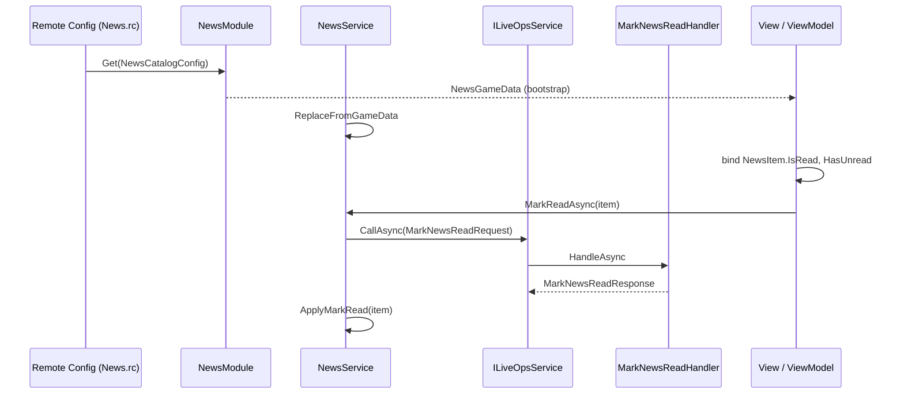

# Implementing a News feature (snippet guide)

This document is **documentation only**: illustrative snippets, not shipped code.

**Normative reference (state and services):** [`Docs/Standards/State-and-Services-Standard.md`](Standards/State-and-Services-Standard.md) — two roles (Model, Service), three tiers, `ILiveOpsService.CallAsync` / `BeginBatch`, delta-first wire requests, no repository layer, **bind for state** (Rule 6), EventBus only when a listener cannot infer the signal from any model.

**Normative reference (LiveOps API):** [`Docs/LiveOps/NewApiAndServices.md`](../LiveOps/NewApiAndServices.md) — shared DTOs, `[UsesGameApi]`, `IGameApiHandler`, `GameModule<T>` snapshots.

**Normative reference (config authoring):** [`Docs/LiveOps/AuthoringPipeline.md`](../LiveOps/AuthoringPipeline.md), [`Docs/LiveOps/RemoteConfig.md`](../LiveOps/RemoteConfig.md), [`Assets/Packages/com.scaffold.liveops.authoring/README.md`](../../Assets/Packages/com.scaffold.liveops.authoring/README.md).

---

## Problem shape

- **News item:** a **message** plus a visibility window **`[StartUtc, EndUtc]`**.
- **Unread:** at least one in-window item with **`IsRead == false`**.
- **Recent:** in-window items the UI can surface (for example sorted by `StartUtc` descending).

**Minimal player data:** persist only what you cannot derive from catalog + server clock + snapshot. A small set of **read news ids** in persistence is enough at low cardinality; at scale, prefer a single **acknowledged revision** (see end).

**Tier:** **Tier 2** (service-gated): “mark read” is an intent with rules; server is authoritative on whether the id is valid and in-window.

**Typed reference (client):** per Rule 3 in the standard, **`MarkReadAsync`** takes the live row type the UI already has (**`NewsItem`**), not a bare string. The **wire DTO** carries **`newsId`** only inside `CallAsync`.

**Read state on the row:** expose **`NewsItem.IsRead`** so lists and badges bind per row without calling back into the service for “is this id read?”. The **service** still performs the command and, on success, tells the **model** to apply the local flip (Tier 2: callers do not mutate `NewsItem` from the View).

---

## UI commands vs binding (why not `RelayCommand`)

[`RelayCommand`](https://learn.microsoft.com/en-us/dotnet/communitytoolkit/mvvm/generators) is optional **CommunityToolkit.Mvvm** sugar. It is **not** part of the State and Services standard. The standard cares that:

- **State** flows through observable models (bind `IsRead`, `Active`, aggregates).
- **Intents** go through the service (`MarkReadAsync`).

A Unity **View** can use a plain click handler that `await`s the service, or a small ViewModel method without `[RelayCommand]`. Below we use a **normal async method** on the ViewModel so the sample stays free of generator attributes while still separating Tier 0 focus state from Tier 2 commands.

---

## 1. Wire DTOs (shared assembly)

Shapes both client and server serialize. Keep fields primitive and stable.

```csharp
using System;
using System.Collections.Generic;
using Newtonsoft.Json;

namespace GameModuleDTO.Modules.News
{
    public sealed class NewsItemDto
    {
        [JsonProperty("id")] public string Id { get; set; } = string.Empty;
        [JsonProperty("message")] public string Message { get; set; } = string.Empty;
        [JsonProperty("startUtc")] public DateTime StartUtc { get; set; }
        [JsonProperty("endUtc")] public DateTime EndUtc { get; set; }
    }

    /// <summary>Cloud Save payload — keep small.</summary>
    public sealed class NewsPersistence
    {
        [JsonProperty("readNewsIds")] public List<string> ReadNewsIds { get; set; } = new();
    }
}
```

Bootstrap snapshot module (optional but typical for inbox-style UI):

```csharp
using System.Collections.Generic;
using GameModuleDTO.GameModule;
using Newtonsoft.Json;

namespace GameModuleDTO.Modules.News
{
    public sealed class NewsGameData : IGameModuleData
    {
        public string Key => nameof(NewsGameData);

        [JsonProperty("activeNews")] public List<NewsItemDto> ActiveNews { get; set; } = new();
        [JsonProperty("readNewsIds")] public List<string> ReadNewsIds { get; set; } = new();
    }
}
```

---

## 2. Catalog config DTO (Remote Config payload)

Authoring turns a **builder asset** into **`Assets/LiveOps/RemoteConfig/News.rc`** (see §8). The server loads this key the same way as other modules (`IRemoteConfig.Get(context, ConfigKey, …)`).

```csharp
using System.Collections.Generic;
using Newtonsoft.Json;

namespace GameModuleDTO.Modules.News
{
    /// <summary>Remote Config key should match <c>nameof(NewsCatalogConfig)</c> in module + builder.</summary>
    public sealed class NewsCatalogConfig
    {
        [JsonProperty("entries")] public List<NewsItemDto> Entries { get; set; } = new();
    }
}
```

---

## 3. GameApi requests and responses

One **intent** per request (`MarkNewsReadRequest`). Do not add `SetNewsReadStateRequest(entireList)` as a default write; that is a blob and needs a waiver under Rule 5 in the standard.

```csharp
using GameModuleDTO.GameApi;
using GameModuleDTO.ModuleRequests;
using Newtonsoft.Json;

namespace GameModuleDTO.Modules.News
{
    public sealed class MarkNewsReadResponse : ModuleResponse
    {
        [JsonProperty("succeeded")] public bool Succeeded { get; set; }
    }
}

namespace GameModuleDTO.ModuleRequests
{
    [UsesGameApi]
    public sealed class MarkNewsReadRequest : ModuleRequest<MarkNewsReadResponse>
    {
        public MarkNewsReadRequest() { }

        public MarkNewsReadRequest(string newsId) => NewsId = newsId;

        [JsonProperty("newsId")] public string NewsId { get; set; } = string.Empty;
    }
}
```

---

## 4. Client model (Tier 2 — observable, read-only to external callers)

- **`NewsItem`** carries **`IsRead`** for binding. Mutations use **`internal SetRead`**: only the owning **`NewsModel`** (same assembly) applies flips after the service succeeds or when hydrating from **`NewsGameData`**.
- **No `IsRead` lookup on the service** — the View binds to **`item.IsRead`** and to **`NewsModel.HasUnread`** (pure query over the collection).

```csharp
using System;
using System.Collections.Generic;
using System.Collections.ObjectModel;
using System.ComponentModel;
using CommunityToolkit.Mvvm.ComponentModel;
using GameModuleDTO.Modules.News;
using Scaffold.Core.Model;

namespace YourGame.News
{
    /// <summary>Live row in the client snapshot (typed ref for <see cref="INewsService.MarkReadAsync"/>).</summary>
    public sealed class NewsItem : INotifyPropertyChanged
    {
        private bool isRead;

        public NewsItem(NewsItemDto dto)
        {
            Id = dto.Id;
            Message = dto.Message;
            StartUtc = dto.StartUtc;
            EndUtc = dto.EndUtc;
        }

        public string Id { get; }
        public string Message { get; }
        public DateTime StartUtc { get; }
        public DateTime EndUtc { get; }

        public bool IsRead
        {
            get => isRead;
            private set
            {
                if (isRead == value) return;
                isRead = value;
                PropertyChanged?.Invoke(this, new PropertyChangedEventArgs(nameof(IsRead)));
            }
        }

        public event PropertyChangedEventHandler? PropertyChanged;

        /// <summary>Called only from <see cref="NewsModel"/> in the same assembly.</summary>
        internal void SetRead(bool value) => IsRead = value;
    }

    public partial class NewsModel : Model
    {
        private readonly ObservableCollection<NewsItem> active = new();

        public ReadOnlyObservableCollection<NewsItem> Active { get; }

        internal ObservableCollection<NewsItem> WritableActive => active;

        public NewsModel() => Active = new ReadOnlyObservableCollection<NewsItem>(active);

        /// <summary>Replaces rows and read flags from the bootstrap snapshot.</summary>
        internal void ReplaceFromGameData(NewsGameData data, HashSet<string>? readLookup = null)
        {
            readLookup ??= new HashSet<string>(StringComparer.Ordinal);
            if (data?.ReadNewsIds != null)
                foreach (var id in data.ReadNewsIds)
                    if (!string.IsNullOrEmpty(id)) readLookup.Add(id);

            active.Clear();
            if (data?.ActiveNews == null) return;

            foreach (var dto in data.ActiveNews)
            {
                if (dto == null || string.IsNullOrEmpty(dto.Id)) continue;
                var item = new NewsItem(dto);
                if (readLookup.Contains(item.Id)) item.SetRead(true);
                active.Add(item);
            }
        }

        /// <summary>Apply authoritative read after a successful <c>MarkNewsReadRequest</c>.</summary>
        internal void ApplyMarkRead(NewsItem item)
        {
            if (item == null) return;
            for (int i = 0; i < active.Count; i++)
            {
                if (ReferenceEquals(active[i], item))
                {
                    item.SetRead(true);
                    return;
                }
            }
        }

        public bool HasUnread(DateTime utcNow)
        {
            for (int i = 0; i < active.Count; i++)
            {
                NewsItem n = active[i];
                if (IsActive(n, utcNow) && !n.IsRead) return true;
            }
            return false;
        }

        public IReadOnlyList<NewsItem> RecentActive(DateTime utcNow, int max = 8)
        {
            var list = new List<NewsItem>();
            for (int i = 0; i < active.Count; i++)
            {
                NewsItem n = active[i];
                if (IsActive(n, utcNow)) list.Add(n);
            }
            list.Sort((a, b) => b.StartUtc.CompareTo(a.StartUtc));
            if (list.Count > max) list.RemoveRange(max, list.Count - max);
            return list;
        }

        private static bool IsActive(NewsItem n, DateTime utcNow)
            => n != null && utcNow >= n.StartUtc && utcNow <= n.EndUtc;
    }
}
```

---

## 5. Client service (Tier 2 — rules, `CallAsync`, no repository)

- **`ApplyGameData`** delegates to **`NewsModel.ReplaceFromGameData`** (snapshot in only).
- **`MarkReadAsync(NewsItem item)`** validates, calls **`CallAsync(new MarkNewsReadRequest(item.Id))`**, then **`model.ApplyMarkRead(item)`** on success (pessimistic local update, same family as currency spend in the standard).
- Optional **`IEventBus`**: only if a listener cannot use **`HasUnread`** / per-row **`IsRead`** binding (Rule 6).

```csharp
using System;
using System.Threading;
using System.Threading.Tasks;
using GameModuleDTO.ModuleRequests;
using GameModuleDTO.Modules.News;
using Scaffold.LiveOps;

namespace YourGame.News
{
    public interface INewsService
    {
        NewsModel News { get; }
        void ApplyGameData(NewsGameData data);
        Task<bool> MarkReadAsync(NewsItem item, DateTime utcNow, CancellationToken ct = default);
    }

    public sealed class NewsService : INewsService
    {
        private readonly NewsModel model;
        private readonly ILiveOpsService liveOps;

        public NewsService(NewsModel model, ILiveOpsService liveOps)
        {
            this.model = model;
            this.liveOps = liveOps;
        }

        public NewsModel News => model;

        public void ApplyGameData(NewsGameData data) => model.ReplaceFromGameData(data);

        public async Task<bool> MarkReadAsync(NewsItem item, DateTime utcNow, CancellationToken ct = default)
        {
            if (item == null) throw new ArgumentNullException(nameof(item));
            if (utcNow < item.StartUtc || utcNow > item.EndUtc) return false;

            var resp = await liveOps.CallAsync(new MarkNewsReadRequest(item.Id), ct);
            if (!resp.Succeeded) return false;

            model.ApplyMarkRead(item);
            return true;
        }
    }
}
```

---

## 6. Usage (ViewModel: Tier 0 focus + bind; service for intents)

- **Tier 0:** `Focused` (which row is expanded) — public setter on the ViewModel.
- **Tier 2 state:** bind list cells to **`News.Active`** and **`NewsItem.IsRead`**; bind badge to **`News.HasUnread(DateTime.UtcNow)`** (refresh `PropertyChanged` for aggregates when a read completes, as below).

```csharp
using System;
using System.ComponentModel;
using System.Threading;
using System.Threading.Tasks;
using CommunityToolkit.Mvvm.ComponentModel;
using Scaffold.Core.ViewModel;

namespace YourGame.News.Ui
{
    public partial class NewsInboxViewModel : ViewModel, IDisposable
    {
        private readonly INewsService news;

        public NewsInboxViewModel(INewsService news)
        {
            this.news = news;
            news.News.Active.CollectionChanged += OnActiveCollectionChanged;
            WireItemPropertyChanged();
        }

        public NewsModel News => news.News;

        /// <summary>Tier 0 — local only.</summary>
        [ObservableProperty] private NewsItem? focused;

        public bool HasUnread => news.News.HasUnread(DateTime.UtcNow);

        /// <summary>Plain method — no RelayCommand required by the standard.</summary>
        public async Task AcknowledgeAsync(NewsItem? item, CancellationToken ct = default)
        {
            if (item == null) return;
            await news.MarkReadAsync(item, DateTime.UtcNow, ct);
            OnPropertyChanged(nameof(HasUnread));
        }

        private void OnActiveCollectionChanged(object? sender, System.Collections.Specialized.NotifyCollectionChangedEventArgs e)
        {
            if (e.OldItems != null)
                foreach (NewsItem o in e.OldItems) o.PropertyChanged -= OnItemPropertyChanged;
            WireItemPropertyChanged();
        }

        private void WireItemPropertyChanged()
        {
            foreach (NewsItem it in news.News.Active)
                it.PropertyChanged -= OnItemPropertyChanged;
            foreach (NewsItem it in news.News.Active)
                it.PropertyChanged += OnItemPropertyChanged;
        }

        private void OnItemPropertyChanged(object? sender, PropertyChangedEventArgs e)
        {
            if (e.PropertyName == nameof(NewsItem.IsRead)) OnPropertyChanged(nameof(HasUnread));
        }

        public void Dispose()
        {
            news.News.Active.CollectionChanged -= OnActiveCollectionChanged;
            foreach (NewsItem it in news.News.Active) it.PropertyChanged -= OnItemPropertyChanged;
        }
    }
}
```

**View (Unity):** `button.onClick.AddListener(() => _ = viewModel.AcknowledgeAsync(row.Item, destroyCancellationToken));` — or call **`INewsService.MarkReadAsync`** directly from the View if you have no Tier 0 state to hold.

---

## 7. Backend — `GameModule` snapshot

Load **`NewsCatalogConfig`** from Remote Config, filter **`Entries`** by server UTC window, merge **`NewsPersistence.ReadNewsIds`**, return **`NewsGameData`**. Use a **`ConfigKey`** constant matching the builder / `.rc` entry (see §8).

```csharp
using System;
using System.Collections.Generic;
using System.Threading.Tasks;
using GameModule.GameModule;
using GameModule.ModuleFetchData;
using GameModuleDTO.GameModule;
using GameModuleDTO.Modules.News;
using Unity.Services.CloudCode.Core;

namespace GameModule.Modules.News
{
    public sealed class NewsModule : GameModule<NewsGameData>
    {
        public const string ConfigKey = nameof(NewsCatalogConfig);
        private const string PersistenceKey = nameof(NewsPersistence);

        public override async Task<IGameModuleData> Initialize(
            IExecutionContext context,
            IPlayerData player,
            IGameState gameState,
            IRemoteConfig remoteConfig)
        {
            var persistence = await player.Get(context, PersistenceKey, new NewsPersistence());
            var catalog = await remoteConfig.Get(context, ConfigKey, new NewsCatalogConfig());
            var active = new List<NewsItemDto>();
            DateTime now = DateTime.UtcNow;

            if (catalog?.Entries != null)
            {
                foreach (var row in catalog.Entries)
                {
                    if (row == null || string.IsNullOrEmpty(row.Id)) continue;
                    if (now < row.StartUtc || now > row.EndUtc) continue;
                    active.Add(row);
                }
            }

            await Task.CompletedTask;
            return new NewsGameData
            {
                ActiveNews = active,
                ReadNewsIds = new List<string>(persistence.ReadNewsIds),
            };
        }
    }
}
```

Register **`NewsModule`** in **`ModuleConfig`** when you implement the feature ([`Docs/LiveOps/NewApiAndServices.md`](../LiveOps/NewApiAndServices.md)).

---

## 8. Editor authoring and Remote Config deployment

Follow the same pipeline as Tracks / Inventory ([`Docs/LiveOps/AuthoringPipeline.md`](../LiveOps/AuthoringPipeline.md)):

| Step | Action |
|------|--------|
| 1 | Add **`NewsCatalogConfig`** under `LiveOps/LiveOps.DTO/Modules/News/` (see §2). |
| 2 | Implement **`NewsCatalogConfigBuilderSO : ConfigBuilderSO<NewsCatalogConfig>`** in your game authoring assembly (e.g. `GearEngine.Campaign.Authoring`). Set **`public override string ConfigKey => nameof(NewsCatalogConfig);`**, **`Build()`** returns entries from a **`NewsCatalogSO`** (or inline list) designers edit in the Editor. |
| 3 | **Window → LiveOps → Config Deployment** → **Sync** for that builder → writes **`Assets/LiveOps/RemoteConfig/News.rc`** with `entries.NewsCatalogConfig` matching the key naming in [`Docs/LiveOps/RemoteConfig.md`](../LiveOps/RemoteConfig.md). |
| 4 | **Window → Deployment** → deploy **`.rc`** to the linked UGS environment. |
| 5 | Add an EditMode test (optional but recommended) that **`Build()`** output matches the committed **`.rc`**, mirroring **`LiveOpsConfigBuilderAndRcTests`**. |

Do **not** hand-edit **`.rc`** for real content; regenerate from the builder so tests and Cloud payloads stay aligned ([`com.scaffold.liveops.authoring` README](../../Assets/Packages/com.scaffold.liveops.authoring/README.md)).

**Example builder skeleton:**

```csharp
using System.Collections.Generic;
using GameModuleDTO.Modules.News;
using Scaffold.LiveOps.Authoring;
using UnityEngine;

namespace GearEngine.Campaign.Authoring
{
    [CreateAssetMenu(menuName = "LiveOps/Authoring/News Catalog Config Builder", fileName = "NewsCatalogConfigBuilder")]
    public sealed class NewsCatalogConfigBuilderSO : ConfigBuilderSO<NewsCatalogConfig>
    {
        [SerializeField] private List<NewsItemDto> entries = new();

        public override string ConfigKey => nameof(NewsCatalogConfig);

        public override NewsCatalogConfig Build() => new NewsCatalogConfig { Entries = new List<NewsItemDto>(entries) };

        public override void Apply(NewsCatalogConfig pulled)
        {
            if (pulled?.Entries == null) return;
            entries = new List<NewsItemDto>(pulled.Entries);
        }
    }
}
```

In practice, replace **`List<NewsItemDto>`** with references to a **`NewsCatalogSO`** (ScriptableObject rows: id, message, start/end) and map **`Build()`** to **`NewsItemDto`**.

---

## 9. Backend — GameApi handler

Validate **`request.NewsId`** against the same catalog + window rules, append to **`NewsPersistence.ReadNewsIds`**, **`await player.Set(...)`**. Handler class under **`LiveOps/Project`** so it compiles into **`LiveOps.dll`** ([`Docs/LiveOps/NewApiAndServices.md`](../LiveOps/NewApiAndServices.md)).

```csharp
using System.Threading.Tasks;
using GameModule.GameApi;
using GameModuleDTO.ModuleRequests;
using GameModuleDTO.Modules.News;

namespace GameModule.Modules.News
{
    public sealed class MarkNewsReadHandler : IGameApiHandler<MarkNewsReadRequest, MarkNewsReadResponse>
    {
        private readonly NewsModule module;

        public MarkNewsReadHandler(NewsModule module) => this.module = module;

        public async Task<MarkNewsReadResponse> HandleAsync(GameApiSession session, MarkNewsReadRequest request)
        {
            // await module.TryMarkReadAsync(session, request.NewsId);
            await Task.CompletedTask;
            return new MarkNewsReadResponse { Succeeded = true };
        }
    }
}
```

---

## End-to-end flow



---

## Scaling read state

If **`readNewsIds`** grows too large, replace it with **`LastAcknowledgedCatalogRevision`** (server bumps revision when the active set changes). **`HasUnread`** becomes “revision not yet acknowledged,” which is coarser than per-item unread but minimal on the wire and in storage.

---

## Related

- [`Docs/Standards/State-and-Services-Standard.md`](Standards/State-and-Services-Standard.md)
- [`Docs/LiveOps/NewApiAndServices.md`](../LiveOps/NewApiAndServices.md)
- [`Docs/LiveOps/AuthoringPipeline.md`](../LiveOps/AuthoringPipeline.md)
- [`Docs/LiveOps/RemoteConfig.md`](../LiveOps/RemoteConfig.md)
