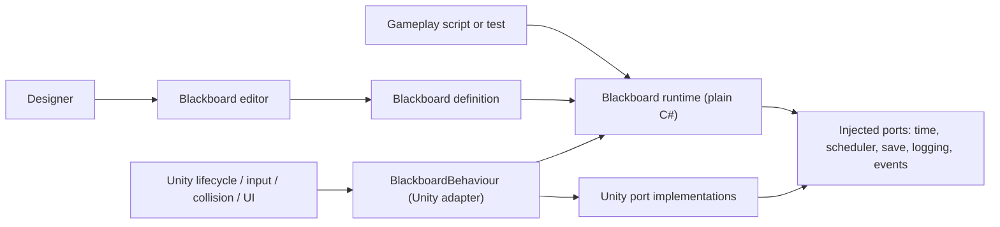
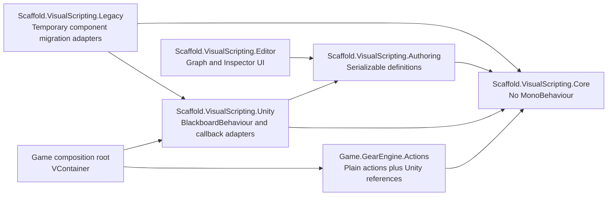
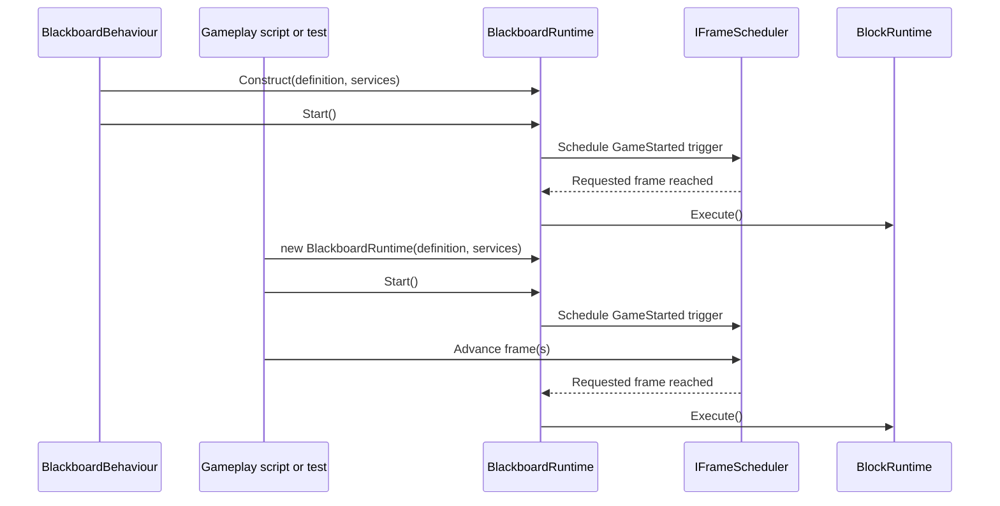
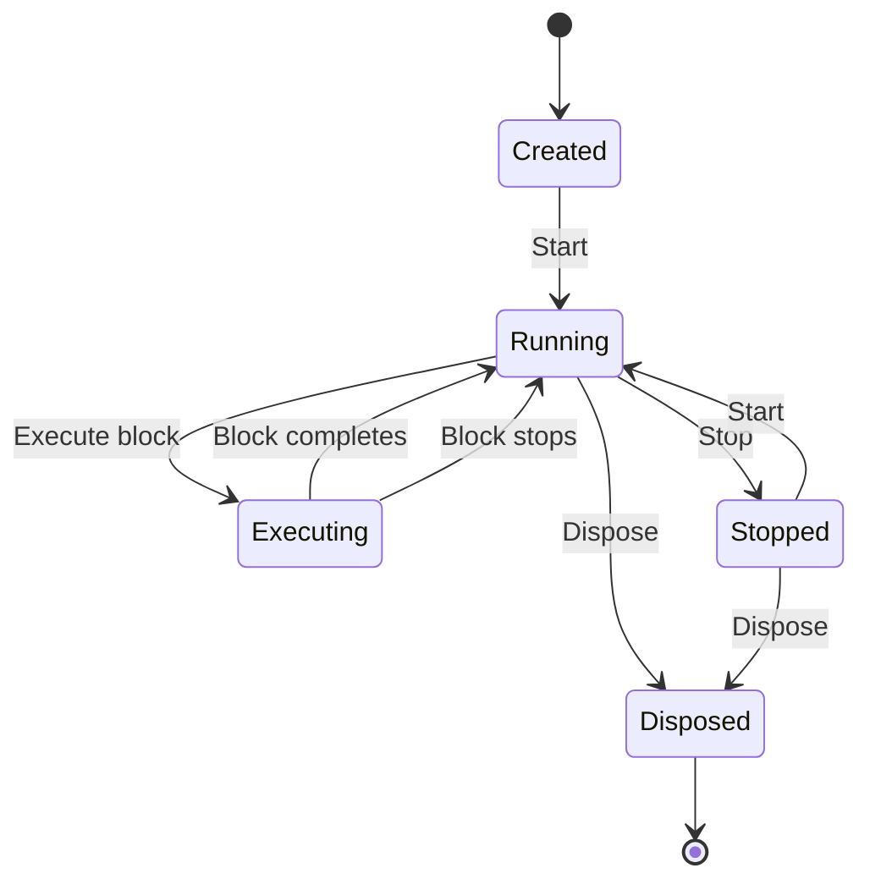

# Blackboard architecture review

## TL;DR

The current Blackboard implementation does not satisfy the intended boundary.
Individual `IAction` instances are now plain serializable C# objects, and the composite
runner is also a plain C# object, but the runtime graph is still rooted in Unity
components:

- `Blackboard`, `Block`, `Command`, `EventHandler`, and `Variable` are
  `MonoBehaviour` types.
- Blocks and variables are discovered through `GetComponent` / `GetComponents`.
- Block execution is owned by Unity coroutines and per-component `Update` methods.
- The action list is plain data, but it is hosted and ticked by
  `InvokeActionCommand : Command`, so it still requires a component.
- `GameStarted` is a component because it directly consumes `Start` and starts a
  coroutine, even though the trigger itself only needs a start signal and a frame
  scheduler.

The target should be a plain C# `BlackboardRuntime` that owns plain Blocks, variables,
triggers, and action lists. A single `BlackboardBehaviour` should be an optional Unity
adapter for scene setup, serialization, lifecycle forwarding, and UnityEvent access.
Only adapters that receive Unity callbacks should be `MonoBehaviour` types. An action
may hold a `UnityEngine.Object` reference without becoming a `MonoBehaviour`.

Review result: **architectural refactor required**. The current implementation is a
partially migrated Command pattern, not yet a runtime that can be constructed and run
from a script without a `GameObject`.

## Architectural Drivers

- Run Blackboard logic from plain C# tests and gameplay scripts without creating a
  `GameObject`.
- Preserve the visual authoring workflow as a convenience layer, not as the runtime
  ownership model.
- Keep Unity lifecycle, input, collision, UI, tag, and scene references at explicit
  adapter boundaries.
- Allow actions to opt into only the capabilities they need.
- Use VContainer at the application composition root instead of static registries or
  service locators.
- Preserve existing serialized scene and prefab content through a bounded migration
  path.

## Constraints and Invariants

The following invariants should govern the refactor:

1. `BlackboardRuntime`, `BlockRuntime`, the variable store, trigger state, and action
   list execution must be constructible with `new`.
2. The core runtime must not call `GetComponent`, `AddComponent`,
   `DestroyImmediate`, `GameObject.Find`, `StartCoroutine`, or Unity lifecycle methods.
3. `BlackboardBehaviour` may construct, own, start, tick, and dispose one
   `BlackboardRuntime`.
4. A Unity reference does not imply a `MonoBehaviour`. Serializable actions can retain
   references such as `Transform`, `Button`, `CustomTag`, or assets.
5. A type should become a Unity adapter only when it must receive a Unity callback or
   translate a Unity service into a core port.
6. Core actions must not inherit Unity-host access by default. Host, Blackboard, block,
   time, input, and logging capabilities must be explicit.
7. Editor selection, node coordinates, tint, zoom, and scroll state must not live in
   runtime execution objects.
8. Existing serialized content should remain readable until an explicit migration has
   completed and been verified.

The locked migration policy is a breaking replacement. The legacy graph remains
compilable beside the new assemblies only until the explicit asset cutover; no
backward-compatible component adapters ship in the finished architecture.

## System Context

Intent: show that Unity and visual authoring are clients of the Blackboard core rather
than owners of its execution model.

Source of truth:
[`Blackboard.cs`](../../Assets/3rdParty/ScaffoldVisualScripting/Scripts/Components/Blackboard.cs),
[`Block.cs`](../../Assets/3rdParty/ScaffoldVisualScripting/Scripts/Components/Block.cs),
[`InvokeActionCommand.cs`](../../Assets/GearEngine/Scripts/Game/GearEngine/Presentation/UI/Tags/Input/InvokeActionCommand.cs),
and the proposed boundary in this review.

Update trigger: changes to Blackboard ownership, construction, lifecycle, serialization,
or external service access.

Target system context:

## Container/Module View

Intent: define an assembly direction that mechanically prevents core code from
depending on scene components.

Source of truth:
[`Scaffold.asmdef`](../../Assets/3rdParty/ScaffoldVisualScripting/Scaffold.asmdef) and
the current `Game.GearEngine` assembly references.

Update trigger: adding the proposed assemblies or moving Blackboard types between
assemblies.

Target module dependency diagram:

The dependency must never point from Core to UnityAdapter, Editor, Legacy, or a concrete
game assembly.

## Runtime Flows

Intent: show that scene-based and script-created Blackboards enter the same core
lifecycle.

Source of truth:
[`Blackboard.Execution.cs`](../../Assets/3rdParty/ScaffoldVisualScripting/Scripts/Components/Blackboard.Execution.cs),
[`GameStarted.cs`](../../Assets/3rdParty/ScaffoldVisualScripting/Scripts/EventHandlers/GameStarted.cs),
and the proposed adapter boundary.

Update trigger: changes to start notification, frame scheduling, ticking, block
execution, or disposal.

Unity-hosted and script-created startup:

Target execution lifecycle:

### Current findings

#### Critical: runtime ownership is inseparable from `GameObject`

`Blackboard` inherits `MonoBehaviour`, requires `EventDispatcher`, stores editor state,
and discovers Blocks, Commands, EventHandlers, and Variables as sibling components
([`Blackboard.cs`](../../Assets/3rdParty/ScaffoldVisualScripting/Scripts/Components/Blackboard.cs):18-20,
188-219, 231-303). `ExecuteBlock` rejects a Block not attached to the same `GameObject`
and starts its coroutine directly
([`Blackboard.Execution.cs`](../../Assets/3rdParty/ScaffoldVisualScripting/Scripts/Components/Blackboard.Execution.cs):56-79).

`Block` inherits `Node`, which is a `MonoBehaviour` used only to hold graph rectangle
and tint data
([`Node.cs`](../../Assets/3rdParty/ScaffoldVisualScripting/Scripts/Components/Node.cs):9-20).
The Block then mixes serialized definition, execution state, editor selection, a
per-frame tick, coroutine scheduling, and command execution in one 1,002-line class
([`Block.cs`](../../Assets/3rdParty/ScaffoldVisualScripting/Scripts/Components/Block.cs):24-27,
110-183, 208-212, 457-548).

This is the primary reason Blackboard logic cannot be authored and executed entirely
from a script.

#### Critical: the action list is still component-hosted

There is no standalone `ActionList` runtime type. The current equivalent is
`InvokeActionCommand.actions`, a serializable list inside
`InvokeActionCommand : Command`; `Command` is a `MonoBehaviour`
([`InvokeActionCommand.cs`](../../Assets/GearEngine/Scripts/Game/GearEngine/Presentation/UI/Tags/Input/InvokeActionCommand.cs):15-37,
[`Command.cs`](../../Assets/3rdParty/ScaffoldVisualScripting/Scripts/Components/Command.cs):37-40).
The component owns `Update`, ticks the composite runner, injects itself as the
`MonoBehaviour` host, and supplies concrete `Blackboard` and `Command` objects
([`InvokeActionCommand.cs`](../../Assets/GearEngine/Scripts/Game/GearEngine/Presentation/UI/Tags/Input/InvokeActionCommand.cs):462-487,
545-579).

`ActionBase` is plain C#, but every subclass automatically implements
`IMonoBehaviourConsumer`, `IBlackboardConsumer`, and `ICommandContextConsumer` and
therefore receives all legacy component contexts whether it needs them or not
([`ActionBase.cs`](../../Assets/GearEngine/Scripts/Game/GearEngine/Core/Actions/ActionBase.cs):7-19,
107-120). A repository scan found 184 files declaring direct `ActionBase` inheritance,
while host-related terms appear in a much smaller subset. The default dependency is
therefore broader than the demonstrated need.

The action list should become a plain `ActionSequence` or `ActionListRuntime` that owns
entries, metadata, and `CompositeExecutionRunner`. The Unity wrapper should only
forward ticks when the chosen scheduler requires them.

#### Critical: triggers are modeled as components instead of signals plus adapters

`EventHandler` is a component that requires both a Block and a Blackboard and checks
`isActiveAndEnabled` before execution
([`EventHandler.cs`](../../Assets/3rdParty/ScaffoldVisualScripting/Scripts/Components/EventHandler.cs):33-36,
55-80). `GameStarted` inherits this component solely to use `Start`, a coroutine, and
`WaitForEndOfFrame`
([`GameStarted.cs`](../../Assets/3rdParty/ScaffoldVisualScripting/Scripts/EventHandlers/GameStarted.cs):14-33).

`GameStarted` should be plain trigger data and state. `BlackboardBehaviour.Start` should
forward the Unity start signal to the runtime. A script-created runtime should call the
same `Start` method. Waiting frames belongs behind `IFrameScheduler`, not inside the
trigger as a coroutine.

Unity callback sources such as pointer events, collision callbacks, and legacy Input
polling may retain thin adapter components. Their filtering and decision logic should
still be plain C# trigger logic.

#### Critical: variables are components and globals create hidden scene objects

`Variable` is a required Blackboard component and resolves ownership with
`GetComponent<Blackboard>`
([`Variable.cs`](../../Assets/3rdParty/ScaffoldVisualScripting/Scripts/Components/Variable.cs):104-109,
163-167). Global variable access calls the `ScaffoldManager` service locator, whose
`GlobalVariables` implementation creates a hidden Blackboard `GameObject` and adds
variable components at runtime
([`Variable.cs`](../../Assets/3rdParty/ScaffoldVisualScripting/Scripts/Components/Variable.cs):174-219,
[`GlobalVariables.cs`](../../Assets/3rdParty/ScaffoldVisualScripting/Scripts/Utils/GlobalVariables.cs):11-20,
29-57).

Variables should be plain typed value cells in an injected `IVariableStore`.
Local/public/global scope should select a store, not a scene lifetime mechanism.

#### High: runtime, editor model, and presentation state are mixed

Blackboard holds zoom, scroll positions, editor selection, colors, view height, and
runtime services in the same type
([`Blackboard.cs`](../../Assets/3rdParty/ScaffoldVisualScripting/Scripts/Components/Blackboard.cs):26-97,
348-456). Block also stores graph state through `Node`, runtime state, and editor
selection caches. This prevents the runtime model from being small and stable and
forces editor operations to create and destroy runtime components.

The editor currently copies Blocks, Commands, and EventHandlers with `Undo.AddComponent`
and `SerializedObject`
([`BlackboardWindow.cs`](../../Assets/3rdParty/ScaffoldVisualScripting/Scripts/Editor/BlackboardWindow.cs):26-88).
The authoring model should instead serialize nested definitions or a dedicated asset,
while editor-only layout state lives in a separate authoring/editor object.

#### High: static registries and service locators hide ownership

Blackboard owns static active-Blackboard caches, message receiver sets, and a mutable
static save service
([`Blackboard.cs`](../../Assets/3rdParty/ScaffoldVisualScripting/Scripts/Components/Blackboard.cs):22,
87-97, 151-177). This is a Singleton / Service Locator anti-pattern: tests share hidden
state, lifetime is implicit, and multiple independent runtimes cannot be isolated.

Use injected registries and services scoped by VContainer. Cross-Blackboard messaging
should be an injected event bus or registry owned by the composition root.

#### High: the third-party runtime constructs a concrete game command

`Blackboard.CreateBlockComponent` resolves a concrete Gear Engine type by assembly-
qualified reflection and adds it as a component
([`Blackboard.cs`](../../Assets/3rdParty/ScaffoldVisualScripting/Scripts/Components/Blackboard.cs):306-323).
This reverses the intended dependency direction and bypasses an explicit factory.

Core should create a plain empty Block. An injected authoring factory or game-side
template may choose the default action content.

#### High: persistence resolves runtime objects through scene names

`BlackboardData.Decode` locates a `GameObject` by Blackboard name and then calls
`GetComponent<Blackboard>`
([`BlackboardData.cs`](../../Assets/3rdParty/ScaffoldVisualScripting/Scripts/Utils/BlackboardData.cs):172-187).
Persistence should target a stable runtime identifier through an injected Blackboard
registry and decode directly into a plain variable store.

#### Medium: Observer implementation has lifecycle and error-reporting gaps

The Observer pattern is present through `BlockSignals` and `EventDispatcher`, which is
a good direction. However, `EventDispatcher` itself has no Unity lifecycle need and
should be plain C#. It catches listener exceptions but only forwards the message to an
optional log delegate, so an exception can disappear when no logger is attached
([`EventDispatcher.cs`](../../Assets/3rdParty/ScaffoldVisualScripting/Scripts/Utils/EventDispatcher.cs):11-15,
97-127).

`ButtonClicked` adds a UnityEvent listener in `Start` but never removes it
([`ButtonClicked.cs`](../../Assets/3rdParty/ScaffoldVisualScripting/Scripts/EventHandlers/ButtonClicked.cs):21-31).
Unity adapters must symmetrically attach and detach listeners.

#### Medium: complexity outliers lack architectural justification

The Blackboard partials total 1,494 lines, `Block` is 1,002 lines, `Command` is 450
lines, and `ActionBase` is 339 lines. Splitting Blackboard into partial files improves
navigation but does not separate ownership. `ActionBase` ends with legacy “stubs to fix
compilation errors,” which documents the symptom but not why those responsibilities
must remain together
([`ActionBase.cs`](../../Assets/GearEngine/Scripts/Game/GearEngine/Core/Actions/ActionBase.cs):331-337).

These are architectural outliers and should be decomposed instead of justified as
permanent runtime types.

### Existing strengths to preserve

- `IAction` is already a plain C# execution contract.
- `CompositeExecutionRunner`, `ICompositeTask`, `CommandTrack`, and the execution
  context types are plain classes and provide a practical extraction seam.
- `[SerializeReference]` already persists individual action objects inside an action
  list.
- Existing PlayMode/runtime tests provide characterization coverage for Block
  execution, flow control, variables, and `GameStarted`.
- The serialized migration surface is currently bounded: the audit found Blackboard
  and Block components in one prefab and two test scenes, `GameStarted` in one prefab
  and one test scene, and `InvokeActionCommand` in two test scenes.

## Dependency Rules

Allowed:

- Core runtime depending on plain contracts such as `ITimeSource`, `IFrameScheduler`,
  `IVariableStore`, `IBlackboardRegistry`, `ISaveService`, and `ILogger`.
- Unity adapters depending on the core and translating Unity callbacks or services.
- Serializable action implementations holding explicit Unity object references.
- Editor code depending on authoring definitions and migration adapters.
- Existing legacy assemblies compiling beside the replacement until the explicit
  breaking cutover, without creating new compatibility wrappers.

Forbidden:

- Core runtime depending on `MonoBehaviour`, `GameObject`, `Component`, Unity
  lifecycle methods, or scene searches.
- Core runtime resolving services through `ScaffoldManager.Instance` or mutable static
  fields.
- A base action automatically receiving a Unity host or concrete Command context.
- Editor layout and selection state living inside runtime execution objects.
- Third-party Scaffold code reflecting into a concrete Gear Engine assembly.
- Persistence identifying a Blackboard only by `GameObject.name`.

## Quality Attributes and Tradeoffs

### Recommended target types

- `BlackboardDefinition`: serializable authoring data containing stable ID, variables,
  and Blocks.
- `BlackboardRuntime`: plain lifecycle, lookup, execution, stop/reset, substitution,
  and messaging.
- `BlockDefinition` and `BlockRuntime`: definition separated from transient execution
  state.
- `ActionSequence`: plain action entries and composite execution settings.
- `ActionContext`: narrow runtime capabilities supplied to actions at execution time.
- `IVariableStore`: typed local/public/global value storage without components.
- `ITrigger`: plain attach/detach or signal-handling contract.
- `GameStartedTrigger`: plain trigger using `IFrameScheduler`.
- `BlackboardBehaviour`: optional Unity wrapper and serialization bridge.
- Unity callback adapters: pointer, collision, UI, Input, scene, and lifecycle sources.

### Recommended migration sequence

1. Add pure characterization tests that construct the new execution types with `new`.
2. Extract core ports and make `CompositeExecutionRunner` independent of component
   ownership.
3. Introduce the plain variable store and prove it independently of legacy variable
   components.
4. Extract `ActionSequence` and `BlockRuntime`; migrate consumers to the new contracts
   in bounded batches.
5. Introduce `BlackboardRuntime`; reduce `Blackboard` to the temporary Unity wrapper.
6. Convert `GameStarted` and other triggers into plain trigger definitions with Unity
   callback adapters.
7. Move editor layout/selection data to the authoring layer and migrate serialized
   component graphs.
8. Verify all fixtures, then remove legacy Block, Command, EventHandler, and Variable
   components that no longer provide a Unity callback.

This sequence deliberately preserves behavior while moving ownership inward. Replacing
all component serialization in one change would be faster to write but substantially
riskier to verify.

### Tradeoffs

- A separate definition/runtime model adds mapping code, but makes script creation,
  deterministic testing, cloning, save/load, and independent runtime instances
  straightforward.
- Running the legacy and replacement assemblies side by side adds short-term
  duplication, but keeps each pre-cutover milestone compilable.
- Injected scheduler and event ports require composition setup, but eliminate hidden
  frame and global-state dependencies.
- Keeping Unity references in actions means not every action assembly can set
  `noEngineReferences: true`; that is acceptable because the invariant is removal of
  `MonoBehaviour` ownership, not removal of every Unity value type.

## Verification

Required acceptance evidence for the refactor:

1. Pure NUnit tests create a Blackboard, Block, action list, variables, and
   `GameStartedTrigger` without `GameObject`, `AddComponent`, `[UnityTest]`, or frame
   coroutines.
2. A script-created Blackboard and a `BlackboardBehaviour`-hosted Blackboard pass the
   same behavior matrix.
3. Unity adapter tests verify lifecycle forwarding and symmetric listener
   registration/removal.
4. Serialization migration tests load and compare the Blackboard prefab,
   `Test Tutorial Scene`, and `UIEffectsForEachDemo`.
5. An assembly test ensures the core has no reference to UnityAdapter, Editor, Legacy,
   or `Game.GearEngine`.
6. Existing flow, variable, Block call, composite execution, and action tests remain
   green during the adapter phase.
7. `.agents/scripts/validate-changes.sh` passes for final macOS acceptance; the
   repository's `.cmd` shim is not acceptance evidence.

### Implementation pattern checkpoint: Milestone 4

- **Observer:** `BlackboardEventBus` owns typed subscriptions and returns disposable
  handles. Disposal removes listeners symmetrically, avoiding the unremoved-listener
  defect in the legacy UI trigger path.
- **Registry:** `BlackboardRegistry` and `PublicVariableRegistry` use runtime-instance
  and definition IDs. They replace name lookup and static active-Blackboard caches;
  owned public registrations are removed when `BlackboardVariableSet` is disposed.
- **Repository / Store:** `VariableStore` separates cell storage from definition data.
  Local and public stores are clone-owned, while `IGlobalVariableStore` makes the one
  shared scope explicit and injectable.
- **Factory seam:** `VariableDefinition<T>.CreateCell` creates typed runtime cells.
  Managed initial values are cloned both on creation and reset, so runtime mutation
  cannot leak back into reusable definitions.
- **Singleton anti-pattern:** no new mutable singleton or service locator was added.
  The only static `Instance` in Core is an immutable stateless reference-equality
  comparer used by graph traversal.
- **Strategy:** `CompositeExecutionRunner` is now the shared plain-C# engine behind
  `ActionList` and `Block`. Composite mode, await mode, ordering, weighting, utility
  reevaluation, repeat prevention, interruption, and feedback are selected from
  definitions rather than a component type switch.
- **Command:** Core `IAction` and `ActionBase` execute through immutable
  `ActionExecutionContext` values and status callbacks. Flow jumps use
  `IActionFlowController`; Core stores no MonoBehaviour or concrete Command.
- **Adapter:** the Gear action base temporarily translates the legacy component runner
  into the Core contract while pre-cutover consumers remain. Scheduler-backed delays
  and IEnumerators use the same Core ports. The legacy overload is explicitly excluded
  from the target API and is deleted in Milestone 8.
- **Observer:** event-wait and input actions now remove listeners symmetrically on
  completion, interruption, and failure.
- **Complexity:** changed action methods were decomposed to the repository's analyzer
  limits and helper declarations follow their call graph. The final changed-C#
  analyzer and file-structure gates are clean.

Milestone 4 evidence:

- Plain action and composite runtime: 16 passed, 0 failed.
- Gear context, delay, routine, cloning, interruption, and compatibility bridge:
  7 passed, 0 failed.
- Legacy component behavior matrix: 39 passed, 0 failed.
- The latest Unity Editor log parser returned `[]`.
- Core static scans contain no `MonoBehaviour`, `GetComponent`, `AddComponent`,
  `StartCoroutine`, `GameObject.Find`, or mutable service locator.
- All 62 changed C# files pass formatter, analyzer, and one-top-level-type checks.

## Change Log

- 2026-07-27: Initial review of Blackboard, Block, Command/action-list hosting,
  triggers, variables, editor serialization, persistence, tests, and Unity boundaries.
- 2026-07-27: Updated after Milestone 4 extracted Core action, composite, Block, track,
  context, scheduling, flow-control, and feedback ownership from components.
