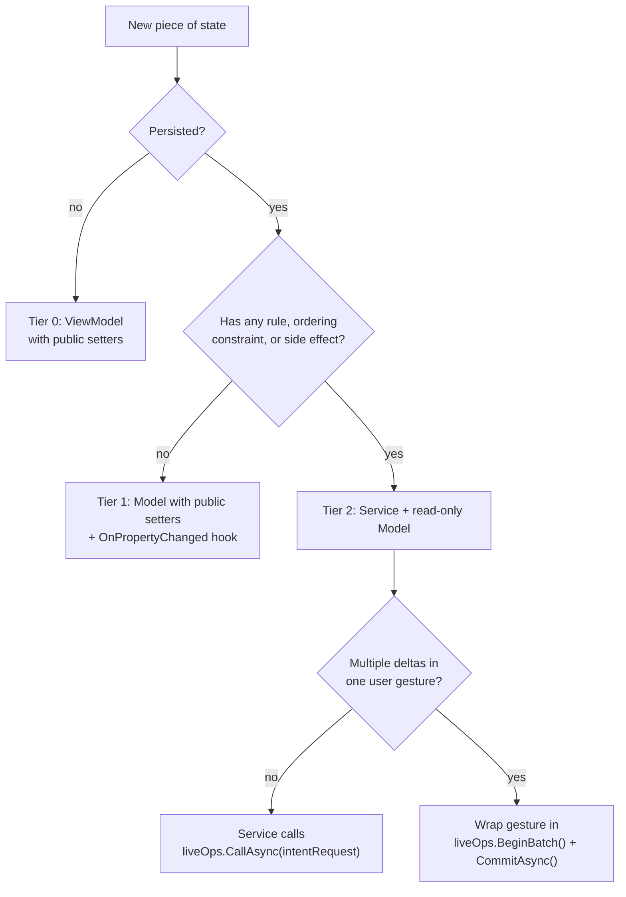
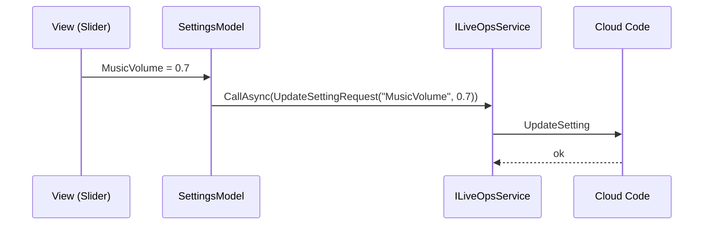
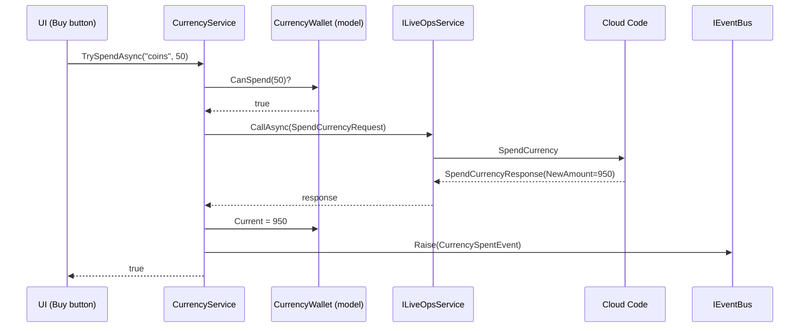
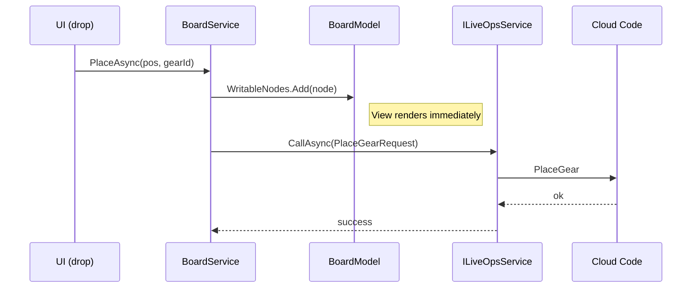
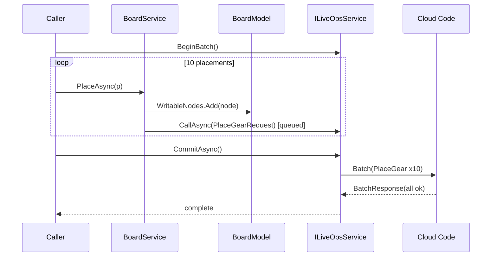
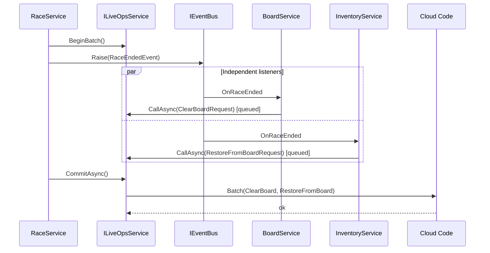
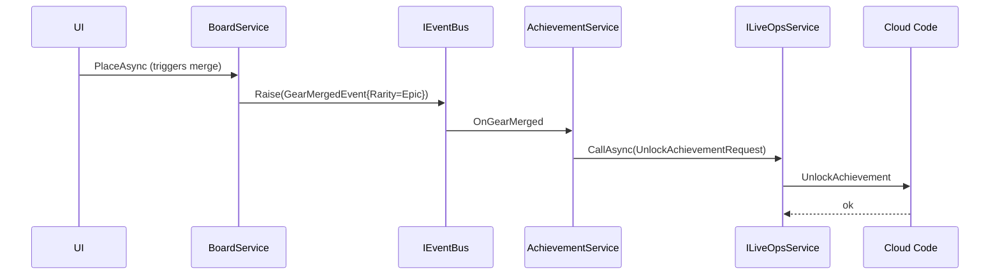
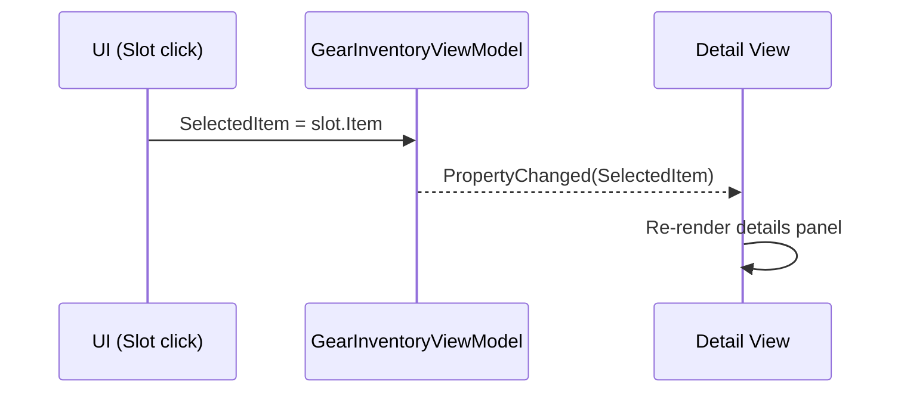

# State and Services Standard (AI-First)

## Why this standard exists

This repository keeps growing types that are partly model, partly service, and partly transport. The result is inconsistent shapes (`Save(thing)` vs `AddAsync(id, amount)`), parallel state representations (`BoardModel` + `IGridManager`), per-instance C# events that duplicate observable models, and whole-state-replace requests (`SetInventoryRequest(everything)`) that hide what actually changed from the server.

This document fixes that by defining:

- the **two roles** state can play (Model, Service) and the rules each must obey
- the **three tiers** of state and when to use each
- the **delta-first transport model** (`ILiveOpsService.CallAsync` + `BeginBatch`) that replaces the previous "four persistence patterns" framing
- the rule set that AI agents and humans must follow when introducing or refactoring stateful code
- worked good/bad examples drawn from the current codebase (`InventoryService`, `BoardService`, `CurrencyClientModule`, `InventoryClientModule`)

Every rule and every sample interaction carries either a working code snippet or a mermaid sequence diagram (most carry both).

Keywords: services, models, MVVM, observables, EventBus, intent, deltas, batching, optimistic update, atomic group, rollback.

---

## TL;DR

- **Two roles, not three.** Model holds state. Service owns rules and calls `liveOps.CallAsync(intentRequest)` directly. There is no "Repository" layer; the LiveOps boundary is the persistence seam.
- **One canonical representation per piece of state.** No parallel models, no shadow copies, no `Sync`* methods.
- **Models are observable but externally read-only above Tier 0.** Writes happen through service intent methods or, for Tier 1, through self-persisting setters.
- **Services expose intent, not payloads.** `TryEquip(gearId)`, never `Save(inventory)` or `Set(field, value)`.
- **Requests are deltas by default.** `EquipGearRequest(gearId)`, not `SetInventoryRequest(everyOwnedGear)`. Whole-blob replace requests require an explicit waiver (see ["Blob requests require a waiver"](#blob-requests-require-a-waiver)).
- **Persistence is one method call.** `await liveOps.CallAsync(intentRequest)`. No debounce timers, no dirty flags, no `Schedule`.
- **Atomic multi-step operations use `BeginBatch`.** The LiveOps boundary collects deltas inside the scope and the server applies them as one transaction on `CommitAsync`.
- **Optimistic UI is the default for high-frequency interactions.** Apply locally → fire the call → roll back local state on failure. The pattern is documented; do not invent new ones.
- **EventBus for cross-system signals; observable models for state binding.** Per-instance `event Action` is the exception, not the default.
- **Three tiers of state:** Tier 0 local UI, Tier 1 self-persisting model, Tier 2 service-gated domain. Promote upward when rules appear.

---

## Vocabulary

These two roles are non-overlapping. Every type that touches state must be exactly one of them, plus the supporting concepts below.

### Model

State container. Observable. **No business rules**. Lives next to its owning service (or in a presentation namespace for Tier 0).

- May expose `[ObservableProperty]` fields and `ObservableCollection<T>`.
- External callers may **read**. Writes are restricted by tier (see below).
- May expose pure query helpers (`CanSpend`, `IsFull`) only when the helper has zero side effects and depends only on the model's own fields.

### Service

Command surface. Owns the rules. Stateless from the outside — the model is the state.

- Methods are named for intent: `TryEquip`, `SpendAsync`, `PlaceAsync`, `MergeAtAsync`.
- Methods take **identifiers and primitives**, never whole domain objects.
- Returns `bool` / typed result for synchronous commands; returns `UniTask<TResponse>` for async commands.
- Exposes its model **read-only** (`InventoryModel Inventory { get; }` where setters on the model are `private`/`internal` or projected through `IReadOnlyList<T>`).
- Calls `ILiveOpsService.CallAsync(intentRequest)` directly. There is no repository between the service and the LiveOps boundary.
- For initial state, owns an `OnInitialized` hook that consumes the server-provided snapshot DTO and populates the model. This is the **only** "blob in" path and is unavoidable because bootstrap has no prior state to delta against.

### LiveOps boundary (`ILiveOpsService`)

The single transport seam. All state changes that cross to the server go through it. Two primitives:

- `await liveOps.CallAsync<TReq, TResp>(req, ct)` — send one intent, await typed response. The default and almost-always answer.
- `using (var batch = liveOps.BeginBatch()) { … await batch.CommitAsync(ct); }` — collect calls inside the scope; the server applies them atomically on commit. Use when a single user gesture must succeed or fail as a unit.

The boundary owns retries, timeouts, error normalization, and (for batches) atomic envelope construction. Services do not.

### EventBus event

Cross-system notification. "X happened, with these consequences." Used by listeners that don't want to diff observable collections to infer a domain event.

- Published with `IEventBus.Raise(new GearAcquiredEvent(instanceId, gearId))`.
- Carries primitive payloads, not references to live model instances.
- Used for analytics, achievements, audio, popups, and any cross-system reaction that does not fit a model binding.

### Per-instance C# `event Action`

The exception. Allowed only when **all three** of:

1. The listener is the same ViewModel that issued the command, **and**
2. ordering matters (the listener must run before the next command), **and**
3. the signal cannot be inferred from the model.

If any of those three is false, use the EventBus or bind to the observable model.

---

## The six rules

Numbered for reference in PRs and analyzer messages.

1. **One canonical representation.** Each piece of state has exactly one writable owner. Projections for views are fine; second writable copies are forbidden.
2. **Models are observable, never validating.** Validation, gating, and rule enforcement live in the service.
3. **Services expose intent, not payloads.** Commands take identifiers and primitives; never `Save(domainObject)` or `Set(field, value)`.
4. **Models are externally read-only above Tier 0.** Public mutators on Tier 1+ models are a violation. Tier 1 setters are public but their only side effect is persistence.
5. **Requests are deltas, not blobs.** Wire requests describe the operation (`EquipGearRequest(id)`, `PlaceGearRequest(pos, id)`), not the full resulting state. Whole-state-replace requests require a waiver comment (see [Blob requests require a waiver](#blob-requests-require-a-waiver)).
6. **Cross-system notifications use `IEventBus`.** Per-instance `event Action` requires the three-condition justification above.

Two corollaries fall out of the six rules and need no separate numbering:

- **Persistence is the LiveOps boundary's concern.** Services call `liveOps.CallAsync` and do not own debounce timers, dirty flags, or batch state.
- **Tier 1 exists.** Persisted-but-ruleless state is a model with public setters and an `OnPropertyChanged` hook, not a service.

---

## The three tiers of state

State earns a tier based on **what kinds of writes it accepts**, not its size or field count.

### Tier 0 — Local observable (no service, no persistence)

- Selection, drag state, hover index, current tab, draft text, transient flags.
- A `ViewModel` with `[ObservableProperty]` and **public setters**.
- Written directly: `vm.SelectedItem = x`.

### Tier 1 — Self-persisting observable

- Persisted state with **no rules** beyond "store the value": settings flags, language preference, last-used loadout id, music volume.
- A `Model` with `[ObservableProperty]`, public setters, and a single `OnPropertyChanged` override that calls `liveOps.CallAsync(...)` with a typed update request.
- Written directly: `settings.MusicVolume = 0.7f`.

### Tier 2 — Service-gated domain

- State with **at least one** of: write rules, ordering constraints with other state, side effects beyond persistence (events, analytics, achievements).
- A `Service` exposing intent commands and a read-only `Model`. The service calls `liveOps.CallAsync(intentRequest)` directly.
- Written through the service: `await inventoryService.EquipAsync(gearId)`.

### Promotion rule

> A piece of state earns the next tier the moment any of (rule, ordering, side-effect) appears. Demotion is allowed when all three are removed.

The size of the model is irrelevant. A wallet with three fields can be Tier 2 because `CanSpend` is a rule. A 30-field settings object can be Tier 1 because none of its setters have any rule beyond persistence.

### Decision flow




---

## How persistence actually works

There is one transport seam (`ILiveOpsService`) and two ways to use it.

### `CallAsync` — the default

```csharp
var resp = await liveOps.CallAsync(new EquipGearRequest(instanceId), ct);
if (resp.Succeeded) model.WritableEquipped.Add(instanceId);
```

One intent → one server call → one typed response. Use this for **every** state change unless you have a specific reason not to.

### `BeginBatch` — for atomic multi-step gestures

When a single logical user action makes N writes that must succeed or fail together (deserialize a saved layout, end-of-race cleanup, scripted sequences), wrap them:

```csharp
using (var batch = liveOps.BeginBatch())
{
    foreach (var p in saved.Placements)
        await boardService.PlaceAsync(p.Pos, p.GearId);
    await batch.CommitAsync(ct);
}
```

Inside the scope, `CallAsync` calls do not hit the network individually. The boundary collects them; on `CommitAsync`, they are sent as one atomic envelope and the server applies them all-or-nothing.

The caller who *opens* the batch is the one who knows the gesture boundary. Services never open batches on their own behalf.

### What's deliberately not here

You will not find:

- a `Schedule` / fire-and-forget primitive,
- a `MarkDirty` / debounce timer,
- per-request "coalesce" or "send mode" attributes,
- a Repository class.

Each of those existed in earlier drafts to manage the costs of **blob requests**. Once requests are deltas (Rule 5), none of them are needed: a delta is cheap, descriptive, and naturally one-to-one with a server call. If you find yourself wanting one of them, the request shape is wrong.

### Optimistic UI for high-frequency interactions

Awaiting every `CallAsync` before updating the model gives correct behavior but a sluggish UI for drag-drop, sliders, and continuous gestures. The standard answer is **optimistic + reconcile**:

1. Apply the change to the model immediately so the View updates.
2. Fire the request.
3. On success, do nothing (model already matches server).
4. On failure, **roll back the local change** and surface an error.

```csharp
public async UniTask<bool> PlaceAsync(Vector2Int pos, string gearId, CancellationToken ct = default)
{
    var node = nodeFactory.Create(pos, gearId);
    Board.WritableNodes.Add(node);
    eventBus.Raise(new GearPlacedEvent(pos, gearId));
    try
    {
        var resp = await liveOps.CallAsync(new PlaceGearRequest(pos, gearId), ct);
        if (resp.Succeeded) return true;
        Board.WritableNodes.Remove(node);
        eventBus.Raise(new GearPlacementRejectedEvent(pos, gearId, resp.ErrorCode));
        return false;
    }
    catch
    {
        Board.WritableNodes.Remove(node);
        throw;
    }
}
```

When in doubt: optimistic for client-validated mutations (board placement, inventory rearrange), pessimistic (`await` before applying) for server-authoritative mutations where the client cannot precompute the result (currency spend, purchase, loot roll).

---

## Blob requests require a waiver

A blob request is one whose payload is the **entire current state of a domain** rather than the operation that changed it (`SetInventoryRequest(allOwnedGears)`, `SetBoardLayoutRequest(allPlacements)`).

Blobs are forbidden by default because they:

- hide the operation from the server (no audit, weak anti-cheat),
- make multi-device sync into silent last-write-wins,
- force snapshot/diff machinery on both ends,
- break optimistic-UI rollback (you cannot roll back a single change you never named),
- require debounce/coalesce machinery to be affordable on continuous edits.

A blob request is permitted only when **all of**:

1. The payload is genuinely opaque to the server (e.g. a user-authored level the server has no schema for), or it's a one-shot import/migration, **and**
2. there is no reasonable enumeration of operations that could express the same intent, **and**
3. the call site carries a `// WAIVER: Rule 5 — <reason>` comment with an issue link.

**Read** snapshots are not write blobs. `GetInventoryResponse(allOwnedGears)` at bootstrap is fine and unavoidable; that is how the model is initially populated. The rule applies only to client→server writes.

---

## Sample interactions

Each interaction shows: the user-visible action, the tier that applies, working snippets of every layer involved, and a sequence diagram of the runtime flow.

### Interaction 1 — Player toggles music volume

- **Tier**: 1. Persisted, no rules.
- **Why**: No rule, no validation. Caller writes directly. The model's `OnPropertyChanged` ships a delta.

Model (Tier 1, public setter, `OnPropertyChanged` hook):

```csharp
public partial class SettingsModel : Model
{
    [ObservableProperty] private float musicVolume = 1.0f;
    [ObservableProperty] private string language = "en";

    private readonly ILiveOpsService liveOps;
    public SettingsModel(ILiveOpsService liveOps) => this.liveOps = liveOps;

    protected override void OnPropertyChanged(PropertyChangedEventArgs e)
    {
        base.OnPropertyChanged(e);
        _ = liveOps.CallAsync(new UpdateSettingRequest(e.PropertyName, GetValue(e.PropertyName)));
    }
}
```

Caller (View binds slider directly to the model):

```csharp
slider.onValueChanged.AddListener(v => settingsModel.MusicVolume = v);
```

Flow:




If the user wiggles the slider 60 times per second, you do get 60 calls. That is fine for a single-value setting; if it ever isn't, wrap the gesture (mouse-down → mouse-up) in `BeginBatch`.

### Interaction 2 — Player spends 50 coins

- **Tier**: 2. Server-authoritative rule.
- **Why**: Server owns the truth. Pessimistic call: await response before updating local model.

Service:

```csharp
public sealed class CurrencyService : ICurrencyService
{
    private readonly CurrencyModel model;
    private readonly ILiveOpsService liveOps;
    private readonly IEventBus eventBus;

    public async UniTask<bool> TrySpendAsync(string id, long amount, CancellationToken ct = default)
    {
        if (string.IsNullOrEmpty(id)) throw new ArgumentException(nameof(id));
        if (amount <= 0) throw new ArgumentOutOfRangeException(nameof(amount));

        var wallet = model.GetWallet(id);
        if (wallet == null || !wallet.CanSpend(amount)) return false;

        try
        {
            var resp = await liveOps.CallAsync(new SpendCurrencyRequest(id, amount), ct);
            if (!resp.Succeeded) return false;

            wallet.Current = resp.NewAmount;
            eventBus.Raise(new CurrencySpentEvent(id, amount));
            return true;
        }
        catch (Exception ex) when (ex is not OperationCanceledException)
        {
            Debug.LogError($"[CurrencyService] TrySpendAsync({id},{amount}) failed: {ex.Message}\n{ex.StackTrace}");
            return false;
        }
    }
}
```

Caller:

```csharp
bool ok = await currencyService.TrySpendAsync("coins", 50, ct);
if (!ok) feedback.Show("Not enough coins");
```

Flow:




### Interaction 3 — Player drops a gear on the board

- **Tier**: 2. Client-authoritative with rules.
- **Why**: One drop = one delta. Optimistic: apply locally, fire `PlaceGearRequest`, roll back on failure.

Service:

```csharp
public async UniTask<bool> PlaceAsync(Vector2Int pos, string gearId, CancellationToken ct = default)
{
    if (string.IsNullOrEmpty(gearId)) throw new ArgumentException(nameof(gearId));
    if (!CanPlace(pos, gearId)) return false;

    var node = nodeFactory.Create(pos, gearId);
    Board.WritableNodes.Add(node);
    eventBus.Raise(new GearPlacedEvent(pos, gearId));

    try
    {
        var resp = await liveOps.CallAsync(new PlaceGearRequest(pos, gearId), ct);
        if (resp.Succeeded) return true;
        Board.WritableNodes.Remove(node);
        eventBus.Raise(new GearPlacementRejectedEvent(pos, gearId, resp.ErrorCode));
        return false;
    }
    catch
    {
        Board.WritableNodes.Remove(node);
        throw;
    }
}
```

Caller (drag-drop handler):

```csharp
slot.onDrop = (pos, gearId) => _ = boardService.PlaceAsync(pos, gearId);
```

Flow:




If 8 drops happen in 2 seconds, that is 8 independent calls. Each is small (`{ pos, gearId }`), each gets its own ack, each can fail independently with a clear UI signal. This is the desired behavior — not a problem to coalesce away.

### Interaction 4 — Deserialize a saved loadout (10 placements at once)

- **Tier**: 2. Same service as Interaction 3.
- **Why**: One logical user action ("apply this saved layout"); must succeed or fail atomically.

Caller:

```csharp
public async UniTask<bool> ApplySavedLayoutAsync(SavedLayout saved, CancellationToken ct)
{
    using var batch = liveOps.BeginBatch();
    foreach (var p in saved.Placements)
        await boardService.PlaceAsync(p.Pos, p.GearId);
    await batch.CommitAsync(ct);
    return true;
}
```

Inside the batch scope, each `PlaceAsync` mutates the local model optimistically and queues its `PlaceGearRequest` instead of sending. On `CommitAsync`, the LiveOps boundary ships one envelope to the server, which applies all 10 deltas atomically. If any single delta is rejected, the boundary returns failure and the caller (or the service) rolls back local state.

Flow:




### Interaction 5 — Race ends, board is cleared, gears return to inventory

- **Tier**: 2 across multiple services.
- **Why**: Cross-system notification. Neither service knows about the other. The cleanup is a single user-visible event ("race ended") that two services react to; the originator wraps it in a batch so both services' deltas commit together.

Producer:

```csharp
public async UniTask EndRaceAsync(CancellationToken ct)
{
    using var batch = liveOps.BeginBatch();
    raceModel.IsActive = false;
    eventBus.Raise(new RaceEndedEvent(raceModel.RaceId));
    await batch.CommitAsync(ct);
}
```

Listeners (each service is independent and registers at construction):

```csharp
public sealed class BoardService : IBoardService, IDisposable
{
    public BoardService(IEventBus eventBus, ILiveOpsService liveOps, /* ... */)
    {
        this.liveOps = liveOps;
        raceEndedSub = eventBus.Subscribe<RaceEndedEvent>(_ => _ = ClearAsync());
    }

    private async UniTask ClearAsync()
    {
        var snapshot = Board.Nodes.ToList();
        Board.WritableNodes.Clear();
        var resp = await liveOps.CallAsync(new ClearBoardRequest());
        if (!resp.Succeeded)
        {
            foreach (var n in snapshot) Board.WritableNodes.Add(n);
        }
    }

    public void Dispose() => raceEndedSub.Dispose();
}
```

Flow:




### Interaction 6 — Achievement system reacts to "first epic gear merged"

- **Tier**: 2. Cross-system listener.
- **Why**: Listener is in a different system; ordering does not matter; signal carries context (rarity) the model alone does not expose.

Producer (inside `BoardService.MergeAtAsync` after a successful merge):

```csharp
eventBus.Raise(new GearMergedEvent(newNode.Position, newNode.GearId, newNode.Rarity));
```

Listener:

```csharp
public sealed class AchievementService : IDisposable
{
    public AchievementService(IEventBus eventBus, ILiveOpsService liveOps)
    {
        this.liveOps = liveOps;
        sub = eventBus.Subscribe<GearMergedEvent>(e => _ = OnGearMergedAsync(e));
    }

    private async UniTask OnGearMergedAsync(GearMergedEvent e)
    {
        if (e.Rarity != GearRarity.Epic) return;
        await liveOps.CallAsync(new UnlockAchievementRequest("first_epic_merge"));
    }

    public void Dispose() => sub.Dispose();
}
```

Flow:




`UnlockAchievementRequest` is idempotent on the server side; the achievement-service does not need to track "already unlocked" locally.

### Interaction 7 — UI selects an inventory item

- **Tier**: 0.
- **Why**: Local, ephemeral, not persisted. No service involved.

ViewModel (Tier 0, public setter, no service):

```csharp
public partial class GearInventoryViewModel : ViewModel
{
    [ObservableProperty] private IItem selectedItem;
}
```

Caller (click handler):

```csharp
slotButton.onClick.AddListener(() => viewModel.SelectedItem = slot.Item);
```

Flow:




No service. No transport. No event bus. No persistence. This is the entire interaction.

---

## Good vs bad — one example per rule

### Rule 1 — One canonical representation

Bad (current `BoardService`): two parallel state stores kept in sync.

```csharp
private readonly IGridManager gridManager;
private readonly BoardModel boardModel;

private void SyncBoardModel(bool publishLayoutChanged = true)
{
    boardModel.Nodes.Clear();
    foreach (IGridNode node in gridManager.GetAllNodes()) boardModel.Nodes.Add(node);
    boardModel.IsSimulationRunning = gridManager.IsRunning;
    if (publishLayoutChanged) BoardLayoutChanged?.Invoke();
}
```

Good: collapse to one store. `BoardModel.Nodes` is the canonical observable collection.

```csharp
public sealed class BoardService : IBoardService
{
    public BoardModel Board { get; }

    public async UniTask<bool> PlaceAsync(Vector2Int pos, string gearId, CancellationToken ct = default)
    {
        if (!CanPlace(pos, gearId)) return false;
        var node = nodeFactory.Create(pos, gearId);
        Board.WritableNodes.Add(node);
        var resp = await liveOps.CallAsync(new PlaceGearRequest(pos, gearId), ct);
        if (resp.Succeeded) return true;
        Board.WritableNodes.Remove(node);
        return false;
    }
}
```

No `Sync*` method exists because there is nothing to sync.

### Rule 2 — Models do not validate

Bad: validation logic on the model.

```csharp
public sealed class CurrencyWallet
{
    public bool TrySpend(long amount)
    {
        if (Current - amount < (Min ?? 0)) return false;
        Current -= amount;
        return true;
    }
}
```

Good: the model exposes a pure query; the service owns the rule.

```csharp
public sealed class CurrencyWallet
{
    public long Current { get; internal set; }
    public long? Min { get; internal set; }
    public bool CanSpend(long amount) => amount > 0 && Current - amount >= (Min ?? 0);
}
```

### Rule 3 — Intent, not payload

Bad (current `InventoryClientModule.SchedulePersist`): caller prepares a snapshot the module ships verbatim.

```csharp
private void SchedulePersist()
{
    List<OwnedGearEntry> snapshot = ownedRefs
        .Select(o => new OwnedGearEntry { InstanceId = o.InstanceId, GearId = o.Config.Id })
        .ToList();
    _ = SendInventoryAsync(snapshot);
}
```

Good: typed intent commands; the wire payload describes the operation, not the world.

```csharp
public async UniTask<OwnedGear> AddAsync(string gearId, CancellationToken ct = default)
{
    if (string.IsNullOrEmpty(gearId)) throw new ArgumentException(nameof(gearId));
    var resp = await liveOps.CallAsync(new AddOwnedGearRequest(gearId), ct);
    if (!resp.Succeeded) return null;
    var owned = new OwnedGear { InstanceId = resp.InstanceId, Config = catalog.Get(gearId) };
    model.WritableOwned.Add(owned);
    return owned;
}

public async UniTask<bool> RemoveAsync(string instanceId, CancellationToken ct = default)
{
    if (string.IsNullOrEmpty(instanceId)) throw new ArgumentException(nameof(instanceId));
    var resp = await liveOps.CallAsync(new RemoveOwnedGearRequest(instanceId), ct);
    if (!resp.Succeeded) return false;
    model.WritableOwned.RemoveAll(o => o.InstanceId == instanceId);
    return true;
}
```

The wire payload is `{ gearId }` or `{ instanceId }`, not the full inventory. The server controls instance ids. A tampered client cannot ship `{ ownedGears: [everything in the catalog] }`.

### Rule 4 — Read-only above Tier 0

Bad: Tier 2 model with a public mutator.

```csharp
public partial class InventoryModel : Model
{
    [ObservableProperty]
    private ObservableCollection<IItem> items = new();
}
```

`model.Items.Add(x)` works from anywhere — bypassing capacity, persistence, and the observable contract.

Good: collection exposed read-only; the writable handle is internal to the service's namespace.

```csharp
public partial class InventoryModel : Model
{
    private readonly ObservableCollection<IItem> items = new();
    public ReadOnlyObservableCollection<IItem> Items { get; }
    internal IList<IItem> WritableItems => items;

    public InventoryModel() => Items = new ReadOnlyObservableCollection<IItem>(items);
}
```

The View binds to `Items` for change notifications. Only the service can mutate.

### Rule 5 — Deltas, not blobs

Bad: blob-replace request.

```csharp
await liveOps.CallAsync(new SetInventoryRequest(model.Items.Select(i => i.InstanceId).ToList()));
```

Server cannot tell whether a gear was added, removed, or nothing happened. Anti-cheat reduces to "is the resulting list legal?". Multi-device sync becomes silent last-write-wins.

Good: delta requests with named operations.

```csharp
await liveOps.CallAsync(new AddOwnedGearRequest(gearId), ct);
await liveOps.CallAsync(new RemoveOwnedGearRequest(instanceId), ct);
await liveOps.CallAsync(new EquipGearRequest(instanceId), ct);
```

The server logs an action per call, validates per-operation, and can reject a single delta without forcing a full reconcile.

If a single user gesture genuinely needs N deltas to be atomic, wrap it:

```csharp
using var batch = liveOps.BeginBatch();
foreach (var p in saved.Placements)
    await boardService.PlaceAsync(p.Pos, p.GearId);
await batch.CommitAsync(ct);
```

### Rule 6 — EventBus over instance events

Bad (current `BoardService` and `InventoryService`):

```csharp
public event Action<IGridNode> GearPlaced;
public event Action<IGridNode> GearRemoved;
public event Action BoardLayoutChanged;
public event Action ItemsChanged;
```

Three problems: every consumer must subscribe and unsubscribe; events leak live model instances; `BoardLayoutChanged` and `ItemsChanged` duplicate the observable collection.

Good:

```csharp
boardViewModel.Board.Nodes
eventBus.Raise(new GearPlacedEvent(node.Position, node.ConfigData.Id));
eventBus.Raise(new GearRemovedEvent(node.Position, node.ConfigData.Id));
```

`BoardLayoutChanged` and `ItemsChanged` cease to exist.

---

## Smell catalog (current code → fix)


| Call site                                                                  | Smell                                                      | Rule violated | Fix                                                                                                                         |
| -------------------------------------------------------------------------- | ---------------------------------------------------------- | ------------- | --------------------------------------------------------------------------------------------------------------------------- |
| `BoardService.SyncBoardModel`                                              | Two state stores kept in agreement                         | 1             | Collapse `IGridManager` and `BoardModel` into one canonical store.                                                          |
| `BoardService.GearPlaced` / `GearRemoved` / `BoardLayoutChanged`           | Per-instance events; two duplicate the observable model    | 6             | Move to `IEventBus` (`GearPlacedEvent`, `GearRemovedEvent`); delete `BoardLayoutChanged` (consumers bind to `Board.Nodes`). |
| `InventoryService.ItemsChanged`                                            | Duplicates `ObservableCollection<IItem>.CollectionChanged` | 6             | Delete; consumers bind to `InventoryModel.Items`.                                                                           |
| `InventoryModel.Items` (public `ObservableCollection`)                     | Externally writable Tier 2 model                           | 4             | Expose `ReadOnlyObservableCollection<IItem>`; keep writable handle internal.                                                |
| `InventoryClientModule.SchedulePersist` + `SetInventoryRequest`            | Whole-blob replace; snapshot + send-the-world              | 3, 5          | Replace with `AddOwnedGearRequest(gearId)` / `RemoveOwnedGearRequest(instanceId)` typed intents.                            |
| `LoadoutClientModule.SaveBoardLayout` + `SetBoardLayoutRequest`            | Whole-blob replace                                         | 5             | Replace with `PlaceGearRequest` / `RemoveGearRequest` deltas; for save-loadout flows, wrap in `liveOps.BeginBatch()`.       |
| `BoardService` does its own dirty-tracking implicitly via `SyncBoardModel` | Service owning persistence timing                          | corollary     | Service calls `liveOps.CallAsync` per intent; remove implicit dirty tracking.                                               |
| Any `SchedulePersist` / `MarkDirty` style helper                           | Service owning persistence timing                          | corollary     | Delete; the LiveOps boundary is the seam.                                                                                   |


---

## Naming conventions

- Service interface: `I<Domain>Service` (`IInventoryService`, `ICurrencyService`, `IBoardService`).
- Service implementation: `<Domain>Service`.
- Model: `<Domain>Model`. One per service.
- EventBus events: `<Domain><PastTenseVerb>Event` (`GearPlacedEvent`, `CurrencySpentEvent`, `GearAcquiredEvent`).
- Command DTOs: `<Verb><Domain>Request` / `<Verb><Domain>Response` (`EquipGearRequest`, `SpendCurrencyResponse`, `AddOwnedGearRequest`).
- Atomic group: `using var batch = liveOps.BeginBatch();` … `await batch.CommitAsync(ct);`.
- LiveOps client modules (where they remain) own only `OnInitializedAsync(snapshotDto)` to seed the model at bootstrap. They do **not** persist runtime mutations; services do that via `liveOps.CallAsync`.

---

## Change checklist for AI agents

When creating or modifying a stateful type, verify in order:

1. Identify the **tier** (0, 1, or 2). If unsure, default to Tier 2.
2. If Tier 2, confirm the **canonical representation** is the model and nothing else holds a parallel writable copy.
3. Confirm the model is **externally read-only** (collections wrapped, fields with `internal`/`private` setters).
4. Confirm service methods take **identifiers and primitives**, not domain objects.
5. Confirm every request DTO is a **delta** (operation + ids/primitives). If it's a blob, attach a `// WAIVER: Rule 5 — <reason>` comment with an issue link.
6. Confirm the service calls `liveOps.CallAsync` directly. There is no repository, no `MarkDirty`, no `Schedule`, no debounce timer.
7. If a single user gesture issues multiple deltas that must succeed-or-fail together, wrap the gesture in `liveOps.BeginBatch()` / `CommitAsync()`.
8. For high-frequency interactions (drag-drop, sliders), apply the change to the model first, fire the call, and **roll back on failure**. Document the rollback path.
9. Replace any `event Action` with **EventBus events** unless the three-condition exception is documented.
10. Add a unit test that asserts: (a) a write through the service updates the model, (b) the typed request is sent, (c) a server failure rolls the model back, (d) the EventBus receives the expected event.
11. Run `.agents/scripts/validate-changes.cmd`.

---

## AI Agent Context

- **Invariants**:
  - Rules 1 through 6 are non-negotiable. Violations require an explicit waiver comment with `// WAIVER: <rule-number> — <reason>` and an issue link.
  - Tier 2 models never expose public setters on domain fields.
  - Services never reach for `Schedule`, `MarkDirty`, or per-service debounce timers. The transport seam is `ILiveOpsService` and only its `CallAsync` / `BeginBatch` primitives.
  - Wire requests are deltas; whole-state-replace requests require a Rule 5 waiver.
- **Allowed Dependencies**:
  - Service → Model, `ILiveOpsService`, `IEventBus`, catalog/config SOs.
  - LiveOps client modules → `ILiveOpsService`, persistence APIs, request/response DTOs (initial-load only).
  - ViewModel → Service, Model (read-only).
- **Forbidden Dependencies**:
  - ViewModel → `ILiveOpsService` directly (always go through a service).
  - Model → Service or `ILiveOpsService` (Tier 1 is the **only** exception, and only via its `OnPropertyChanged` hook).
  - Any service introducing its own debounce / dirty-tracking layer.
- **Change Checklist**: see "Change checklist for AI agents" above.
- **Known Tricky Areas**:
  - `BoardService` currently mixes service and transport concerns and keeps a parallel `IGridManager` store. Refactor requires collapsing the dual representation before splitting deltas out.
  - `InventoryClientModule` currently doubles as `IOwnedGearInventoryService` and ships blob `SetInventoryRequest`. Splitting requires introducing typed `AddOwnedGearRequest` / `RemoveOwnedGearRequest` server endpoints first; the client module's role then shrinks to `OnInitializedAsync(snapshot)`.
  - `LoadoutClientModule` ships blob `SetBoardLayoutRequest`. Migration plan mirrors inventory: typed deltas + `BeginBatch` for save-loadout flows.

---

## Migration notes for current code

Apply in this order to minimize churn.

1. `**InventoryService` (race inventory)**
  - Wrap `InventoryModel.Items` in `ReadOnlyObservableCollection<IItem>`; move the writable handle to `internal`.
  - Delete `event Action ItemsChanged`. View binds to `InventoryModel.Items.CollectionChanged` (already does).
2. `**BoardService`**
  - Choose: `BoardModel` owns the collection (preferred) or `IGridManager` does. Delete the loser.
  - Delete `SyncBoardModel`. Replace internal calls with direct mutations on the canonical store.
  - Delete `event Action BoardLayoutChanged`. `BoardViewComponent` binds to `BoardModel.Nodes`.
  - Move `GearPlaced` / `GearRemoved` to `IEventBus` (`GearPlacedEvent { Vector2Int Position, string GearId }`).
3. `**InventoryClientModule` → `OwnedGearService` + slim `OwnedGearClientModule`**
  - Add `AddOwnedGearRequest(string gearId)` / `AddOwnedGearResponse(string instanceId)` and `RemoveOwnedGearRequest(string instanceId)` typed DTOs and matching server handlers.
  - Move the `IOwnedGearInventoryService` implementation off the `*ClientModule` into a real `OwnedGearService` that calls `liveOps.CallAsync` directly.
  - The `*ClientModule` retains only `OnInitializedAsync(InventoryGameData)` to seed the model from the bootstrap snapshot.
  - Delete `SchedulePersist` and `SendInventoryAsync`. Delete `SetInventoryRequest` once no callers remain.
4. `**LoadoutClientModule`**
  - Same shape as #3: `PlaceGearRequest(pos, gearId)` / `RemoveGearRequest(pos)` deltas; the client module shrinks to `OnInitializedAsync(LoadoutGameData)` plus a thin façade that exposes the bootstrap snapshot.
  - "Save current layout" flows wrap the per-cell deltas in `liveOps.BeginBatch()`.
5. `**CurrencyClientModule` → `CurrencyService`**
  - Rename `CurrencyClientModule` to retain only the bootstrap role; move the `TrySpendAsync`/`AddAsync` rules into a real `CurrencyService` that calls `liveOps.CallAsync(new SpendCurrencyRequest(...))` directly and raises `CurrencySpentEvent` / `CurrencyAddedEvent` on the EventBus after success.
6. **Settings / preferences (when introduced)**
  - Tier 1 model with an `OnPropertyChanged` override that calls `liveOps.CallAsync(new UpdateSettingRequest(name, value))`. No service.

Each step ships independently with regression tests per `AGENTS.md` rule 10.

---

## Related

- `[AGENTS.md](../../AGENTS.md)` — primary agent operating policy.
- `[Architecture.md](../../Architecture.md)` — module boundaries and runtime flows.
- `[Docs/Infra/MVVM.md](../Infra/MVVM.md)` — `ViewModel` / `Model` base types and `[ObservableProperty]` source generator.
- `[Docs/Infra/Events.md](../Infra/Events.md)` — `IEventBus` contract and event conventions.
- `[Docs/LiveOps/NewApiAndServices.md](../LiveOps/NewApiAndServices.md)` — how to add typed request/response DTOs and Cloud Code handlers.
- `[Docs/LiveOps/Currency.md](../LiveOps/Currency.md)` — canonical delta-request example.
- `[Docs/LiveOps/Inventory.md](../LiveOps/Inventory.md)` — current owned-gear flow (target of migration step 3).

## Changelog

- 2026-04-21 — Major revision. Removed the Repository role; collapsed roles to Model + Service. Replaced the four persistence patterns with a single transport seam (`ILiveOpsService.CallAsync` + `BeginBatch`). Made delta requests the default and required a waiver for blob requests. Made optimistic-update + rollback the documented pattern for high-frequency interactions. Reduced the rule set from eight to six. Updated sample interactions, smell catalog, and migration notes to match.
- 2026-04-20 — Initial standard. Defines Model/Service/Repository roles, eight rules, three tiers, four persistence patterns, sample interactions with snippets and sequence diagrams, good/bad examples per rule, smell catalog, and migration notes for `InventoryService`, `BoardService`, `InventoryClientModule`, and `CurrencyClientModule`.

