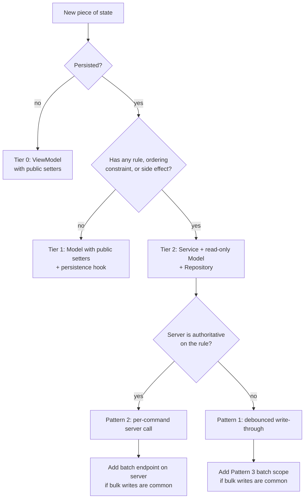
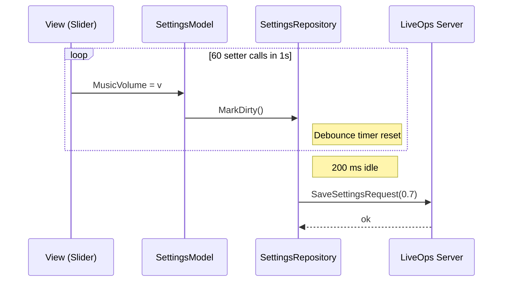
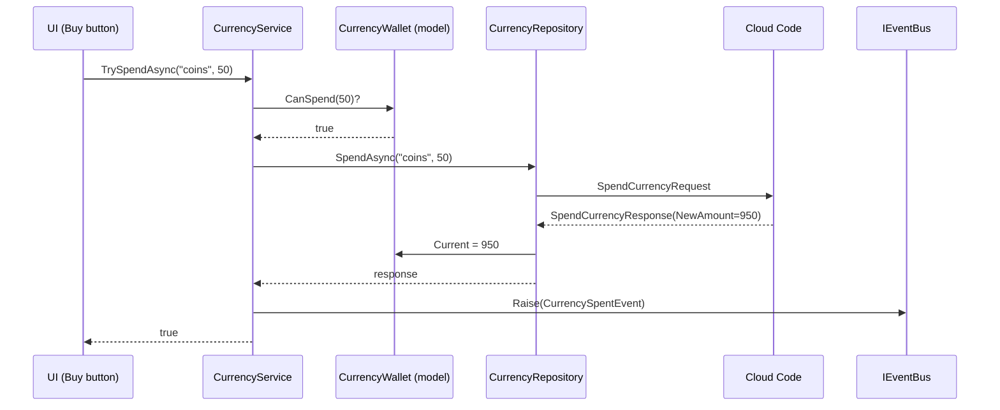
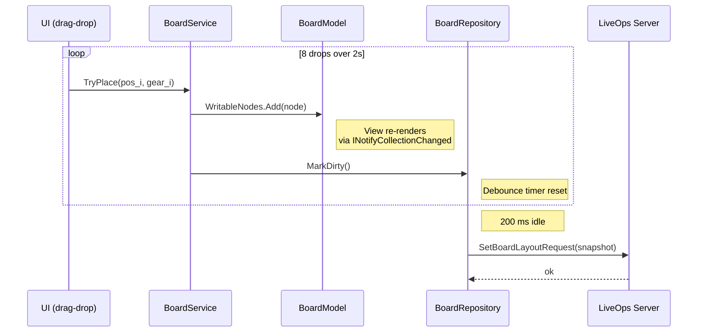
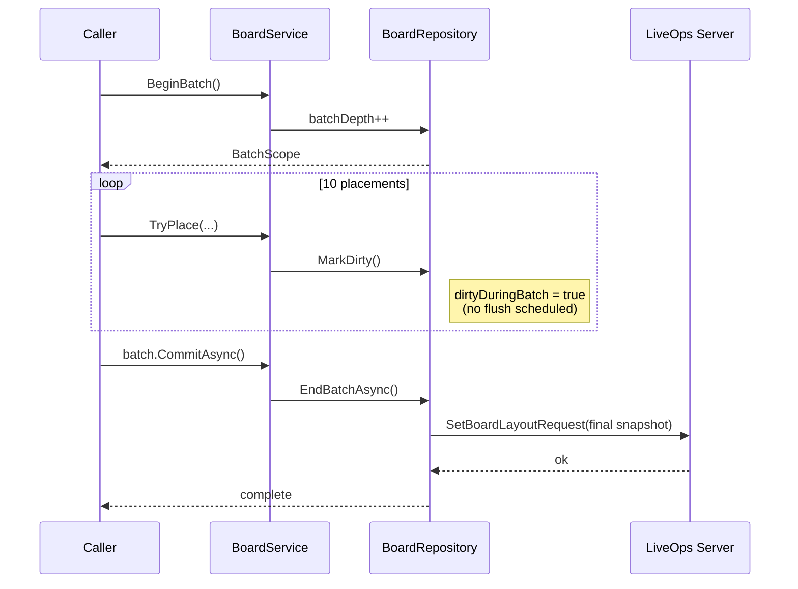
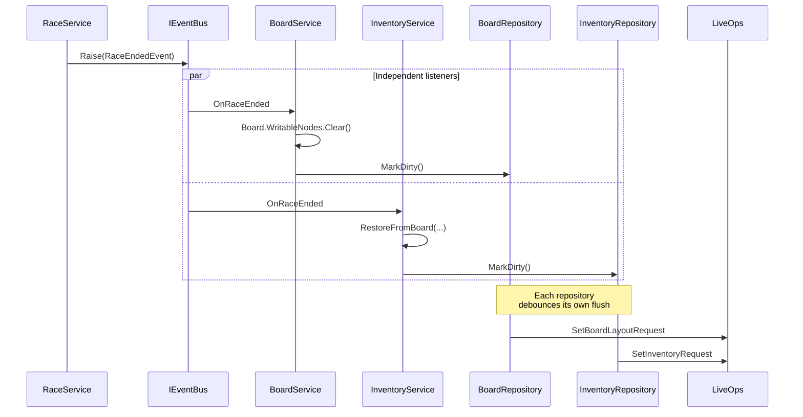
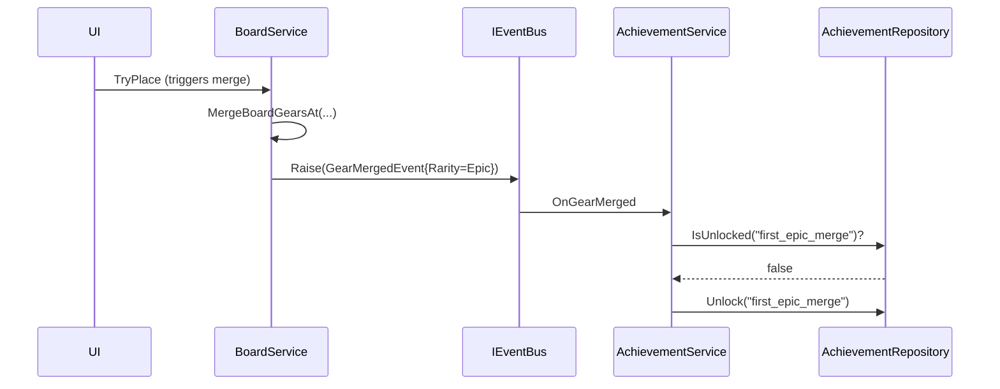
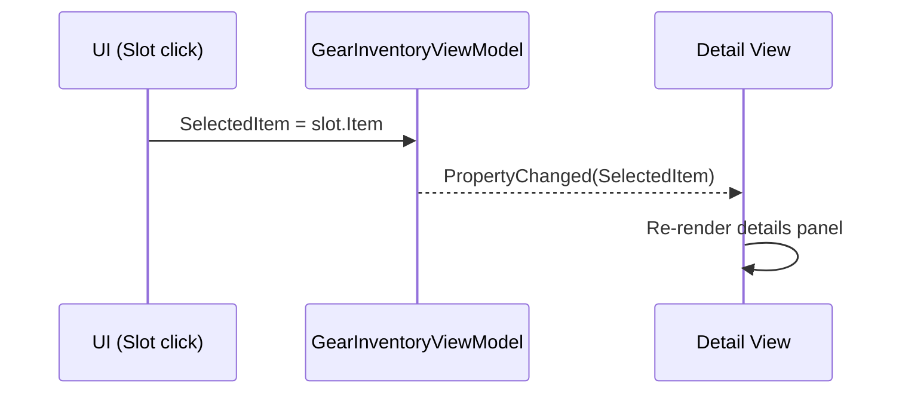
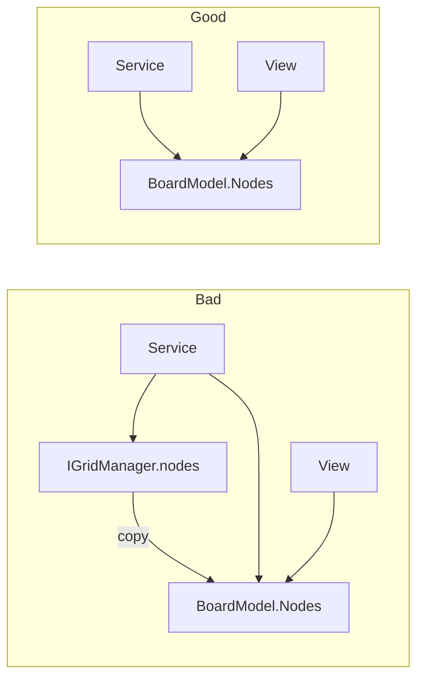
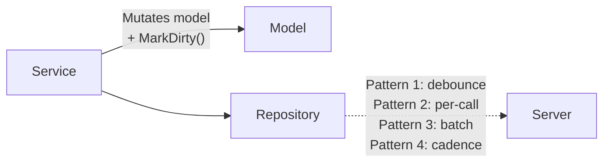

# State and Services Standard (AI-First)

## Why this standard exists

This repository keeps growing types that are partly model, partly service, and partly repository. The result is inconsistent shapes (`Save(thing)` vs `AddAsync(id, amount)`), parallel state representations (`BoardModel` + `IGridManager`), and per-instance C# events that duplicate observable models.

This document fixes that by defining:

- the three roles state can play (Model, Service, Repository) and the rules each must obey
- the three tiers of state and when to use each
- the four persistence patterns and how to choose
- the rule set that AI agents and humans must follow when introducing or refactoring stateful code
- worked good/bad examples drawn from the current codebase (`InventoryService`, `BoardService`, `CurrencyClientModule`, `InventoryClientModule`)

Every rule and every sample interaction in this document carries either a working code snippet or a mermaid sequence diagram (most carry both).

Keywords: services, models, repository, MVVM, observables, EventBus, batching, persistence, command pattern, unit of work, optimistic update, debounce.

---

## TL;DR

- **One canonical representation per piece of state.** No parallel models, no shadow copies, no `Sync`* methods.
- **Models are observable but externally read-only.** Writes happen through services or self-persisting setters; never through caller-supplied payload objects.
- **Services expose intent, not payloads.** `TryEquip(gearId, slot)`, never `Save(inventory)` or `Set(field, value)`.
- **Repositories own persistence shape.** Whether a write becomes 0, 1, or N network calls is a repository concern, not a caller concern.
- **EventBus for cross-system signals; observable models for state binding.** Per-instance `event Action` is the exception, not the default.
- **Three tiers of state:** Tier 0 local UI, Tier 1 self-persisting model, Tier 2 service-gated domain. Promote upward when rules appear.
- **Four persistence patterns:** write-through-coalesced, per-command server, explicit unit-of-work, cadence-based. Pick per service, not globally.

---

## Vocabulary

These three roles are non-overlapping. Every type that touches state must be exactly one of them.

### Model

State container. Observable. **No business rules**. Lives next to its owning service (or in a presentation namespace for Tier 0).

- May expose `[ObservableProperty]` fields and `ObservableCollection<T>`.
- External callers may **read**. Writes are restricted by tier (see below).
- May expose pure query helpers (`CanSpend`, `IsFull`) only when the helper has zero side effects and depends only on the model's own fields.

### Service

Command surface. Owns the rules. Stateless from the outside — the model is the state.

- Methods are named for intent: `TryEquip`, `Spend`, `Place`, `MergeAt`.
- Methods take **identifiers and primitives**, never whole domain objects.
- Returns `bool` / typed result for synchronous commands; returns `UniTask<TResponse>` for async commands.
- Exposes its model **read-only** (`InventoryModel Inventory { get; }` where setters on the model are `private`/`internal` or projected through `IReadOnlyList<T>`).
- Holds a private `IRepository` for persistence. Never opens a network call directly.

### Repository (a.k.a. ClientModule for LiveOps-backed state)

Transport and persistence. Translates between the in-memory model and whatever lives behind it (LiveOps, PlayerPrefs, save file).

- Knows about `ILiveOpsService.CallAsync`, `JsonUtility`, save files.
- Applies authoritative server snapshots back into the model.
- **Never accepts caller-supplied payloads of full domain objects.** Inputs are typed request DTOs that carry intent (`SetEquippedRequest(string[] ids)` is fine; `Save(InventoryModel m)` is not).
- Is injected into services, not into ViewModels.

### EventBus event

Cross-system notification. "X happened, with these consequences." Used by listeners that don't want to diff observable collections to infer a domain event.

- Published with `IEventBus.Raise(new GearDeletedEvent(pos, reward))`.
- Carries primitive payloads, not references to live model instances.
- Used for analytics, achievements, audio, popups, save-triggers in unrelated systems.

### Per-instance C# `event Action`

The exception. Allowed only when **all three** of:

1. The listener is the same ViewModel that issued the command, **and**
2. ordering matters (the listener must run before the next command), **and**
3. the signal cannot be inferred from the model.

If any of those three is false, use the EventBus or bind to the observable model.

---

## The eight rules

Numbered for reference in PRs and analyzer messages.

1. **One canonical representation.** Each piece of state has exactly one writable owner. Projections for views are fine; second writable copies are forbidden.
2. **Models are observable, never validating.** Validation, gating, and rule enforcement live in the service.
3. **Services expose intent, not payloads.** Commands take identifiers and primitives; never `Save(domainObject)` or `Set(field, value)`.
4. **Models are externally read-only above Tier 0.** Public mutators on Tier 1+ models are a violation.
5. **Repositories never accept caller-supplied domain payloads.** Inputs are typed intent DTOs.
6. **Cross-system notifications use `IEventBus`.** Per-instance `event Action` requires the three-condition justification above.
7. **Persistence shape is a repository concern.** Callers do not know whether a command becomes 0, 1, or N network calls.
8. **Tier 1 exists.** Persisted-but-ruleless state is a model with public setters and a persistence hook, not a service.

---

## The three tiers of state

State earns a tier based on **what kinds of writes it accepts**, not its size or field count.

### Tier 0 — Local observable (no service, no persistence)

- Selection, drag state, hover index, current tab, draft text, transient flags.
- A `ViewModel` with `[ObservableProperty]` and **public setters**.
- Written directly: `vm.SelectedItem = x`.

### Tier 1 — Self-persisting observable

- Persisted state with **no rules** beyond "store the value": settings flags, language preference, last-used loadout id, music volume.
- A `Model` with `[ObservableProperty]`, public setters, and a persistence hook (the model's `partial void OnXChanged` calls a debounced repository write).
- Written directly: `settings.MusicVolume = 0.7f`.

### Tier 2 — Service-gated domain

- State with **at least one** of: write rules, ordering constraints with other state, side effects beyond persistence (events, analytics, achievements).
- A `Service` exposing intent commands and a read-only `Model`. A `Repository` injected privately.
- Written through the service: `inventoryService.TryEquip(gearId, slot)`.

### Promotion rule

> A piece of state earns the next tier the moment any of (rule, ordering, side-effect) appears. Demotion is allowed when all three are removed.

The size of the model is irrelevant. A wallet with three fields can be Tier 2 because `CanSpend` is a rule. A 30-field settings object can be Tier 1 because none of its setters have any rule beyond persistence.

---

## The four persistence patterns

Pick per service. The caller never sees the pattern; only the repository does.


| #   | Pattern                      | When to use                                                                                                                                    | Cost                                              |
| --- | ---------------------------- | ---------------------------------------------------------------------------------------------------------------------------------------------- | ------------------------------------------------- |
| 1   | **Write-through, coalesced** | Single-blob state where intermediate states don't matter (inventory layout, board, settings). Default for Tier 1+2 client-authoritative state. | Loses per-change auditability on the server.      |
| 2   | **Per-command server**       | Server-authoritative transactions (currency, purchases, anti-cheat).                                                                           | One round-trip per command unless paired with #3. |
| 3   | **Explicit unit-of-work**    | Caller knows multiple writes are coming and wants atomicity (deserialization, scripted sequences, bulk operations).                            | Caller must remember to open the scope.           |
| 4   | **Cadence-based**            | High-frequency, low-stakes state (preferences, last-viewed).                                                                                   | Up to N seconds of writes can be lost on crash.   |


### Decision flow




---

## Sample interactions

Each interaction shows: the user-visible action, the tier/pattern that apply, working snippets of every layer involved, and a sequence diagram of the runtime flow.

### Interaction 1 — Player toggles music volume

- **Tier**: 1. Persisted, no rules.
- **Pattern**: 1 (debounced).
- **Why**: No rule, no validation. Caller writes directly. Caller does not think about persistence.

Model (Tier 1, public setter, persistence hook):

```csharp
public partial class SettingsModel : Model
{
    [ObservableProperty] private float musicVolume = 1.0f;

    private readonly ISettingsRepository repo;
    public SettingsModel(ISettingsRepository repo) => this.repo = repo;

    partial void OnMusicVolumeChanged(float value) => repo.MarkDirty();
}
```

Caller (View binds slider directly to the model):

```csharp
slider.onValueChanged.AddListener(v => settingsModel.MusicVolume = v);
```

Repository (debounced flush):

```csharp
public sealed class SettingsRepository : ISettingsRepository
{
    public void MarkDirty() => debounce.Schedule(FlushAsync);

    private async UniTask FlushAsync()
    {
        try { await liveOps.CallAsync(new SaveSettingsRequest(model.MusicVolume)); }
        catch (Exception ex) { Debug.LogError($"[SettingsRepository] Flush failed: {ex.Message}\n{ex.StackTrace}"); }
    }
}
```

Flow:




### Interaction 2 — Player spends 50 coins

- **Tier**: 2. Server-authoritative rule.
- **Pattern**: 2 (per-command).
- **Why**: Server owns the rule. One command = one transaction.

Service (owns the local guard, delegates the authoritative spend, raises the domain event):

```csharp
public sealed class CurrencyService : ICurrencyService
{
    public async UniTask<bool> TrySpendAsync(string id, long amount, CancellationToken ct = default)
    {
        try
        {
            if (string.IsNullOrEmpty(id)) throw new ArgumentException(nameof(id));
            if (amount <= 0) throw new ArgumentOutOfRangeException(nameof(amount));

            var wallet = repo.GetWallet(id);
            if (wallet == null || !wallet.CanSpend(amount)) return false;

            var response = await repo.SpendAsync(id, amount, ct);
            if (response?.Succeeded == true) eventBus.Raise(new CurrencySpentEvent(id, amount));
            return response?.Succeeded ?? false;
        }
        catch (Exception ex) when (ex is not OperationCanceledException)
        {
            Debug.LogError($"[CurrencyService] TrySpendAsync({id},{amount}) failed: {ex.Message}\n{ex.StackTrace}");
            return false;
        }
    }
}
```

Caller (purchase button):

```csharp
bool ok = await currencyService.TrySpendAsync("coins", 50, ct);
if (!ok) feedback.Show("Not enough coins");
```

Flow:




### Interaction 3 — Player rearranges 8 gears on the board in 2 seconds

- **Tier**: 2. Client-authoritative with rules (movability, merge, capacity).
- **Pattern**: 1 (debounced write-through).
- **Why**: Intermediate board states have no server meaning. Coalesce into one save.

Service (mutates canonical store, marks dirty, raises domain event):

```csharp
public bool TryPlace(Vector2Int pos, GearConfigData gear)
{
    try
    {
        if (gear == null) throw new ArgumentNullException(nameof(gear));
        if (!CanPlace(pos, gear)) return false;

        var node = nodeFactory.CreateNode(pos, gear);
        Board.WritableNodes.Add(node);
        repo.MarkDirty();
        eventBus.Raise(new GearPlacedEvent(pos, gear.Id));
        return true;
    }
    catch (Exception ex)
    {
        Debug.LogError($"[BoardService] TryPlace({pos},{gear?.Id}) failed: {ex.Message}\n{ex.StackTrace}");
        return false;
    }
}
```

Flow (8 rapid drops collapse into 1 save):




### Interaction 4 — Deserialize a saved loadout (10 gears at once)

- **Tier**: 2. Same service as Interaction 3.
- **Pattern**: 3 (explicit unit-of-work).
- **Why**: Caller knows the whole batch up front; explicit `Commit` is clearer and atomic.

Caller:

```csharp
public async UniTask LoadSavedLayoutAsync(SavedLayout saved, CancellationToken ct)
{
    using var batch = boardService.BeginBatch();
    foreach (var p in saved.Placements) boardService.TryPlace(p.Pos, p.Gear);
    await batch.CommitAsync(ct);
}
```

Repository (suppresses flush while a batch is open):

```csharp
public IDisposable BeginBatch()
{
    batchDepth++;
    return new BatchScope(this);
}

public void MarkDirty()
{
    if (batchDepth > 0) { dirtyDuringBatch = true; return; }
    debounce.Schedule(FlushAsync);
}

internal async UniTask EndBatchAsync(CancellationToken ct)
{
    batchDepth--;
    if (batchDepth == 0 && dirtyDuringBatch)
    {
        dirtyDuringBatch = false;
        await FlushAsync(ct);
    }
}
```

Flow:




### Interaction 5 — Race ends, board is cleared, gears return to inventory

- **Tier**: 2 across multiple services.
- **Pattern**: EventBus + Pattern 1 in each service.
- **Why**: Cross-system notification. Neither service knows about the other.

Producer:

```csharp
public void EndRace()
{
    raceModel.IsActive = false;
    eventBus.Raise(new RaceEndedEvent(raceModel.RaceId));
}
```

Listeners (each service is independent and registers at construction):

```csharp
public sealed class BoardService : IBoardService, IDisposable
{
    public BoardService(IEventBus eventBus, IBoardRepository repo, /* ... */)
    {
        this.repo = repo;
        raceEndedSub = eventBus.Subscribe<RaceEndedEvent>(OnRaceEnded);
    }

    private void OnRaceEnded(RaceEndedEvent _)
    {
        Board.WritableNodes.Clear();
        repo.MarkDirty();
    }

    public void Dispose() => raceEndedSub.Dispose();
}

public sealed class InventoryService : IInventoryService, IDisposable
{
    public InventoryService(IEventBus eventBus, IBoardService boardService, /* ... */)
    {
        raceEndedSub = eventBus.Subscribe<RaceEndedEvent>(_ => RestoreFromBoard(boardService.Board));
    }
}
```

Flow:




### Interaction 6 — Achievement system reacts to "first epic gear merged"

- **Tier**: 2. Cross-system listener.
- **Pattern**: EventBus.
- **Why**: Listener is in a different system; ordering does not matter; signal carries context (rarity) the model alone does not expose.

Producer (inside `BoardService.MergeBoardGearsAt` after a successful merge):

```csharp
eventBus.Raise(new GearMergedEvent(newNode.Position, newNode.ConfigData.Id, newNode.ConfigData.Rarity));
```

Listener:

```csharp
public sealed class AchievementService : IDisposable
{
    public AchievementService(IEventBus eventBus, IAchievementRepository repo)
    {
        this.repo = repo;
        sub = eventBus.Subscribe<GearMergedEvent>(OnGearMerged);
    }

    private void OnGearMerged(GearMergedEvent e)
    {
        if (e.Rarity == GearRarity.Epic && !repo.IsUnlocked("first_epic_merge"))
            repo.Unlock("first_epic_merge");
    }

    public void Dispose() => sub.Dispose();
}
```

Flow:




### Interaction 7 — UI selects an inventory item

- **Tier**: 0.
- **Pattern**: none.
- **Why**: Local, ephemeral, not persisted. No service involved.

ViewModel (Tier 0, public setter, no service):

```csharp
public partial class GearInventoryViewModel : ViewModel
{
    [ObservableProperty] private IItem selectedItem;
}
```

Caller (click handler):

```csharp
slotButton.onClick.AddListener(() => viewModel.SelectedItem = slot.Item);
```

Flow:




No service. No repository. No event bus. No persistence. This is the entire interaction.

---

## Good vs bad — one example per rule

### Rule 1 — One canonical representation

Bad (current `BoardService`): two parallel state stores kept in sync.

```csharp
private readonly IGridManager gridManager;
private readonly BoardModel boardModel;

private void SyncBoardModel(bool publishLayoutChanged = true)
{
    boardModel.Nodes.Clear();
    foreach (IGridNode node in gridManager.GetAllNodes()) boardModel.Nodes.Add(node);
    boardModel.IsSimulationRunning = gridManager.IsRunning;
    if (publishLayoutChanged) BoardLayoutChanged?.Invoke();
}
```

Good: collapse to one store. `BoardModel.Nodes` is the canonical observable collection; the grid manager either owns it directly or is reduced to a stateless query helper.

```csharp
public sealed class BoardService : IBoardService
{
    public BoardModel Board { get; }

    public bool TryPlace(Vector2Int pos, GearConfigData data)
    {
        if (!CanPlace(pos, data)) return false;
        Board.WritableNodes.Add(nodeFactory.CreateNode(pos, data));
        return true;
    }
}
```

No `Sync*` method exists because there is nothing to sync.




### Rule 2 — Models do not validate

Bad: validation logic on the model.

```csharp
public sealed class CurrencyWallet
{
    public bool TrySpend(long amount)
    {
        if (Current - amount < (Min ?? 0)) return false;
        Current -= amount;
        return true;
    }
}
```

Good: the model exposes a pure query; the service owns the rule.

```csharp
public sealed class CurrencyWallet
{
    public long Current { get; internal set; }
    public long? Min { get; internal set; }
    public bool CanSpend(long amount) => amount > 0 && Current - amount >= (Min ?? 0);
}

public sealed class CurrencyService
{
    public async UniTask<bool> TrySpendAsync(string id, long amount, CancellationToken ct)
    {
        var wallet = repo.GetWallet(id);
        if (wallet == null || !wallet.CanSpend(amount)) return false;
        var response = await repo.SpendAsync(id, amount, ct);
        return response?.Succeeded ?? false;
    }
}
```

### Rule 3 — Intent, not payload

Bad (current `InventoryClientModule.PersistOwnedGearFromRaceInventory`): caller hands over a snapshot the module then ships verbatim.

```csharp
public void PersistOwnedGearFromRaceInventory(IRaceInventoryService raceInventory)
{
    List<string> ids = SnapshotGearIds(raceInventory);
    if (data != null) data.GearIds = new List<string>(ids);
    _ = SendInventoryAsync(ids);
}
```

Good: typed intent commands; the module computes the resulting payload itself.

```csharp
public sealed class OwnedGearService
{
    public async UniTask<bool> EquipAsync(string gearId, CancellationToken ct = default)
    {
        if (string.IsNullOrEmpty(gearId)) throw new ArgumentException(nameof(gearId));
        var response = await liveOps.CallAsync(new EquipGearRequest(gearId), ct);
        repo.ApplyServerSnapshot(response);
        return response?.Succeeded ?? false;
    }

    public async UniTask<bool> UnequipAsync(string gearId, CancellationToken ct = default)
    {
        if (string.IsNullOrEmpty(gearId)) throw new ArgumentException(nameof(gearId));
        var response = await liveOps.CallAsync(new UnequipGearRequest(gearId), ct);
        repo.ApplyServerSnapshot(response);
        return response?.Succeeded ?? false;
    }
}
```

The wire payload is `{ gearId }`, not the full inventory. A tampered client cannot ship `{ gearIds: [everything in the catalog] }`.

### Rule 4 — Read-only above Tier 0

Bad: Tier 2 model with a public mutator.

```csharp
public partial class InventoryModel : Model
{
    [ObservableProperty]
    private ObservableCollection<IItem> items = new();
}
```

`model.Items.Add(x)` works from anywhere — bypassing capacity, persistence, and the observable contract.

Good: collection exposed read-only; the writable handle is private to the service.

```csharp
public partial class InventoryModel : Model
{
    private readonly ObservableCollection<IItem> items = new();
    public ReadOnlyObservableCollection<IItem> Items { get; }
    internal IList<IItem> WritableItems => items;

    public InventoryModel() => Items = new ReadOnlyObservableCollection<IItem>(items);
}
```

The View still binds to `Items` for change notifications. Only the service can mutate.

### Rule 5 — Repositories take intent DTOs

Bad:

```csharp
public Task SaveInventoryAsync(InventoryModel model)
    => liveOps.CallAsync(new SetInventoryRequest(model.Items.Select(i => i.Id).ToArray()));
```

Good:

```csharp
public Task EquipAsync(string gearId, CancellationToken ct)
    => liveOps.CallAsync(new EquipGearRequest(gearId), ct);
```

### Rule 6 — EventBus over instance events

Bad (current `BoardService` and `InventoryService`):

```csharp
public event Action<IGridNode> GearPlaced;
public event Action<IGridNode> GearRemoved;
public event Action BoardLayoutChanged;
public event Action ItemsChanged;
```

Three problems: every consumer must subscribe and unsubscribe; events leak live model instances; `BoardLayoutChanged` and `ItemsChanged` duplicate the observable collection.

Good:

```csharp
boardViewModel.Board.Nodes
eventBus.Raise(new GearPlacedEvent(node.Position, node.ConfigData.Id));
eventBus.Raise(new GearRemovedEvent(node.Position, node.ConfigData.Id));
```

`BoardLayoutChanged` and `ItemsChanged` cease to exist.

### Rule 7 — Persistence is a repository concern

Bad: the service decides whether to call the network.

```csharp
public bool TryEquip(string id)
{
    model.Items.Add(catalog.Get(id));
    _ = liveOps.CallAsync(new SetInventoryRequest(...));
    return true;
}
```

Good: the service mutates the model and informs the repository it is dirty. The repository chooses the pattern.

```csharp
public bool TryEquip(string id)
{
    if (!model.CanFit) return false;
    model.WritableItems.Add(catalog.Get(id));
    repo.MarkDirty();
    return true;
}
```




### Rule 8 — Tier 1 is a real option

Bad: ceremony for a flag.

```csharp
public interface ITutorialService { bool HasSeenIntro { get; } void MarkSeenIntro(); }
public sealed class TutorialService : ITutorialService { /* full S/R/M wrapping */ }
```

Good: Tier 1 model with a persistence hook.

```csharp
public partial class TutorialModel : Model
{
    [ObservableProperty] private bool hasSeenIntro;
    private readonly ITutorialRepository repo;
    public TutorialModel(ITutorialRepository repo) => this.repo = repo;
    partial void OnHasSeenIntroChanged(bool value) => repo.MarkDirty();
}
```

`tutorialModel.HasSeenIntro = true` writes through a debounced save. No service exists because no rule exists.

---

## Smell catalog (current code → fix)


| Call site                                                                  | Smell                                                      | Rule violated | Fix                                                                                                                         |
| -------------------------------------------------------------------------- | ---------------------------------------------------------- | ------------- | --------------------------------------------------------------------------------------------------------------------------- |
| `BoardService.SyncBoardModel`                                              | Two state stores kept in agreement                         | 1             | Collapse `IGridManager` and `BoardModel` into one canonical store.                                                          |
| `BoardService.GearPlaced/GearRemoved/BoardLayoutChanged`                   | Per-instance events; two duplicate the observable model    | 6             | Move to `IEventBus` (`GearPlacedEvent`, `GearRemovedEvent`); delete `BoardLayoutChanged` (consumers bind to `Board.Nodes`). |
| `InventoryService.ItemsChanged`                                            | Duplicates `ObservableCollection<IItem>.CollectionChanged` | 6             | Delete; consumers bind to `InventoryModel.Items`.                                                                           |
| `InventoryModel.Items` (public `ObservableCollection`)                     | Externally writable Tier 2 model                           | 4             | Expose `ReadOnlyObservableCollection<IItem>`; keep writable handle internal.                                                |
| `InventoryClientModule.PersistOwnedGearFromRaceInventory`                  | Caller-supplied domain payload                             | 3, 5          | Replace with `EquipAsync(gearId)` / `UnequipAsync(gearId)` typed intents on a real `OwnedGearService`.                      |
| `InventoryClientModule.SnapshotGearIds`                                    | Snapshot exists because state lives in two places          | 1             | Remove once Rule 1 is applied to owned gear.                                                                                |
| `BoardService` does its own dirty-tracking implicitly via `SyncBoardModel` | No clean persistence seam                                  | 7             | Introduce `IBoardRepository.MarkDirty()` with a debounce.                                                                   |


---

## Naming conventions

- Service interface: `I<Domain>Service` (`IInventoryService`, `ICurrencyService`, `IBoardService`).
- Service implementation: `<Domain>Service`.
- Model: `<Domain>Model`. One per service.
- Repository interface: `I<Domain>Repository`. LiveOps repos may keep the historical name `<Domain>ClientModule` when they extend `GameClientModuleBase<T>`, but they must implement `I<Domain>Repository` so the service depends on the abstraction.
- EventBus events: `<Domain><PastTenseVerb>Event` (`GearPlacedEvent`, `CurrencySpentEvent`).
- Command DTOs: `<Verb><Domain>Request` / `<Verb><Domain>Response` (`EquipGearRequest`, `SpendCurrencyResponse`).
- Batch scope: `IDisposable` returned by `BeginBatch()`; `CommitAsync()` flushes.

---

## Change checklist for AI agents

When creating or modifying a stateful type, verify in order:

1. Identify the **tier** (0, 1, or 2). If unsure, default to Tier 2.
2. If Tier 2, confirm the **canonical representation** is the model and nothing else holds a parallel writable copy.
3. Confirm the model is **externally read-only** (collections wrapped, fields with `internal`/`private` setters).
4. Confirm service methods take **identifiers and primitives**, not domain objects.
5. Confirm the **repository never accepts caller-supplied domain payloads**.
6. Choose a **persistence pattern** (1, 2, 3, 4) and document it in the service's XML doc comment.
7. Replace any `event Action` with **EventBus events** unless the three-condition exception is documented.
8. Add a unit test that asserts: (a) a write through the service updates the model, (b) the repository is asked to persist, (c) the EventBus receives the expected event.
9. Run `.agents/scripts/validate-changes.cmd`.

---

## AI Agent Context

- **Invariants**:
  - Rule 1 through Rule 8 are non-negotiable. Violations require an explicit waiver comment with `// WAIVER: <rule-number> — <reason>` and an issue link.
  - Tier 2 models never expose public setters on domain fields.
  - LiveOps repositories never expose `Save(T)` style methods.
- **Allowed Dependencies**:
  - Service → Model, Repository, `IEventBus`, catalog/config SOs.
  - Repository → `ILiveOpsService`, persistence APIs, request/response DTOs.
  - ViewModel → Service, Model (read-only).
- **Forbidden Dependencies**:
  - ViewModel → Repository directly.
  - Repository → Service (no upward calls).
  - Model → Service or Repository.
- **Change Checklist**: see "Change checklist for AI agents" above.
- **Known Tricky Areas**:
  - `BoardService` currently mixes service and repository concerns and keeps a parallel `IGridManager` store. Refactor requires collapsing the dual representation before splitting the repository out.
  - `InventoryClientModule` currently doubles as `IOwnedGearInventoryService`. Splitting requires introducing typed `EquipGearRequest` / `UnequipGearRequest` server endpoints.

---

## Migration notes for current code

Apply in this order to minimize churn.

1. `**InventoryService` (race inventory)**
  - Wrap `InventoryModel.Items` in `ReadOnlyObservableCollection<IItem>`; move the writable handle to `internal`.
  - Delete `event Action ItemsChanged`. Update `GearInventoryViewModel.OnAvailableItemsChanged` to keep binding to `InventoryModel.Items.CollectionChanged` (already does).
2. `**BoardService`**
  - Choose: `BoardModel` owns the collection (preferred) or `IGridManager` does. Delete the loser.
  - Delete `SyncBoardModel`. Replace internal calls with direct mutations on the canonical store.
  - Delete `event Action BoardLayoutChanged`. Update `BoardViewComponent` to bind to `BoardModel.Nodes`.
  - Move `GearPlaced` / `GearRemoved` to `IEventBus` (`GearPlacedEvent { Vector2Int Position, string GearId }`).
3. `**InventoryClientModule` → `OwnedGearService` + `OwnedGearRepository`**
  - Introduce `EquipGearRequest(string gearId)` and `UnequipGearRequest(string gearId)` typed DTOs and matching server handlers.
  - Move `IOwnedGearInventoryService` implementation off the `*ClientModule`. The `*ClientModule` becomes `OwnedGearRepository` and only does `Initialize`/`ApplyServerSnapshot`.
  - Delete `PersistOwnedGearFromRaceInventory` and `SnapshotGearIds`. Callers invoke `ownedGearService.EquipAsync(id)` / `UnequipAsync(id)` directly.
4. `**CurrencyClientModule` → `CurrencyService` + `CurrencyRepository`**
  - Rename `CurrencyClientModule` to `CurrencyRepository`. It already follows Pattern 2 cleanly.
  - Add a thin `CurrencyService` that owns the `CanSpend` rule and raises `CurrencySpentEvent` / `CurrencyAddedEvent` on the EventBus after a successful response.
5. **Settings / preferences (when introduced)**
  - Tier 1 with a persistence hook (`partial void OnXChanged` calling `repo.MarkDirty()`). No service.

Each step ships independently with regression tests per `AGENTS.md` rule 10.

---

## Related

- `[AGENTS.md](../../AGENTS.md)` — primary agent operating policy.
- `[Architecture.md](../../Architecture.md)` — module boundaries and runtime flows.
- `[Docs/Infra/MVVM.md](../Infra/MVVM.md)` — `ViewModel` / `Model` base types and `[ObservableProperty]` source generator.
- `[Docs/Infra/Events.md](../Infra/Events.md)` — `IEventBus` contract and event conventions.
- `[Docs/LiveOps/NewApiAndServices.md](../LiveOps/NewApiAndServices.md)` — how to add typed request/response DTOs and Cloud Code handlers.
- `[Docs/LiveOps/Currency.md](../LiveOps/Currency.md)` — canonical Pattern 2 example.
- `[Docs/LiveOps/Inventory.md](../LiveOps/Inventory.md)` — current owned-gear flow (target of migration step 3).

## Changelog

- 2026-04-20 — Initial standard. Defines Model/Service/Repository roles, eight rules, three tiers, four persistence patterns, sample interactions with snippets and sequence diagrams, good/bad examples per rule, smell catalog, and migration notes for `InventoryService`, `BoardService`, `InventoryClientModule`, and `CurrencyClientModule`.

