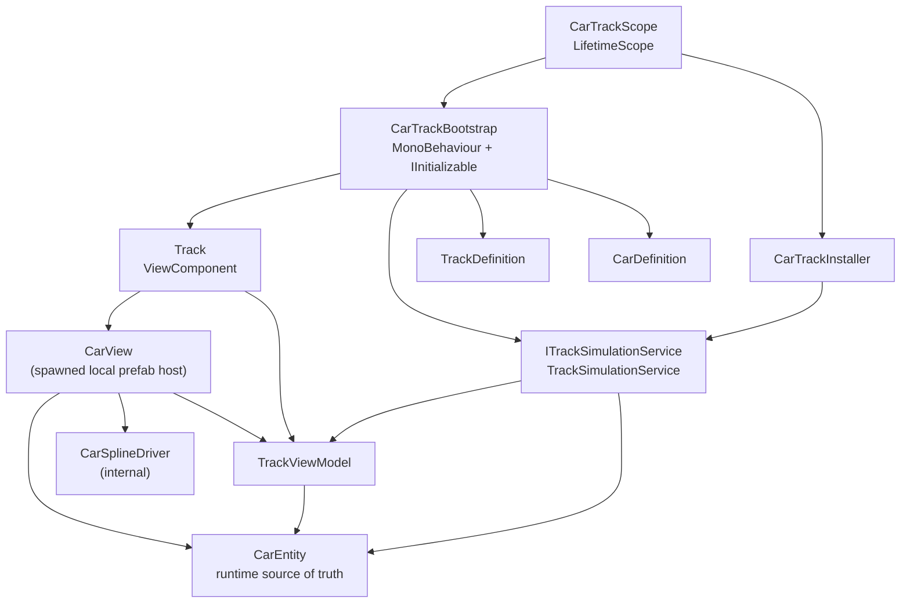
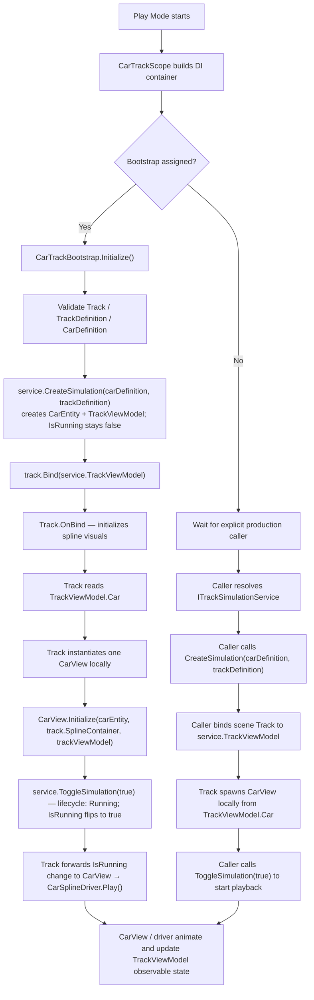

# Car Simulation — Decouple Track Scene Wiring and Runtime Car Ownership

This ExecPlan is a living document. The sections `Progress`, `Surprises & Discoveries`,
`Decision Log`, and `Outcomes & Retrospective` must be kept up to date as work proceeds.

Repository planning rules live at `PLANS.md`. This document must be maintained in
accordance with `PLANS.md`.

---

## Purpose / Big Picture

`CarTrackScope`, `CarTrackBootstrap`, `Track`, the current prefab-host `CarEntity`, and
`CarSplineDriver` currently mix five responsibilities in one startup path:

- dependency registration
- test-scene auto-start behavior
- scene-object wiring
- runtime car creation
- simulation startup and playback

That makes the current test scene work, but it couples the feature to container-owned
scene references and to a prefab-born runtime car. It also makes the public surface wider
than necessary because scene infrastructure and shared runtime state are not clearly
separated.

This plan reshapes Car Simulation to follow the same successful pattern used by Gear
Engine while further reducing public/shared surface area:

- installer registers services only
- scope becomes a thin container host plus bootstrap reference
- bootstrap remains a thin test-scene auto-trigger
- `TrackViewModel` becomes the only public/shared ViewModel for this feature
- `CarEntity` becomes the shared runtime source of truth
- prefab spawning becomes a view concern owned by `Track` / `CarView`
- `CarSplineDriver` becomes internal view infrastructure, not a service contract
- non-test scenes can initialize the same feature path explicitly by calling the same
  service

After this plan:

- `CarTrackInstaller` owns service registration. `CarTrackScope` no longer registers
  `CarDefinition`, `TrackDefinition`, or `Track`.
- `CarTrackBootstrap` becomes a scene `MonoBehaviour` that also implements
  `IInitializable`. It remains the test-scene auto-trigger, but no longer contains core
  simulation logic.
- `Track` becomes a `ViewComponent<TrackViewModel>` that owns only its local presentation
  concerns. It does not call `GetComponentInParent`.
- `TrackViewModel` becomes the sole public/shared ViewModel for the feature. It inherits
  `ViewModel`, holds the active `CarEntity`, and exposes simulation and runtime state
  through observable properties.
- `CarEntity` becomes the runtime source of truth and is created from `CarDefinition` by
  the service or external flow. It is shared with any interested ViewModel or service.
- the current prefab-host `CarEntity : EntityComponent<CarDefinition>` is renamed to
  `CarView`
- `Track` inherits `ViewComponent<TrackViewModel>`, owns local `CarView` prefab
  instantiation, and binds through the standard MVVM bind API
- `CarView` becomes the prefab-side composition root: it owns the visual host lifecycle
  and delegates spline-driving behavior to `CarSplineDriver`
- `CarSplineDriver` no longer auto-plays on `Start()`. Start/stop becomes explicit.
- `TrackSimulationService` is intentionally engine-facing because it creates runtime
  `CarEntity` instances (via **`Scaffold.Entities` runtime factory APIs**), but it does not
  accept scene views from DI and does not spawn prefab views until `Track` binds and
  materializes them.
- the service exposes three control entry points with clear separation:
  - `CreateSimulation(CarDefinition, TrackDefinition)` — creates runtime `CarEntity` and
    `TrackViewModel`; does not start playback
  - `ToggleSimulation(bool)` — starts or temporarily pauses the running simulation
  - `CompleteSimulation()` — ends the simulation and sets `IsRunning` to `false`
- the same initialization path supports both:
  - a fully decoupled test scene with auto-start
  - a production scene where another system explicitly starts the simulation

The intended mental model is:

1. `CarDefinition` and `TrackDefinition` are setup inputs.
2. Services create and own runtime feature state.
3. `CarEntity` is the shared runtime source of truth.
4. `TrackViewModel` follows the Gear Engine MVVM pattern: it inherits `ViewModel` and
   exposes state through observable properties.
5. Scene views bind explicitly and own only local visuals.
6. Bootstrap only wires a test scene together.

---

## Progress

- [x] M1 — Lock current passing behavior and note failing regressions
- [x] M2 — Introduce runtime `CarEntity` and `TrackViewModel`; rename prefab host to `CarView`
- [x] M3 — Make `Track` self-sufficient and bindable
- [x] M4 — Refactor `CarView` / `CarSplineDriver` into explicit internal view infrastructure
- [x] M5 — Introduce `ITrackSimulationService` / `TrackSimulationService`
- [x] M6 — Extract `CarTrackInstaller` and slim `CarTrackScope`
- [x] M7 — Convert `CarTrackBootstrap` into a thin scene launcher
- [x] M8 — Update the test scene setup tool and hierarchy wiring
- [x] M9 — Add docs and finish validation

---

## Surprises & Discoveries

- `Track` already separates logical spline copy from visual rebuild reasonably well. The
  biggest structural problem is not the math; it is the hidden scene dependency in
  `GetComponentInParent<SplineExtrude>()`.
- `CarSplineDriver` already owns speed subscription and spline animation setup. The
  missing piece is lifecycle control: it auto-plays immediately on `Start()`.
- `CarTrackBootstrap` is not itself the problem. Its `IInitializable` role is desirable
  for the test scene. The problem is that it currently contains all simulation startup
  logic instead of delegating to reusable service and bind flows.
- the recently expanded `Scaffold.Entities` package explicitly supports a serializable
  entity instance plus an optional MonoBehaviour host. Car Simulation should use that
  split instead of forcing runtime truth to live only on the prefab host.

---

## Decision Log

- **Decision:** Keep `CarTrackBootstrap` as the test-scene auto-trigger, but convert it
  from a plain C# type into a scene `MonoBehaviour` that also implements
  `IInitializable`.
  **Rationale:** The test scene needs serialized references to `Track`,
  `TrackDefinition`, and `CarDefinition`, and it also needs automatic startup. A scene
  component with `IInitializable` satisfies both needs while keeping the bootstrap thin.
  `CarTrackScope` must register the component and expose its implemented interfaces so the
  `Initialize()` callback is invoked by VContainer.
  **Author:** this plan

- **Decision:** Extract `CarTrackInstaller` from `CarTrackScope`.
  **Rationale:** Scope should not double as the feature installer. The installer becomes
  the single place that registers services, while the scope becomes a thin host that
  calls the installer and optionally registers the bootstrap.
  **Author:** this plan

- **Decision:** `CarTrackScope` owns only the bootstrap scene component; everything else
  feature-specific belongs in `CarTrackInstaller`.
  **Rationale:** This is the clean ownership line for the refactor. The scope hosts the
  container and the bootstrap reference. The installer registers all non-bootstrap feature
  services. No other Car Simulation data or scene references belong on the scope.
  **Author:** this plan

- **Decision:** Remove `Track`, `CarDefinition`, and `TrackDefinition` from scope-owned DI
  registration.
  **Rationale:** `Track` is a scene presentation element. `CarDefinition` and
  `TrackDefinition` are startup data assets. None of these should be globally registered
  by the scope. They belong in the test-scene host or in the production caller.
  **Author:** this plan

- **Decision:** `Track` becomes a `ViewComponent<TrackViewModel>` rather than a DI-managed
  object.
  **Rationale:** The real MVVM pattern used in Gear Engine is `ViewModel` plus
  `ViewComponent<TViewModel>` binding with observable properties. This plan should mirror
  that pattern instead of inventing a separate binding style for track presentation.
  **Author:** this plan

- **Decision:** No public/shared `CarViewModel` is required for this plan.
  **Rationale:** `CarEntity` is the correct shared runtime object for the current scope.
  A separate public `CarViewModel` would widen the feature surface and duplicate state.
  If track presentation or another feature needs child view models later, they can be
  added intentionally without this plan blocking that future evolution.
  **Author:** this plan

- **Decision:** `TrackViewModel` is the only public/shared ViewModel in this feature, and
  it inherits `ViewModel`.
  **Rationale:** External callers should depend on one track-facing VM plus the shared
  `CarEntity`. This keeps the public API narrow and makes track presentation the owner of
  any future child VMs that exist only for rendering concerns. Using the same `ViewModel`
  base class and observable-property style as Gear Engine keeps this feature aligned with
  existing repo conventions.
  **Author:** this plan

- **Decision:** `CarEntity` becomes the shared runtime source of truth.
  **Rationale:** `CarDefinition` is setup input only. Services and other features should
  share the active runtime car through a serializable entity instance, not through a
  prefab host or a presentation VM.
  **Author:** this plan

- **Decision:** Rename the current prefab-host `CarEntity : EntityComponent<CarDefinition>`
  to `CarView`.
  **Rationale:** The current name conflates the runtime entity with the view host. After
  this refactor, `CarEntity` means the runtime entity instance and `CarView` means the
  prefab-side MonoBehaviour host.
  **Author:** this plan

- **Decision:** `Track` owns local `CarView` prefab instantiation.
  **Rationale:** The prefab matters only to track presentation. The service should create
  runtime `CarEntity` data; the view should materialize local visuals from that data.
  `Track` therefore owns the one active `CarView` instance and initializes it from
  `TrackViewModel.Car`.
  **Author:** this plan

- **Decision:** `CarView` and `CarSplineDriver` have separate responsibilities.
  **Rationale:** `CarView` is the prefab-facing composition root. It knows how to connect
  a runtime `CarEntity`, the `TrackViewModel`, and the local Unity components on the
  prefab. `CarSplineDriver` is a lower-level implementation detail focused only on
  movement and spline animation. This keeps `CarView` meaningful and prevents the driver
  from becoming a quasi-public feature surface.
  **Author:** this plan

- **Decision:** `CarSplineDriver` is view infrastructure, not a feature entry point.
  **Rationale:** No service contract or external caller should know about the spline
  driver. It exists only to animate the local `CarView` on the current track.
  **Author:** this plan

- **Decision:** `CarSplineDriver` initialization must be safe before Unity `Start()` runs.
  **Rationale:** A newly spawned `CarView` may initialize its driver immediately after
  instantiation, before Unity invokes `Start()`. Therefore, all required setup for
  binding and attribute subscription must happen in `Bind()` or in an idempotent helper
  invoked by `Bind()`, not in `Start()`.
  **Author:** this plan

- **Decision:** `CarSplineDriver` playback becomes explicit.
  **Rationale:** Automatic playback in `Start()` makes the spawned car uncontrollable by
  callers and prevents a real pause/start contract. Explicit playback makes test and
  production flows predictable.
  **Author:** this plan

- **Decision:** Simulation control state and reported runtime/view state both live on
  `TrackViewModel` as observable properties.
  **Rationale:** Control state such as start/pause/stop should be owned by the service and
  exposed on the ViewModel. Runtime state produced by track presentation should also live
  on that same ViewModel so the VM remains the single observable state surface.
  **Author:** this plan

- **Decision:** Track hierarchy becomes flat and self-owned.
  **Rationale:** `Track` should only look for components on itself. If visual spline
  support is needed, the required `SplineExtrude` must be on the same GameObject. Scene
  hierarchy should not be part of the runtime API.
  **Author:** this plan

- **Decision:** `ITrackSimulationService` separates `CreateSimulation` from `ToggleSimulation`.
  **Rationale:** Combining creation and playback start in a single method (`StartSimulation`)
  caused a race condition: `IsRunning` would flip to `true` before `Track.Bind` had a
  chance to run and materialize `CarView`. Splitting into `CreateSimulation` (setup only,
  no state change) and `ToggleSimulation(true)` (explicit start) lets the bootstrap follow
  the safe order: create → bind → start.
  **Author:** this plan

- **Decision:** `TrackViewModel` does not expose `IsPaused`. Only `IsRunning` is needed.
  **Rationale:** A paused simulation is modelled as `IsRunning = false`. Having a separate
  `IsPaused` flag introduces ambiguous state combinations (e.g. both false, or both true)
  with no benefit for the current scope. If the product eventually needs a distinct paused
  state that differs from a not-yet-started state, that can be added with a clear contract
  at that point.
  **Author:** this plan

- **Decision:** Richer lifecycle state lives inside `TrackSimulationService` as an internal
  enum state machine, not on `TrackViewModel`.
  **Rationale:** The feature needs to distinguish at least `Created`, `Running`, `Paused`,
  and `Completed`, but the current public/shared view surface only needs one reactive flag:
  `TrackViewModel.IsRunning`. Keeping the full lifecycle internal to the service preserves a
  small MVVM surface while still allowing strict rules such as "paused can resume" and
  "completed cannot resume."
  **Author:** this plan

- **Decision:** `CarFactory.cs` is deleted. Responsibilities are split between the service
  and the view.
  **Rationale:** `CarFactory` currently mixes two concerns: instantiating the car prefab (a
  view concern) and creating the runtime `CarEntity` on that object (a service concern).
  After this refactor `CarEntity` is a pure C# `EntityInstance<CarDefinition>` created
  **without** a `GameObject`. Runtime entity creation MUST go through the
  **`Scaffold.Entities` package factory API** for `EntityInstance<TDefinition>` (see the
  installed package for the exact static method name — it replaces ad-hoc `new
  CarEntity(...)` and must not use `CreateOnGameObject` unless intentionally attaching to a
  host). Prefab instantiation for visuals uses `CarDefinition.CarPrefab` only inside
  `Track` / `CarView`. A game-level `CarFactory` that does both is no longer correct.
  **Author:** this plan

- **Decision:** `TrackSimulationService.CreateSimulation(...)` is the canonical place that
  invokes the Scaffold runtime entity factory, unless an entry point explicitly passes an
  already-created `CarEntity` (optional future overload for bootstrap/tests).
  **Rationale:** Bootstrap and production can both call `CreateSimulation(CarDefinition,
  TrackDefinition)` and receive a consistent VM + entity graph. If a caller needs to
  construct the `CarEntity` earlier (e.g. tests), it may use the same package factory and
  then call an overload such as `CreateSimulation(CarEntity, TrackDefinition)` — document
  that at implementation time if needed. The important rule is: **no** inline `new
  CarEntity(...)` without matching the package contract.
  **Author:** this plan

- **Decision:** `CarSplineDriver` reads movement and attribute data only from `CarEntity`
  (and Unity scene components it needs, e.g. spline). It does **not** take or read
  `TrackViewModel`. UI mirrors on `TrackViewModel` are updated by the ViewModel (or
  `CarView`) subscribing to entity attributes, not by the driver.
  **Rationale:** Keeps the driver a pure movement layer; the VM remains optional for
  display and framework binding, not a data source for physics/spline driving.
  **Author:** this plan

- **Decision:** ViewModel and view mutation rules for this feature.
  **Rationale:** Aligns with Gear-style MVVM and avoids views poking generated setters.
  Rules:
  - `TrackViewModel` exposes observable properties that are **not** publicly settable from
    outside (generated `[ObservableProperty]` with internal/private setters, or service-only
    methods such as `SetRunning`).
  - `TrackViewModel` may **subscribe** to `CarEntity` / attributes internally to update its
    exposed observables (e.g. `CurrentSpeed` mirrors for UI).
  - Views may **read** VM and entity data and may **call public methods** on the ViewModel
    to request changes; they must not assign observable properties directly.
  **Author:** this plan

- **Decision:** The car visual prefab is always resolved from **`CarDefinition.CarPrefab`**
  (see `Assets/Scripts/Game/CarSimulation/Definitions/CarDefinition.cs`). `Track` spawns
  `CarView` by instantiating that prefab when materializing the car for the current run.
  **Rationale:** Single source of truth for which prefab the track uses; matches existing
  project assets.
  **Author:** this plan

- **Decision:** `CarView` is purely reactive. No external caller invokes playback on it directly.
  **Rationale:** Allowing the service or bootstrap to call `CarView` playback methods
  directly would bypass the ViewModel and create a second control path. The correct flow
  is: the service changes simulation state; `TrackViewModel` exposes the reactive state
  needed by views; `Track` receives the framework binding callback for `IsRunning` and
  forwards that state to the locally owned `CarView`; `CarView` drives
  `CarSplineDriver`. `CarView` stays invisible above the scene-presentation layer and
  never becomes part of the feature API.
  **Author:** this plan

- **Decision:** `Track` follows the framework-driven `ViewComponent<TrackViewModel>` pattern.
  **Rationale:** `Track` should use the standard framework `Bind(TrackViewModel)` entry
  point and `OnBind()` lifecycle rather than introducing a custom feature-specific binding
  model. It owns spawning and cleanup of local presentation objects such as `CarView`, and
  forwards `IsRunning` changes to `CarView` explicitly. `CarView` does not independently
  subscribe to the public/shared ViewModel for playback control.
  **Author:** this plan

- **Decision:** New service files live under `Assets/Scripts/Game/CarSimulation/Services/`,
  new ViewModel files live under `Assets/Scripts/Game/CarSimulation/Presentation/`, and
  the view host for the prefab lives under presentation as `CarView`.
  **Rationale:** This keeps folder ownership consistent and avoids scattering feature
  types at the assembly root.
  **Author:** this plan

---

## Outcomes & Retrospective

- **Delivered:** Car Simulation now uses `CarTrackInstaller` for DI, a slim `CarTrackScope` (bootstrap reference only), `CarTrackBootstrap` as a scene `MonoBehaviour` + `IInitializable`, `ITrackSimulationService` with `CreateSimulation` / `ToggleSimulation` / `CompleteSimulation`, `TrackViewModel` + runtime `CarEntity` (`EntityInstanceFactory.CreateInstance`), `Track` as `ViewComponent<TrackViewModel>` with local `CarView` spawn from `CarDefinition.CarPrefab`, and internal `CarSplineDriver` with explicit `Bind` / `Play` / `Pause` (stop) lifecycle. `CarFactory` removed. Documentation: `Docs/CarSimulation.md`. Editor setup tool updated for flattened track host, bootstrap wiring, and `bag.entries` on `CarDefinition`. Quality gate: `.agents/scripts/validate-changes.cmd` clean (59 EditMode tests passed).
- **Note:** `CarEntity` is implemented as a serializable wrapper around `EntityInstance<CarDefinition>` because `EntityInstance<T>` is sealed in Scaffold.Entities.

---

## Context and Orientation

### Current state

Today the feature is wired like this:

1. `CarTrackScope` registers `CarFactory`, the two ScriptableObject definitions, the
   scene `Track`, and `CarTrackBootstrap`.
2. `CarTrackBootstrap.Initialize()` immediately:
   - initializes `Track`
   - spawns a car prefab-host
   - initializes `CarSplineDriver` with `track.SplineContainer`
3. `CarSplineDriver.Start()` subscribes to speed and immediately starts playback.

That creates five concrete problems:

- startup data is registered globally instead of being passed explicitly
- a scene view object (`Track`) is container-managed
- runtime car truth is born from a prefab host rather than created as shared data
- car playback starts before any caller can control it
- driver setup depends on Unity lifecycle ordering instead of explicit binding

### Terms used in this plan

- **Installer:** a plain C# class whose only job is to register services into the DI
  container.
- **Scope:** the Unity `LifetimeScope` MonoBehaviour that creates the DI container for a
  scene.
- **Bootstrap:** a small startup component that automatically runs initialization for a
  dedicated test scene.
- **ViewModel:** a plain object that exposes feature state in a way views can bind to
  without owning business logic.
- **Bind / lifecycle cleanup:** the framework `Bind(TViewModel)` entry point plus the
  scene component's own cleanup logic for subscriptions and spawned local presentation.
- **ViewModel surface rules (this feature):** `TrackViewModel` exposes observables without
  public setters; it may subscribe to `CarEntity` internally to mirror state; views read data
  and call **public methods** on the ViewModel to request changes — they do not assign
  observable properties directly.
- **Engine-facing service:** a service that is allowed to interact with Unity runtime
  concepts such as instantiated data or engine-facing gameplay helpers, but still avoids
  owning unrelated scene view references.
- **Runtime entity:** the serializable `CarEntity` instance created from `CarDefinition`
  and shared across features as the source of truth.
- **View host:** the `MonoBehaviour` placed on the car prefab that renders and animates
  the runtime entity (`CarView` after this refactor).

### Assembly context

`Assets/Scripts/Game/CarSimulation/Game.CarSimulation.asmdef` already exists. The new
`Presentation/` and `Services/` folders introduced by this plan stay under the same
assembly root, so no new assembly is required by default. During implementation, verify
that no folder split creates a new dependency edge that would require updating `.asmdef`
references explicitly.

### Files expected to change

| File | Change |
|---|---|
| `Assets/Scripts/Game/CarSimulation/Bootstrap/CarTrackScope.cs` | Keep only the bootstrap scene reference; call installer; register bootstrap component as implemented interfaces |
| `Assets/Scripts/Game/CarSimulation/Bootstrap/CarTrackBootstrap.cs` | Convert from plain C# type to `MonoBehaviour` + `IInitializable`; replace inlined startup logic with thin scene-host flow |
| `Assets/Scripts/Game/CarSimulation/Track/Track.cs` | Remove parent lookup; follow framework `ViewComponent<TrackViewModel>` bind/lifecycle flow; own local `CarView` lifetime |
| `Assets/Scripts/Game/CarSimulation/Drivers/CarSplineDriver.cs` | Remove auto-play; move bind-critical setup out of `Start()`; become internal view infrastructure |
| `Assets/Scripts/Game/CarSimulation/Factory/CarFactory.cs` | **Delete.** Prefab instantiation moves to `Track` / `CarView` (view concern). Runtime `CarEntity` creation moves to `TrackSimulationService` (service concern). `CarFactory` should not exist after this plan. |
| `Assets/Scripts/Game/CarSimulation/Editor/CarSimulationSetupTool.cs` | Rebuild scene hierarchy and serialized wiring for the new flow |
| `Assets/Scripts/Game/CarSimulation/Tests/Editor/TrackInitializationTests.cs` | Extend to cover self-sufficient track behavior |
| `Assets/Scripts/Game/CarSimulation/Entity/CarEntity.cs` | Change base class from `EntityComponent<CarDefinition>` to `EntityInstance<CarDefinition>`. Remove MonoBehaviour/scene dependencies. |

### New files expected

| File | Purpose |
|---|---|
| `Assets/Scripts/Game/CarSimulation/Bootstrap/CarTrackInstaller.cs` | Pure service registration |
| `Assets/Scripts/Game/CarSimulation/Presentation/TrackViewModel.cs` | The only public/shared ViewModel; owns control state, reported runtime state, and the active `CarEntity` |
| `Assets/Scripts/Game/CarSimulation/Presentation/CarView.cs` | Prefab-side MonoBehaviour host replacing the old prefab-host `CarEntity` |
| `Assets/Scripts/Game/CarSimulation/Services/ITrackSimulationService.cs` | Feature service contract |
| `Assets/Scripts/Game/CarSimulation/Services/TrackSimulationService.cs` | Feature service implementation |
| `Assets/Scripts/Game/CarSimulation/Tests/Editor/TrackSimulationServiceTests.cs` | Regression and lifecycle coverage |
| `Docs/CarSimulation.md` | Required module documentation for the new flow |

### Files not expected to change materially

- `Assets/Scripts/Game/CarSimulation/Definitions/CarDefinition.cs`
- `Assets/Scripts/Game/CarSimulation/Definitions/TrackDefinition.cs`

---

## Plan of Work

### Milestone 1 — Lock current passing behavior and note failing regressions

Before refactoring, extend or confirm the existing editor tests that already match current
behavior:

- `Track.Initialize(null)` throws `ArgumentNullException`
- `Track.Initialize(validDefinition)` copies knots and rebuilds visuals

Then explicitly remove the existing parent-based visual test during the track refactor.
That test encodes behavior the new architecture rejects and should not be preserved.

Then record the two known-failing target regressions rather than pretending they should
pass before the fix:

- future regression for track self-sufficiency: `Track` should not need a parent
  `SplineExtrude`
- future regression for explicit playback: `CarSplineDriver` should not auto-play before
  an explicit start call

Those failing regressions are added in the milestones that fix them so the project remains
green milestone by milestone.

### Milestone 2 — Introduce runtime `CarEntity`, `TrackViewModel`, and `CarView`

Add or refactor the runtime car types first so later milestones compile cleanly.

`CarEntity` responsibilities:

- exist as a serializable runtime entity instance created from `CarDefinition`
- hold runtime attributes and identity
- be safe to share with multiple systems and ViewModels
- not depend on a scene object or prefab host

`TrackViewModel` responsibilities:

- hold the `TrackDefinition`
- hold the active `CarEntity`
- expose simulation control state (`IsRunning`) through observable properties
- mirror any runtime state that must be displayed by UI-focused view elements
- expose only the observable properties that are actually needed by shared/public views
- inherit `ViewModel`

`CarView` responsibilities:

- replace the current prefab-host `CarEntity` MonoBehaviour
- live only on the car prefab
- initialize from an already-created `CarEntity`
- own the prefab-side composition and lifecycle
- own `CarSplineDriver` and other visual-only behavior
- be the only prefab-facing type that `Track` directly talks to

`CarSplineDriver` responsibilities:

- stay internal to `CarView`
- own spline animation and movement behavior only
- read the runtime attributes it needs directly from `CarEntity`
- report only UI-relevant mirrored state back through `TrackViewModel` when needed

Keep `TrackViewModel` small. Do not add speculative child ViewModels. If track
presentation needs a private child VM later, it is internal to the track feature and not
part of the public/shared contract.

For this plan specifically:

- `CarEntity` owns car attributes such as speed.
- `CarView` / `CarSplineDriver` react directly to those runtime attributes to drive
  movement.
- if UI-focused elements later need to display those attributes, `TrackViewModel` may
  mirror them through observable properties for UI-only consumers.
- `TrackProgress01` is intentionally underdefined here and deferred to the next feature.
  It may remain as a placeholder property, but its production/update rules are out of
  scope for this ExecPlan.

#### Target shape

```csharp
using CommunityToolkit.Mvvm.ComponentModel;
using Scaffold.MVVM;
using Scaffold.Entities;

// Before: EntityComponent<CarDefinition> (MonoBehaviour, lives on prefab)
// After:  EntityInstance<CarDefinition>  (pure C#, created by the service)
public sealed class CarEntity : EntityInstance<CarDefinition>
{
    // Runtime source of truth. No MonoBehaviour, no scene dependency.
    // Created by TrackSimulationService. Shared via TrackViewModel.Car.
}

public partial class TrackViewModel : ViewModel
{
    public TrackDefinition Track { get; }

    [ObservableProperty] private CarEntity car;
    [ObservableProperty] private bool isRunning;

    // UI-facing mirrors. Population rules are intentionally minimal in this plan.
    [ObservableProperty] private float currentSpeed;
    [ObservableProperty] private float trackProgress01;

    public TrackViewModel(TrackDefinition track, CarEntity car = null)
    {
        Track = track ?? throw new ArgumentNullException(nameof(track));
        Car = car;
    }

    protected override void Initialize()
    {
    }

    // Called by service only. Richer lifecycle state stays inside the service.
    internal void SetRunning(bool isRunning) { IsRunning = isRunning; }
}

public sealed class CarView : MonoBehaviour
{
    // trackViewModel: optional one-time read for initial IsRunning (views may read VM).
    // Playback control afterward comes only from Track.OnRunningChanged forwarding.
    public void Initialize(CarEntity car, SplineContainer splineContainer, TrackViewModel trackViewModel)
    {
        ...
    }
}
```

#### Must not

- Do not let `CarEntity` depend on a prefab host or any scene object.
- Do not let `CarView` become a shared runtime contract; it is presentation only.
- Do not model track state with ad-hoc backing fields instead of observable properties.

#### Verification hint

- A focused test should prove `CarEntity` (now `EntityInstance<CarDefinition>`) can be
  instantiated from a `CarDefinition` without any scene object or MonoBehaviour.
- A focused test should prove `TrackViewModel` can hold a `CarEntity` without creating
  any prefab host.
- A focused test should prove creating a `CarEntity` via the **`Scaffold.Entities` runtime
  factory** does not require a `GameObject` or `Object.Instantiate` for the entity itself.

### Milestone 3 — Make `Track` self-sufficient and bindable

Update `Track` so it only searches for components on itself:

- keep `GetComponent<SplineContainer>()`
- keep `GetComponent<SplineExtrude>()`
- remove `GetComponentInParent<SplineExtrude>()`

Convert `Track` to the standard framework-driven `ViewComponent<TrackViewModel>` pattern.
`Bind(TrackViewModel)` is the public framework entry point; `OnBind()` should initialize
spline and visual state from `viewModel`, bind only to the observable properties `Track`
actually needs, and materialize one local `CarView` if `viewModel.Car` is set.

Important runtime assumption for this plan:

- `CreateSimulation(...)` sets `TrackViewModel.Car` before `Track.Bind(...)` is called.
- the active `CarEntity` does not change during a simulation run.
- therefore `Track` does not need to observe `viewModel.Car`; it can read it once during
  `OnBind()` and spawn the `CarView` synchronously.
- to spawn the prefab, resolve the active **`CarDefinition`** from `viewModel.Car` (as an
  `EntityInstance<CarDefinition>`) and instantiate **`CarDefinition.CarPrefab`** exactly
  once for the `CarView` host. The service must not spawn the prefab.

`OnDestroy()` or the equivalent cleanup path should:

1. clear local references
2. destroy or detach the locally owned `CarView`
3. leave the component reusable

Add the regression test that proves the track no longer needs a parent `SplineExtrude`.
If keeping `Initialize(TrackDefinition)` temporarily reduces churn in editor tests, do so,
but keep the framework `Bind(TrackViewModel)` path as the preferred public entry point and
record the temporary compatibility decision in `Decision Log`.

#### Target shape

```csharp
using Scaffold.MVVM;

public sealed class Track : ViewComponent<TrackViewModel>
{
    protected override void OnBind()
    {
        InitializeTrack(viewModel.Track);

        Bind<bool, bool>(() => viewModel.IsRunning, OnSimulationStateChanged);

        if (viewModel.Car != null)
        {
            SpawnCarView(viewModel.Car);
        }
    }

    private void OnSimulationStateChanged(bool isRunning)
    {
        // Forward the framework binding callback to the locally owned CarView.
        // Track owns the child view lifetime; CarView does not subscribe to the
        // public/shared ViewModel independently.
        carView?.OnRunningChanged(isRunning);
    }

    private void SpawnCarView(CarEntity car)
    {
        ...
    }

    private void OnDestroy()
    {
        DestroyCarViewIfNeeded();
    }
}
```

#### Must not

- Do not instantiate or create `CarEntity` here.
- Do not read startup data directly from the scope or bootstrap.
- Do not inject `Track` or `CarView` through DI.
- Do not observe `viewModel.Car` as though the active car can change during a run.
- Do not bind `CurrentSpeed` or `TrackProgress01` here unless Track presentation actually
  needs them.
- Do not replace MVVM bindings with ad-hoc polling or manual sync loops.

#### Verification hint

- A focused test should prove calling the framework `Bind(TrackViewModel)` initializes the track from the ViewModel without any parent hierarchy assumptions.
- Manual verification should prove exactly one `CarView` is materialized when `TrackViewModel.Car` is set.

### Milestone 4 — Refactor `CarView` / `CarSplineDriver` to explicit internal lifecycle

Replace the implicit behavior with explicit view-owned flow:

- rename the current prefab-host `CarEntity` component to `CarView`
- remove `splineAnimate.Play()` from `CarSplineDriver.Start()`
- add a `CarView.Initialize(CarEntity entity, SplineContainer splineContainer, TrackViewModel viewModel)`-style path
- move bind-critical setup out of `Start()`
- add explicit playback controls on the local driver infrastructure

Clarify the split:

- `CarView` is the prefab-side composition root. It initializes from the data passed by
  `Track` and then **reacts** only to the state forwarded by `Track` plus the runtime car
  data passed into `Initialize(...)`. It must not independently bind to public/shared
  ViewModel state. No external caller should call playback methods on `CarView` directly.
- `CarSplineDriver` is an internal helper owned by `CarView`. It is not visible to any
  caller above `CarView`.

Control chain:

```
Service.ToggleSimulation(bool)
  → TrackSimulationService lifecycle state changes (Created / Running / Paused / Completed)
  → TrackViewModel.IsRunning changes (observable view state)
    → Track.OnSimulationStateChanged(bool) fires from framework binding
      → Track forwards to local CarView.OnRunningChanged(bool)
        → CarView stops/starts local animations and counters
          → CarSplineDriver.Play() / .Stop()

Service.CompleteSimulation()
  → TrackSimulationService lifecycle state becomes Completed
  → TrackViewModel.IsRunning = false
    → Track.OnSimulationStateChanged(false)
      → Track forwards to local CarView.OnRunningChanged(false)
        → CarView stops all local animations and counters
          → CarSplineDriver.Stop()
```

`CarView` is purely reactive. It never appears in the public API of the service or any
ViewModel.

For this plan, local presentation behavior on `false` is intentionally the same for both
pause and complete: stop all active animations and counters. The distinction between a
paused run that can resume and a completed run that cannot resume is enforced only by the
internal service lifecycle enum.

Critical lifecycle rule:

- `CarView.Initialize(CarEntity, SplineContainer, TrackViewModel)` must perform all setup
  required for safe first use, including configuring the driver from the runtime entity,
  assigning the spline container, and preparing local counters/animations for forwarded
  simulation-state changes from `Track`
- `Start()` must no longer be responsible for required bind-time setup because the driver
  may be initialized immediately after instantiation

This milestone also defines reported runtime state:

- movement and attribute reads for the driver come **only** from `CarEntity` (see
  `CarSplineDriver` target shape).
- optional UI-facing mirrors (e.g. `CurrentSpeed`) live on `TrackViewModel` and are fed by
  **`TrackViewModel` subscribing to `CarEntity` / attributes**, not by the driver writing
  into the VM.
- the view must not bypass `TrackViewModel` public API rules (no direct observable
  assignment from views)

Add the failing-then-passing regression test that proves the driver does not auto-play
before an explicit start call.

#### Target shape

```csharp
public sealed class CarView : MonoBehaviour
{
    [SerializeField] private CarSplineDriver splineDriver;

    // Called once by Track after instantiating this prefab host.
    public void Initialize(CarEntity car, SplineContainer splineContainer, TrackViewModel trackViewModel)
    {
        if (car == null) throw new ArgumentNullException(nameof(car));
        if (splineContainer == null) throw new ArgumentNullException(nameof(splineContainer));
        if (trackViewModel == null) throw new ArgumentNullException(nameof(trackViewModel));

        // Driver reads movement data only from CarEntity + scene inputs — not TrackViewModel.
        splineDriver.Bind(car, splineContainer);
        // Optional one-time read of initial running state (views may read VM).
        // Track forwards all later IsRunning changes via OnRunningChanged(...).
        if (trackViewModel.IsRunning)
        {
            splineDriver.Play();
        }
    }

    // Called only by Track when its framework binding callback fires.
    // Not part of any public API.
    internal void OnRunningChanged(bool isRunning)
    {
        if (isRunning)
        {
            splineDriver.Play();
        }
        else
        {
            // Stop all local animations and counters regardless of whether the service
            // is pausing or completing. The service lifecycle enum owns that distinction.
            splineDriver.Stop();
        }
    }
}

internal sealed class CarSplineDriver : MonoBehaviour
{
    public void Bind(CarEntity car, SplineContainer splineContainer)
    {
        // Read speed and other attributes from `car` only. Do not reference TrackViewModel.
        // Do not depend on Start() for correctness.
    }

    public void Play() { ... }
    public void Stop() { ... }
}
```

#### Must not

- Do not call `CarView` playback methods from the service, bootstrap, or any ViewModel.
- Do not let `CarView` independently bind to public/shared ViewModel state for playback.
- Do not let `CarSplineDriver.Start()` be required for correctness.
- Do not reference `CarSplineDriver` from services, bootstrap, or external callers.
- Do not pass `TrackViewModel` into `CarSplineDriver` or read simulation data from the VM
  inside the driver.
- Do not write directly into mutable ViewModel fields from the view (use public VM methods
  or service-driven updates per the ViewModel surface rules).

#### Verification hint

- A focused test should prove `CarSplineDriver` remains idle until explicit playback starts.
- A focused test should prove `Bind()` can run safely before Unity invokes `Start()`.

### Milestone 5 — Introduce the simulation service

Add `ITrackSimulationService` and `TrackSimulationService` under `Services/`.

The service owns feature setup and runtime state. It exposes three clearly separated
entry points:

- `CreateSimulation(CarDefinition, TrackDefinition)` — creates the runtime `CarEntity`
  and `TrackViewModel`, assigns the car to the ViewModel. Does **not** mark the
  simulation as running. Calling this twice throws.
- `ToggleSimulation(true)` — starts or resumes the simulation for all related elements.
- `ToggleSimulation(false)` — temporarily pauses the simulation for all related elements
  while keeping the current run resumable.
- `CompleteSimulation()` — finishes the current run so results can be evaluated. Once
  completed, resuming is invalid.

This split keeps creation and playback separate: the bootstrap can create the simulation
and bind the track before playback begins, eliminating the race where `IsRunning` is
true before the view has had a chance to spawn `CarView`.

The richer lifecycle state lives inside the service as an internal enum:

- `Created`
- `Running`
- `Paused`
- `Completed`

Only `IsRunning` is exposed publicly on `TrackViewModel`. That single reactive flag is
enough for current views. The service uses the internal enum to enforce the difference
between a paused simulation that can resume and a completed simulation that cannot.

Important boundary:

- the service may create runtime `CarEntity` instances because that is an engine-facing
  gameplay concern
- the service must not accept `Track`, `CarView`, or other scene-resident view objects via
  DI
- the service must not spawn prefab views
- the service must not depend on hierarchy shape

Preconditions:

- `CreateSimulation(CarDefinition, TrackDefinition)` may throw for null or invalid input
- `ToggleSimulation(true)` must throw if `CreateSimulation` has not been called yet
- `ToggleSimulation(false)` is valid only while the simulation is currently running
- `CompleteSimulation()` is valid only while the simulation is currently running or paused
- `ToggleSimulation(true)` must throw after completion because the run is terminal

The service should validate all inputs, fail fast on null arguments, and log Unity-side
errors with `Debug.LogError` where runtime creation or simulation control can fail.

Entity creation in the target shape is factored into `CreateCarEntityFromDefinition` so
the **Scaffold.Entities** factory call lives in one place. Bootstrap and production both
rely on `CreateSimulation(...)` unless you add an optional overload that accepts a
pre-built `CarEntity` for tests.

#### Target shape

```csharp
public interface ITrackSimulationService
{
    TrackViewModel TrackViewModel { get; }

    void CreateSimulation(CarDefinition carDefinition, TrackDefinition trackDefinition);
    void ToggleSimulation(bool isRunning);
    void CompleteSimulation();
}

internal enum SimulationLifecycleState
{
    Created,
    Running,
    Paused,
    Completed,
}

internal sealed class TrackSimulationService : ITrackSimulationService
{
    public TrackViewModel TrackViewModel { get; private set; }
    private SimulationLifecycleState lifecycleState;

    public void CreateSimulation(CarDefinition carDefinition, TrackDefinition trackDefinition)
    {
        if (carDefinition == null) throw new ArgumentNullException(nameof(carDefinition));
        if (trackDefinition == null) throw new ArgumentNullException(nameof(trackDefinition));
        if (TrackViewModel != null) throw new InvalidOperationException("Simulation already created.");

        // Use Scaffold.Entities runtime factory for EntityInstance<CarDefinition> — see package API.
        CarEntity car = CreateCarEntityFromDefinition(carDefinition);
        TrackViewModel = new TrackViewModel(trackDefinition, car);
        lifecycleState = SimulationLifecycleState.Created;
        TrackViewModel.SetRunning(false);
    }

    public void ToggleSimulation(bool isRunning)
    {
        if (TrackViewModel == null)
        {
            throw new InvalidOperationException("Call CreateSimulation before toggling.");
        }

        if (isRunning)
        {
            if (lifecycleState is SimulationLifecycleState.Created or SimulationLifecycleState.Paused)
            {
                lifecycleState = SimulationLifecycleState.Running;
                TrackViewModel.SetRunning(true);
                return;
            }

            throw new InvalidOperationException("Simulation cannot be resumed from the current state.");
        }

        if (lifecycleState != SimulationLifecycleState.Running)
        {
            throw new InvalidOperationException("Simulation can only be paused while running.");
        }

        lifecycleState = SimulationLifecycleState.Paused;
        TrackViewModel.SetRunning(false);
    }

    public void CompleteSimulation()
    {
        if (TrackViewModel == null)
        {
            throw new InvalidOperationException("Call CreateSimulation before completing.");
        }

        if (lifecycleState is not (SimulationLifecycleState.Running or SimulationLifecycleState.Paused))
        {
            throw new InvalidOperationException("Simulation can only be completed while running or paused.");
        }

        lifecycleState = SimulationLifecycleState.Completed;
        TrackViewModel.SetRunning(false);
    }

    private static CarEntity CreateCarEntityFromDefinition(CarDefinition definition)
    {
        // Implement using Scaffold.Entities runtime factory for EntityInstance<CarDefinition>.
        // Do not use CreateOnGameObject unless intentionally attaching to a GameObject host.
        ...
    }
}
```

#### Must not

- Do not spawn prefab views in the service.
- Do not expose `CarView` or `CarSplineDriver` in the service API.
- Do not require any scene object to create runtime `CarEntity`.
- Do not bypass the `ViewModel` base type or observable-property conventions used elsewhere in this repo.

#### Verification hint

- A focused test should prove `CreateSimulation(car, track)` creates a runtime `CarEntity`
  and a `TrackViewModel` with `IsRunning == false`, without needing any scene object.
- A focused test should prove `ToggleSimulation(true)` sets `IsRunning` and
  `ToggleSimulation(false)` clears `IsRunning` while leaving the service lifecycle in the
  resumable `Paused` state.
- A focused test should prove `CompleteSimulation()` is valid only from running/paused.
- A focused test should prove `ToggleSimulation(true)` throws after completion.
- A focused test should prove `ToggleSimulation` throws if called before `CreateSimulation`.

### Milestone 6 — Extract installer and simplify scope

Create `CarTrackInstaller` as a plain C# class with one public `Install` method. It
should register:

- `ITrackSimulationService` / `TrackSimulationService`

It must not register:

- `Track`
- `CarDefinition`
- `TrackDefinition`
- `CarTrackBootstrap`
- `CarView`

Update `CarTrackScope` so it:

1. has the serialized `CarTrackBootstrap` field for the scene bootstrap
2. calls `new CarTrackInstaller().Install(builder)`
3. keeps no other Car Simulation feature fields
4. registers the bootstrap component when assigned
5. exposes the bootstrap component as implemented interfaces so `IInitializable` runs

The scope should become a small container host. Its only Car Simulation scene concern is
the bootstrap reference. All other feature registrations belong in the installer.

#### Target shape

```csharp
public sealed class CarTrackInstaller
{
    public void Install(IContainerBuilder builder)
    {
        builder.Register<ITrackSimulationService, TrackSimulationService>(Lifetime.Singleton);
    }
}

public sealed class CarTrackScope : LifetimeScope
{
    [SerializeField] private CarTrackBootstrap sceneBootstrap;

    protected override void Configure(IContainerBuilder builder)
    {
        new CarTrackInstaller().Install(builder);

        if (sceneBootstrap != null)
        {
            builder.RegisterComponent(sceneBootstrap).AsImplementedInterfaces().AsSelf();
        }
    }
}
```

#### Must not

- Do not keep `CarDefinition`, `TrackDefinition`, or `Track` fields on the scope.
- Do not register `Track` or `CarView` in DI.
- Do not let the scope own feature setup data beyond the bootstrap reference.

#### Verification hint

- Inspector wiring on the scope should contain only the bootstrap reference for this feature.

### Milestone 7 — Convert the bootstrap into a thin scene launcher

Update `CarTrackBootstrap` so it becomes a scene `MonoBehaviour` that also implements
`IInitializable`. It owns only:

- serialized scene reference to `Track`
- serialized `TrackDefinition`
- serialized `CarDefinition`
- injected `ITrackSimulationService`

`Initialize()` should:

1. validate all serialized references
2. call `service.CreateSimulation(carDefinition, trackDefinition)` — creates `CarEntity` and
   `TrackViewModel` without starting playback
3. call `track.Bind(service.TrackViewModel)` — `OnBind()` runs synchronously: it
   initializes the spline from `viewModel.Track`, reads `viewModel.Car` (already set by
   `CreateSimulation(...)`), and spawns exactly one `CarView` before the call returns
4. call `service.ToggleSimulation(true)` — starts playback now that `CarView` exists

The deliberate ordering (create → bind → toggle) ensures `CarView` is materialized on
screen before `IsRunning` flips to `true`, eliminating any race between state and view.

This keeps the bootstrap as the dedicated test-scene auto-runner while making the core
simulation flow reusable by non-test callers.

#### Target shape

```csharp
public sealed class CarTrackBootstrap : MonoBehaviour, IInitializable
{
    [SerializeField] private Track track;
    [SerializeField] private TrackDefinition trackDefinition;
    [SerializeField] private CarDefinition carDefinition;

    private ITrackSimulationService service;

    [Inject]
    public void Construct(ITrackSimulationService service)
    {
        this.service = service ?? throw new ArgumentNullException(nameof(service));
    }

    public void Initialize()
    {
        if (track == null) throw new InvalidOperationException("[CarTrackBootstrap] Track reference is missing.");
        if (trackDefinition == null) throw new InvalidOperationException("[CarTrackBootstrap] TrackDefinition is missing.");
        if (carDefinition == null) throw new InvalidOperationException("[CarTrackBootstrap] CarDefinition is missing.");

        service.CreateSimulation(carDefinition, trackDefinition);
        track.Bind(service.TrackViewModel);
        service.ToggleSimulation(true);
    }
}
```

#### Must not

- Do not instantiate the car prefab directly in the bootstrap.
- Do not keep simulation logic in the bootstrap.
- Do not bypass `Track.Bind(...)` for scene composition.

#### Verification hint

- The test-scene bootstrap should only configure the service, bind the track, and start
  simulation.
- Manual verification should confirm that `track.Bind(...)` has already spawned the
  `CarView` before `ToggleSimulation(true)` is called.

### Milestone 8 — Update test-scene setup and hierarchy

Update `CarSimulationSetupTool` and the target scene so the track hierarchy matches the
new self-sufficient rule:

- `Track` lives on a root GameObject
- `SplineContainer` lives on the same GameObject
- `SplineExtrude`, when used, lives on the same GameObject

Also update scene wiring so:

- `CarTrackScope` references only the bootstrap
- `CarTrackBootstrap` references the scene `Track`, `TrackDefinition`, and `CarDefinition`
- the car prefab contains `CarView` instead of the old prefab-host `CarEntity`
- rerunning the setup tool repairs these references deterministically

#### Tool responsibilities

When `CarSimulationSetupTool` runs, it should:

1. find or create the root `Track` GameObject in the active scene
2. ensure `Track` and `SplineContainer` live on the same GameObject
3. ensure `SplineExtrude`, when present, lives on that same GameObject
4. find or create a single `CarTrackBootstrap` scene component
5. assign the scene `Track` reference onto `CarTrackBootstrap`
6. assign `TrackDefinition` and `CarDefinition` onto `CarTrackBootstrap`
7. find or create a single `CarTrackScope`
8. assign the bootstrap reference onto `CarTrackScope`
9. verify the configured car prefab uses `CarView` instead of the old prefab-host
   `CarEntity`

#### Must not

- Do not create duplicate `Track`, `CarTrackBootstrap`, or `CarTrackScope` objects.
- Do not hard-code scene names, asset GUIDs, or paths.
- Do not silently leave the scene half-wired; report missing required assets or
  references clearly.

#### Verification hint

- Running the setup tool twice should leave one valid `Track`, one valid
  `CarTrackBootstrap`, and one valid `CarTrackScope`.
- Running the setup tool on a partially migrated scene should repair serialized
  references instead of duplicating objects.

### Milestone 9 — Documentation and validation

Add or update `Docs/CarSimulation.md` so the feature documents:

- the installer/scope/bootstrap split
- the `CreateSimulation(CarDefinition, TrackDefinition)` → `CarEntity` → `TrackViewModel`
  → `Track.Bind(vm)` → `CarView` spawn → `ToggleSimulation(true)` /
  `ToggleSimulation(false)` / `CompleteSimulation()` control flow
- that `TrackViewModel` is the only public/shared VM
- that `TrackViewModel` follows the same `ViewModel` + observable-property pattern as Gear Engine
- that the richer lifecycle enum is internal to `TrackSimulationService`
- ViewModel surface rules (no public observable setters from views; VM may subscribe to
  `CarEntity`; views call public VM methods)
- that runtime `CarEntity` is created via **`Scaffold.Entities` factories**, and car visuals
  use **`CarDefinition.CarPrefab`**
- test-scene auto-start versus production explicit-start usage

Then run the full quality loop:

1. run focused editor tests
2. run `.agents/scripts/validate-changes.cmd`
3. fix issues
4. rerun until clean

---

## Concrete Steps

1. Confirm the current Car Simulation dependency surface and preserve passing baseline
   tests.
2. Introduce runtime `CarEntity`, create `TrackViewModel`, and rename the prefab host to
   `CarView`.
3. Refactor `Track` to remove parent lookup, follow framework `ViewComponent<TrackViewModel>`
   bind/lifecycle flow, and add the self-sufficiency regression while removing the
   parent-based visual test.
4. Refactor `CarView` / `CarSplineDriver` so bind-critical setup does not depend on
   `Start()`, add explicit playback control, and add the autoplay regression.
5. Create `ITrackSimulationService` and `TrackSimulationService` with the
   `CreateSimulation(car, track)` / `ToggleSimulation(bool)` / `CompleteSimulation()`
   contract that owns `TrackViewModel` and `CarEntity`, not prefab views.
6. Create `CarTrackInstaller`.
7. Refactor `CarTrackScope` to use the installer and optionally register the bootstrap
   component as `IInitializable`.
8. Convert `CarTrackBootstrap` into the thin scene launcher and bind flow host.
9. Update `CarSimulationSetupTool` and the target scene hierarchy.
10. Verify `Game.CarSimulation.asmdef` still covers the new folders and update only if the
    implementation introduces a real assembly split.
11. Update `Docs/CarSimulation.md`.
12. Run tests, run the repository validation script, and record results in `Progress`,
    `Surprises & Discoveries`, and `Outcomes & Retrospective`.

---

## Validation and Acceptance

The work is complete only when all of the following are true:

1. `CarTrackScope` no longer registers `Track`, `CarDefinition`, or `TrackDefinition`.
2. `CarTrackInstaller` exists and is the only place where Car Simulation services are
   registered.
3. `CarTrackBootstrap` is a scene `MonoBehaviour` that also implements `IInitializable`.
4. `CarTrackScope` owns only the bootstrap scene reference for Car Simulation.
5. `Track` no longer calls `GetComponentInParent<SplineExtrude>()`.
6. `Track` can be placed on a root GameObject with its own `SplineContainer` and optional
   `SplineExtrude` and initialize correctly.
7. `Track`'s framework-provided `Bind(TrackViewModel)` method (inherited from
   `ViewComponent<TrackViewModel>`) can be called with a valid `TrackViewModel` and
   triggers `OnBind()` successfully.
8. `TrackViewModel` is the only public/shared ViewModel in the feature and inherits `ViewModel`.
9. `TrackViewModel` holds the active `CarEntity` via observable property state.
10. `CarEntity` is a serializable runtime entity instance and no longer the prefab host.
11. The old prefab-host `CarEntity` type has been renamed to `CarView`.
12. `Track` locally instantiates and owns one `CarView`.
13. `CarSplineDriver` does not start movement automatically on `Start()`.
14. `CarSplineDriver` can be initialized safely before Unity `Start()` runs.
15. Observable state on `TrackViewModel` follows the ViewModel surface rules: no public
    setters from views; internal VM subscription to `CarEntity` is allowed for mirrors.
16. `Track` reads `TrackViewModel.Car` once during `Bind(...)` and does not treat the
    active car as a changing observable during a run.
17. `Track.OnSimulationStateChanged(bool)` explicitly forwards the framework binding
    callback to the locally owned `CarView`.
18. `CarView` does not independently bind to public/shared ViewModel state for playback.
19. The test scene still auto-starts through `CarTrackBootstrap`.
20. A non-test caller can start the same simulation flow without relying on the bootstrap.
21. `ITrackSimulationService` exposes exactly `CreateSimulation(CarDefinition, TrackDefinition)`,
    `ToggleSimulation(bool)`, and `CompleteSimulation()` as its three control entry points.
22. `TrackSimulationService` owns an internal enum lifecycle state that distinguishes at
    least `Created`, `Running`, `Paused`, and `Completed`.
23. `CompleteSimulation()` is valid only while the simulation is running or paused, and
    resuming after completion is rejected.
24. Regression tests for track self-sufficiency and explicit playback pass.
25. `.agents/scripts/validate-changes.cmd` passes.

Manual verification checklist:

- Open the test scene and press Play.
- Confirm the track initializes correctly.
- Confirm the service creates `CarEntity` and `TrackViewModel` from `CreateSimulation(...)` with `IsRunning` still false. Confirm `TrackViewModel.IsRunning` becomes true only after `ToggleSimulation(true)` is called.
- Confirm the track view spawns exactly one `CarView`.
- Confirm `ToggleSimulation(false)` pauses the current run and `ToggleSimulation(true)`
  resumes it.
- Confirm `CompleteSimulation()` stops the run and a later `ToggleSimulation(true)` is
  rejected.
- Temporarily disable or remove the bootstrap reference from the scope and press Play.
- Confirm the scene does not auto-start and does not throw unexpected errors.
- Invoke the service from a temporary harness or focused test and confirm that calling
  `CreateSimulation`, then binding the track, then calling `ToggleSimulation(true)` starts
  the car correctly without relying on the bootstrap.

---

## Idempotence and Recovery

- The setup tool should be safe to run more than once. Re-running it must not create
  duplicate bootstrap, scope, track hosts, or car view hosts.
- If the scene hierarchy is partially migrated, the developer can recover by:
  1. placing `Track`, `SplineContainer`, and `SplineExtrude` on the same GameObject
  2. assigning that `Track` to `CarTrackBootstrap`
  3. assigning the bootstrap to `CarTrackScope`
- If the bind flow lands before the setup tool update, the scene can be wired manually in
  the Inspector for temporary verification.
- If service refactoring reveals additional lifecycle needs, record them in
  `Surprises & Discoveries` and add a follow-up milestone or deferred note instead of
  silently widening scope.

---

## Artifacts and Notes

- This plan intentionally does not introduce a screen-level navigation ViewModel unless a
  real navigation-driven Car Simulation screen is added later.
- This plan intentionally keeps `CarTrackBootstrap` because the test scene needs an
  automatic launcher.
- This plan intentionally keeps the public/shared surface small:
  - one public/shared ViewModel (`TrackViewModel`)
  - one shared runtime car object (`CarEntity`)
  - local presentation-only `CarView` / `CarSplineDriver`
- This plan intentionally aligns with the existing Gear Engine MVVM pattern:
  `ViewModel` + `[ObservableProperty]` + `ViewComponent<TViewModel>`.
- Runtime `CarEntity` creation uses **`Scaffold.Entities` factory APIs**, not ad-hoc
  constructors, and not `CreateOnGameObject` unless attaching to a host by design.
- `CarSplineDriver` depends on **`CarEntity` + scene spline data only**; `TrackViewModel` is
  for framework binding and optional UI mirrors, not driver input.
- If the implementation keeps a temporary compatibility method such as
  `Track.Initialize(TrackDefinition)` alongside `Bind(TrackViewModel)`, remove it before
  completion unless tests or public API usage justify keeping it.

---

## Interfaces and Dependencies

## Final Target API

```csharp
using CommunityToolkit.Mvvm.ComponentModel;
using Scaffold.MVVM;

public interface ITrackSimulationService
{
    TrackViewModel TrackViewModel { get; }

    void CreateSimulation(CarDefinition carDefinition, TrackDefinition trackDefinition);
    void ToggleSimulation(bool isRunning);
    void CompleteSimulation();
}

public partial class TrackViewModel : ViewModel
{
    public TrackDefinition Track { get; }

    [ObservableProperty] private CarEntity car;
    [ObservableProperty] private bool isRunning;
    [ObservableProperty] private float currentSpeed;
    [ObservableProperty] private float trackProgress01;
}

public sealed class Track : ViewComponent<TrackViewModel>
{
    protected override void OnBind() { ... }
}

public sealed class CarTrackBootstrap : MonoBehaviour, IInitializable
{
    public void Initialize() { ... }
}
```

Target responsibilities:

- `CarTrackScope`: create the container and optionally host the bootstrap.
- `CarTrackInstaller`: register all non-bootstrap feature services.
- `CarTrackBootstrap`: test-scene-only startup and scene binding.
- `ITrackSimulationService`: create and own runtime `CarEntity` and `TrackViewModel`
  via `CreateSimulation(CarDefinition, TrackDefinition)`. Control playback state through
  `ToggleSimulation(bool)` and `CompleteSimulation()`. These are three distinct
  operations. The richer lifecycle enum stays internal to the service.
- `TrackViewModel`: the only public/shared ViewModel; inherits `ViewModel` and exposes
  observable `TrackDefinition`, `CarEntity`, control state, and optional UI mirrors; may
  subscribe to `CarEntity` internally per the ViewModel surface rules.
- `CarEntity`: shared runtime source of truth for car attributes and identity.
- `Track`: `ViewComponent<TrackViewModel>` that renders and maintains the track from
  `TrackViewModel`, and locally owns one `CarView`.
- `CarView`: prefab-side MonoBehaviour host initialized from `CarEntity`; owns the local
  car-object lifecycle and delegates movement to `CarSplineDriver`.
- `CarSplineDriver`: internal movement/animation helper used only by `CarView`; reads
  attributes from `CarEntity` and spline scene inputs only — not `TrackViewModel`.

---

## Dependency Flow Graph



Note: the `CarView --> TrackVM` edge is for **optional read-only use** during
`CarView.Initialize` (initial `IsRunning` peek). `CarSplineDriver` does not depend on the
ViewModel.

## Execution Flow Graph



## File Inventory

### Added files

| File | Purpose |
|---|---|
| `Assets/Scripts/Game/CarSimulation/Bootstrap/CarTrackInstaller.cs` | Pure service registration |
| `Assets/Scripts/Game/CarSimulation/Presentation/TrackViewModel.cs` | The only public/shared ViewModel; owns control state, reported runtime state, and `CarEntity` |
| `Assets/Scripts/Game/CarSimulation/Presentation/CarView.cs` | Prefab-side MonoBehaviour host replacing the old prefab-host `CarEntity` |
| `Assets/Scripts/Game/CarSimulation/Services/ITrackSimulationService.cs` | Simulation service contract |
| `Assets/Scripts/Game/CarSimulation/Services/TrackSimulationService.cs` | Simulation service implementation |
| `Assets/Scripts/Game/CarSimulation/Tests/Editor/TrackSimulationServiceTests.cs` | Service and lifecycle regression coverage |
| `Docs/CarSimulation.md` | Required module documentation |

### Changed files

| File | Change |
|---|---|
| `Assets/Scripts/Game/CarSimulation/Bootstrap/CarTrackScope.cs` | Use installer; optionally register bootstrap component as `IInitializable`; remove feature data and view registration |
| `Assets/Scripts/Game/CarSimulation/Bootstrap/CarTrackBootstrap.cs` | Convert to `MonoBehaviour` + `IInitializable`; keep only thin scene wiring and startup delegation |
| `Assets/Scripts/Game/CarSimulation/Track/Track.cs` | Remove parent lookup; follow framework `ViewComponent<TrackViewModel>` bind/lifecycle flow; keep track self-sufficient and own local `CarView` lifetime |
| `Assets/Scripts/Game/CarSimulation/Drivers/CarSplineDriver.cs` | Remove autoplay; move bind-critical setup out of `Start()`; keep as view-only infrastructure |
| `Assets/Scripts/Game/CarSimulation/Editor/CarSimulationSetupTool.cs` | Flatten hierarchy and update serialized references |
| `Assets/Scripts/Game/CarSimulation/Tests/Editor/TrackInitializationTests.cs` | Remove the bad parent-based visual test and add self-sufficient track coverage |
| `Assets/Scripts/Game/CarSimulation/Entity/CarEntity.cs` | Change base class from `EntityComponent<CarDefinition>` (MonoBehaviour prefab host) to `EntityInstance<CarDefinition>` (pure C# runtime entity). Remove all scene/view dependencies. |
| `Assets/Scripts/Game/CarSimulation/Game.CarSimulation.asmdef` | Verify coverage only; update only if implementation creates a real assembly dependency change |

### Removed files

| File | Reason |
|---|---|
| `Assets/Scripts/Game/CarSimulation/Factory/CarFactory.cs` | Current class mixes prefab spawning (view concern) with runtime entity creation (service concern). After split both responsibilities have better owners; this file has no residual purpose. |
