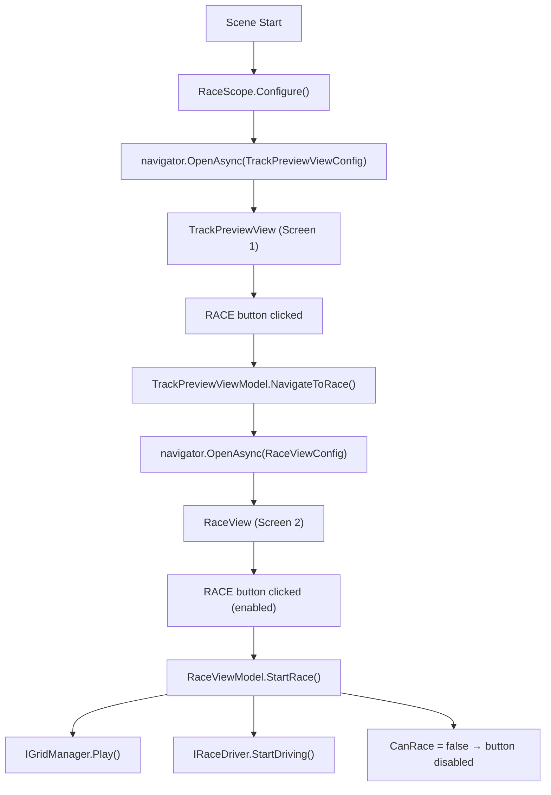
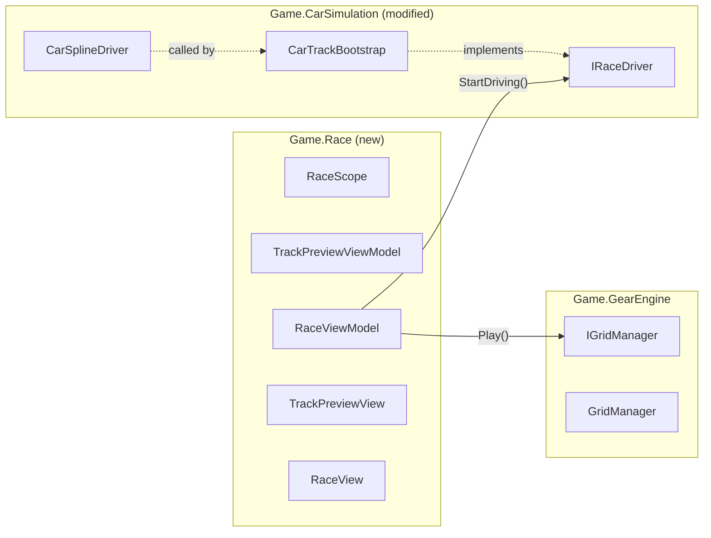

# Race Flow: Track Preview → Race Screen

This ExecPlan is a living document. The sections `Progress`, `Surprises & Discoveries`, `Decision Log`, and `Outcomes & Retrospective` must be kept up to date as work proceeds.

Repository planning rules live at `PLANS.md` (repository root). This document must be maintained in accordance with `PLANS.md`.

---

## Purpose / Big Picture

Build the first two screens of the race loop:

- **Screen 1 — Track Preview**: Shows the selected track's name, placeholder leaderboard rows, and a RACE button. Tapping RACE navigates to Screen 2.
- **Screen 2 — Race**: Shows the idle car on the spline track (top), a RACE button (middle), and the full gear engine board (bottom). Tapping RACE starts the gear engine ticking and starts the car driving simultaneously. The button is then disabled for the rest of the session.

The feature connects two previously isolated modules — `Game.GearEngine` (gear grid, `IGridManager`) and `Game.CarSimulation` (track, car, `CarSplineDriver`) — through a new thin orchestration module `Game.Race` that owns the navigation flow and race ViewModels.

**How to see it working:** Open `RaceScene`, enter Play Mode. Screen 1 appears with the track name. Tap RACE — Screen 2 appears with the gear board and idle car. Tap RACE again — gears begin spinning, car begins moving, button becomes non-interactive.

---

## Progress

- [ ] **M1** — Add `IRaceDriver` to `Game.CarSimulation`; defer car start; update `CarTrackBootstrap` and `CarTrackScope`.
- [ ] **M2** — Create `Game.Race` assembly with `TrackPreviewViewModel`, `RaceViewModel`, `TrackPreviewView`, `RaceView`.
- [ ] **M3** — Implement `RaceScope`; confirm and wire navigation registration.
- [ ] **M4** — Create prefabs, mark as Addressable, create `ViewConfig` assets, update `Navigation Settings`, build `RaceScene`.
- [ ] **M5** — Add EditMode tests for `TrackPreviewViewModel` and `RaceViewModel`.
- [ ] **M6** — Add `Docs/Game/Race.md`.
- [ ] **Validate** — Run `validate-changes.ps1` clean after each milestone.

---

## Surprises & Discoveries

- Observation: (fill in during implementation)
  Evidence: (fill in during implementation)

---

## Decision Log

- **Decision:** `IRaceDriver` is implemented by `CarTrackBootstrap`, not by `CarSplineDriver` directly.
  **Rationale:** `CarSplineDriver` is a `MonoBehaviour` on a prefab that is instantiated at runtime inside `CarTrackBootstrap.Initialize()`. It is not present in the scene hierarchy at DI registration time, so it cannot be registered with `RegisterComponentInHierarchy<>`. `CarTrackBootstrap` is already a registered `IInitializable` and holds the driver reference after `Initialize()` runs, making it the natural delegation point.
  **Author:** initial plan

- **Decision:** `RaceScope` is a new unified `LifetimeScope` rather than a VContainer parent/child scope tree.
  **Rationale:** Both `IGridManager` (GearEngine) and `IRaceDriver` (CarSimulation) must be visible to `RaceViewModel` in the same DI scope. Parent-child VContainer scope wiring requires additional scene setup and is more complex than a flat scope for a single-scene prototype. Existing `GearMechanicsScope` and `CarTrackScope` are preserved unchanged for their own test scenes.
  **Author:** initial plan

- **Decision:** Scaffold Navigation with Addressables (Option C) is used for screen transitions, not a panel-swap or scene reload.
  **Rationale:** Establishes the correct production navigation pattern early. The `NavigationViewConfig` plan for direct-prefab navigation is pending and not yet implemented; Addressables is the currently working path.
  **Author:** initial plan

- **Decision:** Exact `NavigationInstaller` / `AddNavigation` API must be confirmed from `Library/PackageCache/com.scaffold.navigation@.../` at implementation time.
  **Rationale:** The `com.scaffold.navigation` package source is not checked into this repo; it resolves via UPM from `https://github.com/MgCohen/Scaffold.git`. The reference pattern is `BootstrapCoreInstaller` using `new LiveOpsInstaller()` passed to `BuildInstaller(builder, installer)`.
  **Author:** initial plan

---

## Outcomes & Retrospective

(Summarize at completion: what shipped, what was deferred, lessons learned.)

---

## Context and Orientation

### Term Definitions

- **ViewModel** (`Scaffold.MVVM`): A plain C# class extending `ViewModel` that holds observable state and commands. Injected by VContainer. Never references Unity UI directly.
- **View** (`Scaffold.MVVM`): A `MonoBehaviour` extending `View<TViewModel>`. Lives in the scene or a prefab. Receives the ViewModel via `[Inject]`, calls `Bind(vm)`, and overrides `OnBind()` to set up property bindings and button listeners.
- **ViewConfig** (`Scaffold.Navigation`): A `ScriptableObject` (a `SchemaObject`) that stores an `AssetReference` to a view prefab, plus `viewType` and `controllerType` type references. Navigation uses it to load and instantiate the right view.
- **NavigationSettings** (`Scaffold.Navigation`): A `ScriptableObject` listing all registered `ViewConfig` screens. Passed to the navigation installer at startup.
- **Addressable**: A Unity asset tagged for loading via the Addressables API (no direct project reference required at load time). Both view prefabs must be tagged so the navigation system can load them.
- **INavigator** (`Scaffold.Navigation`): The runtime interface used to open and close screens. Obtained via DI injection. Key method: `OpenAsync(ViewConfig)`.
- **IRaceDriver** (`Game.CarSimulation`, new): Interface with one method `StartDriving()`. Implemented by `CarTrackBootstrap`. Decouples `RaceViewModel` from the concrete `CarSplineDriver` MonoBehaviour.
- **IGridManager** (`Game.GearEngine`): Existing interface; `Play()` starts the gear simulation tick. Implemented by `GridManager`.
- **LifetimeScope** (VContainer): A MonoBehaviour that acts as a DI container root for a scene. `Configure(IContainerBuilder builder)` is where services are registered.

### Existing Files Relevant to This Plan

| File | Role |
|------|------|
| [`Assets/Scripts/Game/CarSimulation/Drivers/CarSplineDriver.cs`](../../Assets/Scripts/Game/CarSimulation/Drivers/CarSplineDriver.cs) | MonoBehaviour that drives the car along a spline. Currently calls `splineAnimate.Play()` in `Start()` — **must be deferred**. |
| [`Assets/Scripts/Game/CarSimulation/Bootstrap/CarTrackBootstrap.cs`](../../Assets/Scripts/Game/CarSimulation/Bootstrap/CarTrackBootstrap.cs) | `IInitializable` that sets up track and spawns the car. Will implement `IRaceDriver`. |
| [`Assets/Scripts/Game/CarSimulation/Bootstrap/CarTrackScope.cs`](../../Assets/Scripts/Game/CarSimulation/Bootstrap/CarTrackScope.cs) | VContainer scope for CarSimulation test scene. Registration of `CarTrackBootstrap` needs updating. |
| [`Assets/Scripts/Game/GearEngine/Bootstrap/GearMechanicsScope.cs`](../../Assets/Scripts/Game/GearEngine/Bootstrap/GearMechanicsScope.cs) | VContainer scope for GearEngine test scene. `RaceScope` will duplicate its registrations. |
| [`Assets/Scripts/Game/GearEngine/Manager/IGridManager.cs`](../../Assets/Scripts/Game/GearEngine/Manager/IGridManager.cs) | Interface for the gear simulation manager. `RaceViewModel` depends on this. |
| [`Assets/Data/Navigation/Navigation Settings.asset`](../../Assets/Data/Navigation/Navigation%20Settings.asset) | Existing empty `NavigationSettings` asset. Will be populated with both ViewConfigs. |
| [`Assets/Data/Navigation/Template View Config.asset`](../../Assets/Data/Navigation/Template%20View%20Config.asset) | Template to duplicate when creating new `ViewConfig` assets. |

### Flow Diagram



### Module Dependency Diagram



---

## Plan of Work

### Milestone 1 — Defer car start + expose `IRaceDriver`

**New file:** `Assets/Scripts/Game/CarSimulation/IRaceDriver.cs`

```csharp
namespace Game.CarSimulation
{
    public interface IRaceDriver
    {
        void StartDriving();
    }
}
```

**Modify** [`Assets/Scripts/Game/CarSimulation/Drivers/CarSplineDriver.cs`](../../Assets/Scripts/Game/CarSimulation/Drivers/CarSplineDriver.cs):
- Remove `splineAnimate.Play()` from `Start()`.
- Add `public void StartDriving() => splineAnimate.Play();`
- `Start()` still sets up `SplineAnimate` parameters (`AnimationMethod`, `Easing`, speed subscription) — only the `Play()` call is deferred.

**Modify** [`Assets/Scripts/Game/CarSimulation/Bootstrap/CarTrackBootstrap.cs`](../../Assets/Scripts/Game/CarSimulation/Bootstrap/CarTrackBootstrap.cs):

```csharp
using System;
using VContainer.Unity;

namespace Game.CarSimulation
{
    public class CarTrackBootstrap : IInitializable, IRaceDriver
    {
        private readonly CarFactory carFactory;
        private readonly CarDefinition carDefinition;
        private readonly TrackDefinition trackDefinition;
        private readonly Track track;
        private CarSplineDriver carDriver;

        public CarTrackBootstrap(CarFactory carFactory, CarDefinition carDefinition,
            TrackDefinition trackDefinition, Track track)
        {
            this.carFactory = carFactory;
            this.carDefinition = carDefinition;
            this.trackDefinition = trackDefinition;
            this.track = track;
        }

        public void Initialize()
        {
            track.Initialize(trackDefinition);
            var carEntity = carFactory.Create(carDefinition);
            carDriver = carEntity.GetComponent<CarSplineDriver>();
            carDriver.Initialize(track.SplineContainer);
        }

        public void StartDriving()
        {
            if (carDriver == null)
                throw new InvalidOperationException(
                    "[CarTrackBootstrap] StartDriving called before Initialize.");
            carDriver.StartDriving();
        }
    }
}
```

**Modify** [`Assets/Scripts/Game/CarSimulation/Bootstrap/CarTrackScope.cs`](../../Assets/Scripts/Game/CarSimulation/Bootstrap/CarTrackScope.cs) — change the `RegisterEntryPoint` line to expose the `IRaceDriver` interface:

```csharp
builder.RegisterEntryPoint<CarTrackBootstrap>().AsImplementedInterfaces().AsSelf();
```

(Previously it was `builder.RegisterEntryPoint<CarTrackBootstrap>();`.)

**Regression test (Milestone 1):** Add a test to the existing `Game.CarSimulation.Tests` asserting that `CarTrackBootstrap.StartDriving()` throws `InvalidOperationException` when called before `Initialize()`.

---

### Milestone 2 — Create `Game.Race` assembly

**New assembly:** `Assets/Scripts/Game/Race/Game.Race.asmdef`

```json
{
    "name": "Game.Race",
    "rootNamespace": "Game.Race",
    "references": [
        "Game.CarSimulation",
        "Game.GearEngine",
        "Scaffold.MVVM",
        "Scaffold.MVVM.View",
        "Scaffold.MVVM.ViewModel",
        "Scaffold.Navigation",
        "VContainer",
        "Unity.TextMeshPro"
    ],
    "overrideReferences": true,
    "precompiledReferences": [
        "CommunityToolkit.Mvvm.dll"
    ],
    "autoReferenced": true,
    "noEngineReferences": false
}
```

**`Assets/Scripts/Game/Race/ViewModels/TrackPreviewViewModel.cs`**

```csharp
using System;
using CommunityToolkit.Mvvm.ComponentModel;
using Scaffold.MVVM;
using Scaffold.Navigation;
using UnityEngine;
using VContainer;
using Game.CarSimulation;

namespace Game.Race
{
    public partial class TrackPreviewViewModel : ViewModel
    {
        [ObservableProperty] private string trackName;

        private INavigator navigator;
        private ViewConfig raceViewConfig;

        [Inject]
        public void Construct(INavigator navigator, TrackDefinition trackDef, ViewConfig raceViewConfig)
        {
            this.navigator = navigator;
            this.raceViewConfig = raceViewConfig;
            TrackName = trackDef.TrackName;
        }

        public async void NavigateToRace()
        {
            try
            {
                await navigator.OpenAsync(raceViewConfig);
            }
            catch (Exception ex)
            {
                Debug.LogError($"[TrackPreviewViewModel] Navigation to Race failed: {ex.Message}\n{ex.StackTrace}");
            }
        }
    }
}
```

**`Assets/Scripts/Game/Race/ViewModels/RaceViewModel.cs`**

```csharp
using CommunityToolkit.Mvvm.ComponentModel;
using Scaffold.MVVM;
using VContainer;
using Game.CarSimulation;
using Game.GearEngine;

namespace Game.Race
{
    public partial class RaceViewModel : ViewModel
    {
        [ObservableProperty] private bool canRace = true;

        private IGridManager gridManager;
        private IRaceDriver raceDriver;

        [Inject]
        public void Construct(IGridManager gridManager, IRaceDriver raceDriver)
        {
            this.gridManager = gridManager;
            this.raceDriver = raceDriver;
        }

        public void StartRace()
        {
            if (!canRace) return;
            CanRace = false;
            gridManager.Play();
            raceDriver.StartDriving();
        }
    }
}
```

**`Assets/Scripts/Game/Race/Views/TrackPreviewView.cs`**

```csharp
using UnityEngine;
using UnityEngine.UI;
using Scaffold.MVVM;
using TMPro;
using VContainer;

namespace Game.Race
{
    public class TrackPreviewView : View<TrackPreviewViewModel>
    {
        [SerializeField] private TextMeshProUGUI trackNameLabel;
        [SerializeField] private Button raceButton;

        [Inject]
        public void Construct(TrackPreviewViewModel vm)
        {
            Bind(vm);
        }

        protected override void OnBind()
        {
            Bind<string, string>(() => viewModel.TrackName, OnTrackNameChanged);
            if (raceButton != null)
                raceButton.onClick.AddListener(OnRaceButtonClicked);
        }

        private void OnTrackNameChanged(string name)
        {
            if (trackNameLabel != null)
                trackNameLabel.text = name;
        }

        private void OnRaceButtonClicked()
        {
            viewModel?.NavigateToRace();
        }

        private void OnDestroy()
        {
            if (raceButton != null)
                raceButton.onClick.RemoveListener(OnRaceButtonClicked);
        }
    }
}
```

**`Assets/Scripts/Game/Race/Views/RaceView.cs`**

```csharp
using UnityEngine;
using UnityEngine.UI;
using Scaffold.MVVM;
using VContainer;

namespace Game.Race
{
    public class RaceView : View<RaceViewModel>
    {
        [SerializeField] private Button raceButton;
        [SerializeField] private GameObject trackVisualRoot;  // SplineContainer / camera rig parent
        [SerializeField] private GameObject gearBoardRoot;    // BoardView world-space grid parent

        [Inject]
        public void Construct(RaceViewModel vm)
        {
            Bind(vm);
        }

        protected override void OnBind()
        {
            Bind<bool, bool>(() => viewModel.CanRace, OnCanRaceChanged);
            if (raceButton != null)
                raceButton.onClick.AddListener(OnRaceButtonClicked);
        }

        private void OnCanRaceChanged(bool canRace)
        {
            if (raceButton != null)
                raceButton.interactable = canRace;
        }

        private void OnRaceButtonClicked()
        {
            viewModel?.StartRace();
        }

        private void OnDestroy()
        {
            if (raceButton != null)
                raceButton.onClick.RemoveListener(OnRaceButtonClicked);
        }
    }
}
```

`trackVisualRoot` and `gearBoardRoot` are assigned in the Inspector. They give the view a reference to the in-scene world-space objects so visibility can be toggled if needed. Neither field is required for the RACE button to work.

---

### Milestone 3 — `RaceScope` with navigation

**Prerequisite:** Before writing `RaceScope`, open `Library/PackageCache/com.scaffold.navigation@.../` in the editor file browser and locate the `NavigationInstaller` or container extension method. The `BootstrapCoreInstaller` pattern (`new XInstaller()` + `BuildInstaller(builder, installer)`) is the reference. Update this plan's Decision Log with the confirmed API before proceeding.

**`Assets/Scripts/Game/Race/Bootstrap/RaceScope.cs`**

```csharp
using UnityEngine;
using VContainer;
using VContainer.Unity;
using Scaffold.Navigation;
using Game.CarSimulation;
using Game.GearEngine;
using Game.GearEngine.Presentation;

namespace Game.Race
{
    public class RaceScope : LifetimeScope
    {
        [Header("Navigation")]
        [SerializeField] private NavigationSettings navigationSettings;
        [SerializeField] private ViewConfig raceViewConfig;

        [Header("Car Simulation")]
        [SerializeField] private CarDefinition carDefinition;
        [SerializeField] private TrackDefinition trackDefinition;
        [SerializeField] private Track track;

        [Header("Gear Engine")]
        [SerializeField] private BoardConfigSO boardConfig;

        protected override void Configure(IContainerBuilder builder)
        {
            // --- Navigation ---
            // TODO: replace with confirmed installer API from Library/PackageCache
            builder.AddNavigation(navigationSettings);
            builder.RegisterInstance(raceViewConfig);

            // --- CarSimulation ---
            builder.Register<CarFactory>(Lifetime.Singleton);
            builder.RegisterInstance(carDefinition);
            builder.RegisterInstance(trackDefinition);
            builder.RegisterComponent(track);
            builder.RegisterEntryPoint<CarTrackBootstrap>()
                   .AsImplementedInterfaces()
                   .AsSelf();

            // --- GearEngine ---
            builder.RegisterInstance(boardConfig);
            builder.Register<Scaffold.Events.EventController>(Lifetime.Singleton)
                   .AsImplementedInterfaces().AsSelf();
            builder.Register<GridManager>(Lifetime.Singleton)
                   .AsImplementedInterfaces().AsSelf();
            builder.Register<CoreGearNode>(Lifetime.Transient);
            builder.Register<BaseGearNode>(Lifetime.Transient);
            builder.Register<AuraGearNode>(Lifetime.Transient);
            builder.Register<GearMergeService>(Lifetime.Singleton);
            builder.Register<GearNodeFactory>(Lifetime.Singleton);
            builder.Register<GearViewFactory>(Lifetime.Singleton);
            builder.Register<GearInventoryViewModel>(Lifetime.Singleton);
            builder.RegisterComponentInHierarchy<GearBootstrap>();
            builder.RegisterComponentInHierarchy<GearInventoryView>();
            builder.RegisterComponentInHierarchy<BoardView>();

            // --- Race ---
            builder.Register<TrackPreviewViewModel>(Lifetime.Singleton);
            builder.Register<RaceViewModel>(Lifetime.Singleton);
            builder.RegisterComponentInHierarchy<TrackPreviewView>();
            builder.RegisterComponentInHierarchy<RaceView>();
        }
    }
}
```

`Game.Race.asmdef` references `Game.GearEngine` so all GearEngine types resolve. No circular dependency: GearEngine and CarSimulation do not reference Game.Race.

---

### Milestone 4 — Assets and scene (editor-time steps)

These steps are performed manually in the Unity Editor.

#### 4a — Create prefabs

1. In the Project window, create folder `Assets/Prefabs/Race/`.
2. Create a new UI Canvas GameObject in a temp scene. Add the `TrackPreviewView` component. Add children:
   - `TextMeshProUGUI` named `TrackNameLabel` → assign to `trackNameLabel` field.
   - `Button` named `RaceButton` with TMP label "RACE" → assign to `raceButton` field.
3. Save as prefab `Assets/Prefabs/Race/TrackPreviewView.prefab`. Delete the temp scene object.
4. Create a second Canvas GameObject. Add the `RaceView` component. Add children:
   - `Button` named `RaceButton` with TMP label "RACE" → assign to `raceButton` field.
   - Leave `trackVisualRoot` and `gearBoardRoot` empty for now (assigned in the scene, not the prefab).
5. Save as `Assets/Prefabs/Race/RaceView.prefab`.

#### 4b — Mark prefabs as Addressable

1. Open **Window > Asset Management > Addressables > Groups**.
2. Select `Assets/Prefabs/Race/TrackPreviewView.prefab` in the Project window → in the Inspector tick **Addressable** → set address to `Race/TrackPreviewView`.
3. Repeat for `RaceView.prefab` → address `Race/RaceView`.
4. Both should appear in the Default Local Group (or create a dedicated `Race` group).

#### 4c — Create ViewConfig assets

1. Duplicate `Assets/Data/Navigation/Template View Config.asset` twice.
2. Name them `TrackPreviewViewConfig.asset` and `RaceViewConfig.asset` under `Assets/Data/Navigation/`.
3. For `TrackPreviewViewConfig`:
   - Set `viewAsset` AssetReference → pick `Race/TrackPreviewView` prefab.
   - Set `viewType` → select `TrackPreviewView` from the type picker.
4. For `RaceViewConfig`:
   - Set `viewAsset` → pick `Race/RaceView` prefab.
   - Set `viewType` → select `RaceView`.

#### 4d — Update Navigation Settings

Open `Assets/Data/Navigation/Navigation Settings.asset`. Add both ViewConfig assets to the `screens` list:
- Element 0: `TrackPreviewViewConfig`
- Element 1: `RaceViewConfig`

#### 4e — Build RaceScene

1. Create a new scene `Assets/Scenes/RaceScene.unity`.
2. Copy the `CircleRaceTrack` hierarchy from `SplineTrack_TestScene` into `RaceScene` (the SplineContainer + SplineExtrude mesh). This is `trackVisualRoot`.
3. Add a `Track` child with `SplineContainer` component (as in `SplineTrack_TestScene`).
4. Place the car prefab (`Assets/Game/CarSimulation/Prefabs/Car.prefab`) in the scene. It will not move until `StartDriving()` is called.
5. Add GearEngine world objects: a `GearBootstrap` GameObject with `GearBootstrap` component, a `GridBoardCollider` with `BoardView` and `BoardConfigSO` assigned, `GearInventoryView` UI. These are the same objects created by `SetupTestSceneTool`. This is `gearBoardRoot`.
6. Add a `RaceScope` LifetimeScope component on a root GameObject. Assign in the Inspector:
   - `navigationSettings` → `Assets/Data/Navigation/Navigation Settings.asset`
   - `raceViewConfig` → `Assets/Data/Navigation/RaceViewConfig.asset`
   - `carDefinition` → `Assets/Game/CarSimulation/Data/CarDefinition.asset`
   - `trackDefinition` → `Assets/Game/CarSimulation/Data/Tracks/CircleTrack.asset`
   - `track` → the `Track` component in the scene
   - `boardConfig` → `Assets/Game/GearEngine/Configs/BasicBoardConfig.asset`
7. On the `RaceView` component (either as a scene object or Addressable-loaded), assign `trackVisualRoot` and `gearBoardRoot` to the relevant scene GameObjects.
8. Add a **Navigation View Holder**: create an empty `GameObject` named `NavigationViewHolder`. This is the parent `Transform` under which the navigation system instantiates loaded view prefabs. Wire this to the navigation installer (exact field name to confirm from package source).

---

### Milestone 5 — Tests

**New asmdef:** `Assets/Scripts/Game/Race/Tests/Editor/Game.Race.Tests.asmdef`

References: `Game.Race`, `Game.CarSimulation`, `Game.GearEngine`, `VContainer`, `UnityEngine.TestRunner`, `UnityEditor.TestRunner`

**`TrackPreviewViewModelTests.cs`**

```csharp
// Verify TrackName is populated from the injected TrackDefinition.
// Uses a mock INavigator and a real TrackDefinition ScriptableObject instance.
[Test]
public void TrackPreviewViewModel_TrackName_MatchesDefinition()
{
    var def = ScriptableObject.CreateInstance<TrackDefinition>();
    // set TrackName via reflection or exposed setter if needed
    var vm = new TrackPreviewViewModel();
    vm.Construct(mockNavigator, def, mockViewConfig);
    Assert.AreEqual(def.TrackName, vm.TrackName);
}
```

**`RaceViewModelTests.cs`**

```csharp
// Verify CanRace starts true and becomes false after StartRace().
// Verify IGridManager.Play() and IRaceDriver.StartDriving() are each called exactly once.
[Test]
public void RaceViewModel_StartRace_DisablesButtonAndStartsBoth()
{
    var mockGrid = new MockGridManager();
    var mockDriver = new MockRaceDriver();
    var vm = new RaceViewModel();
    vm.Construct(mockGrid, mockDriver);

    Assert.IsTrue(vm.CanRace);
    vm.StartRace();
    Assert.IsFalse(vm.CanRace);
    Assert.IsTrue(mockGrid.PlayCalled);
    Assert.IsTrue(mockDriver.StartDrivingCalled);
}

[Test]
public void RaceViewModel_StartRace_CalledTwice_OnlyFiresOnce()
{
    var mockGrid = new MockGridManager();
    var mockDriver = new MockRaceDriver();
    var vm = new RaceViewModel();
    vm.Construct(mockGrid, mockDriver);

    vm.StartRace();
    vm.StartRace(); // second call must be a no-op
    Assert.AreEqual(1, mockGrid.PlayCallCount);
    Assert.AreEqual(1, mockDriver.StartDrivingCallCount);
}
```

**`CarTrackBootstrap_IRaceDriverTests.cs`** (add to existing `Game.CarSimulation.Tests`)

```csharp
// Regression: StartDriving before Initialize must throw.
[Test]
public void CarTrackBootstrap_StartDriving_BeforeInitialize_Throws()
{
    var bootstrap = new CarTrackBootstrap(null, null, null, null);
    Assert.Throws<InvalidOperationException>(() => bootstrap.StartDriving());
}
```

---

### Milestone 6 — Documentation

Create `Docs/Game/Race.md`:

```markdown
# Game.Race module

Runtime code: `Assets/Scripts/Game/Race/` (`Game.Race` assembly).

## Purpose
Owns the race flow navigation: Track Preview screen → Race screen.

## Screens
- **TrackPreviewView** / `TrackPreviewViewModel` — shows track name, navigates to Race on button press.
- **RaceView** / `RaceViewModel` — shows idle track + gear board; RACE button starts `IGridManager` and `IRaceDriver` simultaneously, then disables itself.

## Scene setup
See `Assets/Scenes/RaceScene.unity`. The scene root holds a `RaceScope` LifetimeScope. Addressable prefab addresses: `Race/TrackPreviewView`, `Race/RaceView`. ViewConfig assets: `Assets/Data/Navigation/`.

## Dependencies
- `Game.CarSimulation` — provides `IRaceDriver` (via `CarTrackBootstrap`), `TrackDefinition`
- `Game.GearEngine` — provides `IGridManager`
- `Scaffold.Navigation` — `INavigator`, `ViewConfig`, `NavigationSettings`
- `Scaffold.MVVM` — `ViewModel`, `View<T>`
```

---

## Concrete Steps

All commands run from the repository root `C:\Unity\Gear-Engine`.

1. Complete Milestone 1 (code changes only).
2. Run: `powershell -NoProfile -ExecutionPolicy Bypass -File ".\.agents\scripts\validate-changes.ps1" -SkipTests`
3. Complete Milestone 2 (code changes only).
4. Run validate again.
5. Open Unity. Navigate to `Library/PackageCache/com.scaffold.navigation@.../` and read the NavigationInstaller / container extension. Update Decision Log. Complete Milestone 3.
6. Run validate again.
7. Complete Milestone 4 in the Unity Editor (prefabs, Addressables, ViewConfigs, scene).
8. Complete Milestone 5 (tests).
9. Run: `powershell -NoProfile -ExecutionPolicy Bypass -File ".\.agents\scripts\validate-changes.ps1"` (includes tests).
10. Complete Milestone 6 (docs).
11. Run final validate. Fix any remaining failures.

---

## Validation and Acceptance

- `validate-changes.ps1` passes clean (no analyzer errors, no compile errors, tests green).
- Play Mode smoke test:
  1. Open `RaceScene`, enter Play Mode.
  2. Screen 1 (`TrackPreviewView`) appears; track name label shows the `TrackDefinition.TrackName` value.
  3. Click RACE → Screen 2 (`RaceView`) appears; RACE button is enabled; car is idle on spline; gears are visible but not rotating.
  4. Click RACE → gears begin rotating; car begins moving along the spline; RACE button is non-interactive.
  5. Clicking RACE again has no effect.

---

## Idempotence and Recovery

- Milestones 1–3 are pure code additions/modifications. Re-running them is safe (overwrite).
- Milestone 4 (assets/scene) is editor-time; if prefabs already exist in `Assets/Prefabs/Race/`, skip creation and only update missing fields.
- `CarTrackScope` is modified to add `.AsImplementedInterfaces()` — the existing `SplineTrack_TestScene` still works because `IRaceDriver` is registered but nothing in that scene requires it. The car will now sit idle until `StartDriving()` is called, which means the `SplineTrack_TestScene` car will no longer auto-drive. Add a note to the test scene or add a dedicated `CarAutoStartBootstrap` entry point if the old behavior needs to be preserved for that scene.

---

## Artifacts and Notes

New files:

- `Assets/Scripts/Game/CarSimulation/IRaceDriver.cs`
- `Assets/Scripts/Game/Race/Game.Race.asmdef`
- `Assets/Scripts/Game/Race/Bootstrap/RaceScope.cs`
- `Assets/Scripts/Game/Race/ViewModels/TrackPreviewViewModel.cs`
- `Assets/Scripts/Game/Race/ViewModels/RaceViewModel.cs`
- `Assets/Scripts/Game/Race/Views/TrackPreviewView.cs`
- `Assets/Scripts/Game/Race/Views/RaceView.cs`
- `Assets/Scripts/Game/Race/Tests/Editor/Game.Race.Tests.asmdef`
- `Assets/Scripts/Game/Race/Tests/Editor/TrackPreviewViewModelTests.cs`
- `Assets/Scripts/Game/Race/Tests/Editor/RaceViewModelTests.cs`
- `Assets/Prefabs/Race/TrackPreviewView.prefab`
- `Assets/Prefabs/Race/RaceView.prefab`
- `Assets/Data/Navigation/TrackPreviewViewConfig.asset`
- `Assets/Data/Navigation/RaceViewConfig.asset`
- `Assets/Scenes/RaceScene.unity`
- `Docs/Game/Race.md`

Modified files:

- `Assets/Scripts/Game/CarSimulation/Drivers/CarSplineDriver.cs` — defer `Play()`
- `Assets/Scripts/Game/CarSimulation/Bootstrap/CarTrackBootstrap.cs` — implement `IRaceDriver`
- `Assets/Scripts/Game/CarSimulation/Bootstrap/CarTrackScope.cs` — `.AsImplementedInterfaces()`
- `Assets/Data/Navigation/Navigation Settings.asset` — add both ViewConfigs
- `Assets/Scripts/Game/CarSimulation/Tests/Editor/TrackInitializationTests.cs` — add regression test

---

## Interfaces and Dependencies

At completion the following must hold:

- `IRaceDriver` is in `Game.CarSimulation`. Only `CarTrackBootstrap` implements it.
- `Game.Race` depends on `Game.CarSimulation` and `Game.GearEngine`. Neither of those depends on `Game.Race` (no circular references).
- `RaceViewModel` only knows `IGridManager` and `IRaceDriver`. It does not import any concrete GearEngine or CarSimulation types.
- Scaffold Navigation loads view prefabs from Addressables; no direct prefab references in code.
- `validate-changes.ps1` passes clean.

---

Revision history:

- Initial version: Defines IRaceDriver contract, Game.Race assembly, TrackPreviewViewModel/View, RaceViewModel/View, RaceScope, Addressables navigation setup, and full test coverage.
