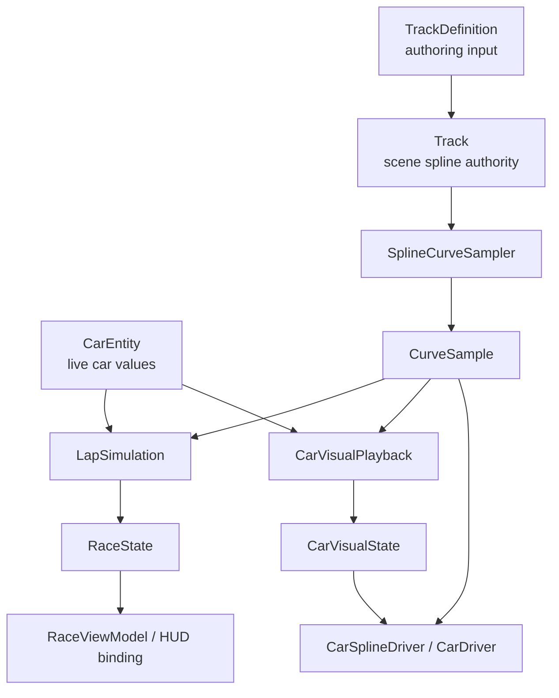
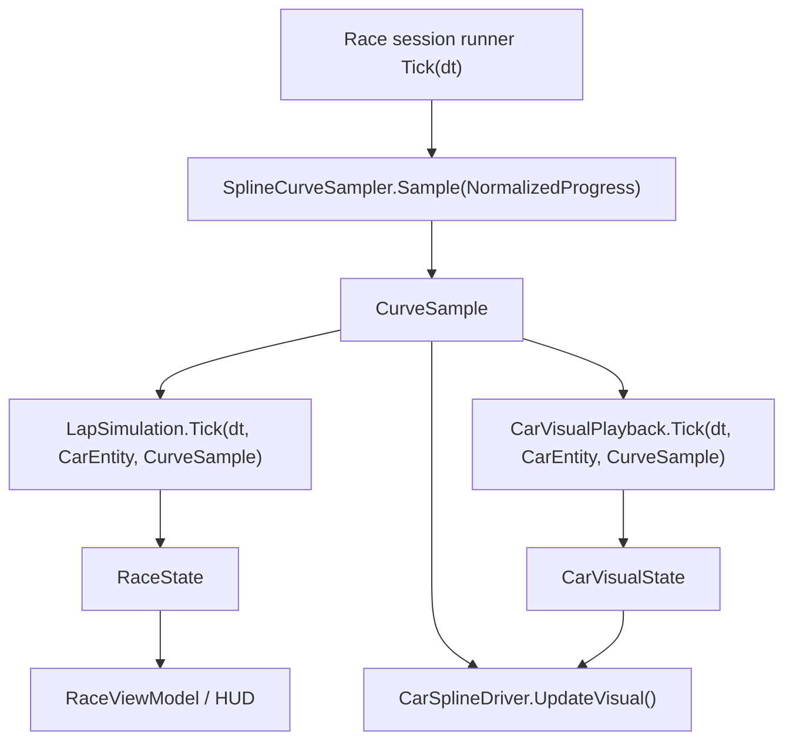

# Unified Lap Race — Reconciled ExecPlan

This ExecPlan is a living document. The sections `Progress`, `Surprises & Discoveries`,
`Decision Log`, and `Outcomes & Retrospective` must be kept up to date as work proceeds.

Repository planning rules live at `PLANS.md`. This document must be maintained in
accordance with `PLANS.md`.

Source input for this plan:

- historical design draft: `.cursor/plans/unified_lap_race_27d02fb0.plan.md`

This ExecPlan supersedes that draft for implementation work. The `.cursor` plan remains a
historical design input; the authoritative executable plan lives here under `Plans/`.

---

## Purpose / Big Picture

Build a single-car lap race that keeps the useful parts of the current game wiring while
replacing the current simulation model with the simpler split from the unified draft.

The finished feature must:

- use `Assets/GearEngine/Scripts/Game/CarSimulation/Entity/CarEntity.cs` as the live
  runtime source for car variables
- use `Assets/GearEngine/Scripts/Game/CarSimulation/Tracks/Track.cs` as the scene-owned
  spline authority and view host
- sample the spline once per frame from the scene `Track.SplineContainer`
- compute race outcome in a minimal core simulation that owns only pace, progress, time,
  lap count, lap splits, and finish state
- compute cosmetic drift and offset in a separate visual playback subsystem that never
  feeds back into lap time in the first pass
- keep the existing Race scene shell (`RaceBootstrap`, `RaceScope`, `RaceViewModel`,
  `RaceView`) but repurpose it around the new runtime model

What changes compared with the current implementation:

- keep the current scene anchors and MVVM shell
- delete the baked-profile / curve-band / heading-error simulation model
- replace it with live spline sampling and a strict simulation-versus-visual split

## Requirements

Build a simple arcade lap simulation where:

- the track comes from a Unity spline
- lap timing is computed in real time
- live car values can change at any moment during the race
- the car visually appears to drift or overshoot on corners
- cosmetic playback does not change race outcome in the first pass

For this repository, the reconciled implementation interprets "live car values" as values
read from `CarEntity` rather than from a standalone mutable `CarStats` object. The
conceptual fields remain the same:

- `Speed`
- `Handling`
- `Acceleration`

Those values may still be projected into a small read-only adapter or snapshot if the new
simulation classes need a narrow interface, but `CarEntity` remains the authoritative
source.

## Unified Decisions

The merged plan adopts these decisions, and this ExecPlan preserves them while adapting
them to the existing codebase:

- Keep a separate visual subsystem, even if it starts with only one runtime float.
- Keep race pace independent from cosmetic drift; lap timing is driven only by spline
  curve sampling and live car values.
- Use a small simulation core and pass spline-derived curve inputs into it.
- Use one direction-aware visual response step instead of conflicting entry/recovery math.
- Keep spline sampling tuners out of `LapSimulationConfig`.
- Store lap splits directly on `RaceState`.
- Replace lifecycle booleans with a single `RaceLifecycle` enum.
- Extend `CurveSample` so one spline evaluation can serve simulation and rendering.
- Standardize terminology across the old drafts and the current runtime.

## Scope

In scope:

- Single-car arcade lap simulation.
- Spline-defined track path and curve sampling.
- Real-time progress, clock, lap counting, and finish state.
- Live mutable car values sourced from `CarEntity`.
- Separate cosmetic playback layer for drift, offset, and slip angle.
- HUD binding for race time and lap state through the existing Race shell.

Out of scope:

- Physics-based handling, collisions, multiple cars, AI lines, drafting.
- Prebaked curve bands or predictive full-lap simulation.
- Complex effects beyond the minimal visual playback layer.
- Replacing the Race scene shell for its own sake.

How to see it working:

1. Open `Assets/GearEngine/Scenes/Race Scene.unity`.
2. Enter Play Mode.
3. Start the race from the existing Race UI.
4. Confirm the car advances around the spline in real time, lap time updates, lap splits
   are recorded, and visual drift can be disabled without changing lap results.

---

## Progress

- [x] **M1** — Lock the reconciliation perimeter and add guard tests for the keepers
- [x] **M2** — Introduce the new lap-race vocabulary and runtime data model
- [x] **M3** — Add scene-spline sampling and the minimal simulation / visual subsystems
- [x] **M4** — Repurpose driver and presentation paths around shared sampled pose data
- [x] **M5** — Rewire the Race shell to the new session model while preserving current UX
- [x] **M6** — Delete the obsolete simulation stack and replace old tests
- [x] **M7** — Add docs and run repository validation clean

---

## Surprises & Discoveries

- Observation: `CarEntity` is already the correct live stat authority because existing car
  values are read through variable assets and runtime modifiers rather than copied into an
  isolated race-specific DTO.
  Evidence: `SimulationFrame.FromCar(...)` currently reads values directly from
  `CarEntity` and `CarVariableSet`.

- Observation: `Track` already owns the right scene-facing responsibilities for this plan:
  it exposes `SplineContainer`, copies authoring spline data into the live container, and
  rebuilds the visual extrude.
  Evidence: `Track.InitializeTrack(...)`, `CopySplineIntoContainer(...)`, and
  `RebuildVisualSplineExtrude(...)`.

- Observation: the main mismatch is not startup wiring; it is the current simulation math
  and state ownership.
  Evidence: `TrackSimulationRunner` currently mixes curve-band look-ahead, heading error,
  speed penalty, and presentation values (`SlipAngle`, `LateralOffset`) into one loop.

---

## Decision Log

- **Decision:** Keep `CarEntity` as the runtime source of truth for mutable car values.
  **Rationale:** This satisfies the requirement to use what already exists and preserves
  the current modifier pipeline. The new lap-race systems read live values from
  `CarEntity`; they do not create a parallel writable stats store.
  **Author:** this plan

- **Decision:** Keep `Track` as the runtime spline authority in-scene, while still using
  `TrackDefinition` as authoring/startup input.
  **Rationale:** The race should sample the actual scene spline from
  `Track.SplineContainer` each frame. `TrackDefinition` remains useful to seed the scene
  spline at startup, but it is no longer the runtime sampling authority once the race is
  running.
  **Author:** this plan

- **Decision:** Replace the current `TrackSimulationRunner` math model instead of evolving
  it incrementally.
  **Rationale:** The current runner encodes a different design: curve bands, heading-error
  accumulation, speed penalties from drift state, and mixed ownership of simulation and
  visual values. Renaming fields would not produce the target architecture.
  **Author:** this plan

- **Decision:** Split runtime state into `RaceState` and `CarVisualState`.
  **Rationale:** Race outcome state must contain only pace, progress, time, lap count,
  lap splits, and finish state. Cosmetic values such as lateral offset and slip angle
  belong in visual playback only.
  **Author:** this plan

- **Decision:** `RaceState.Lifecycle` uses the unified-plan outcome states
  `Idle`, `Running`, and `Finished`. Pause and resume remain a runner/session concern.
  **Rationale:** The Race UI still needs start and stop control, but pause is not a race
  result. Keeping pause outside `RaceState` preserves the clean simulation model while
  allowing the existing UI toggle behavior to survive.
  **Author:** this plan

- **Decision:** Sample the spline once per frame through a dedicated `SplineCurveSampler`
  and share the resulting `CurveSample` across simulation, visual playback, and driver.
  **Rationale:** This matches the unified draft and removes duplicate evaluation paths.
  It also makes it easy to prove that turning off visual playback does not change lap
  results.
  **Author:** this plan

- **Decision:** Repurpose `CarSplineDriver` into a pure presentation driver that consumes
  shared sampled pose data and visual playback state.
  **Rationale:** The driver already owns transform placement. It should stop reading from
  the old motion model and become the last-mile presentation layer for the new split
  architecture.
  **Author:** this plan

- **Decision:** Keep the current Race scene shell and repurpose it around a new race
  session factory/session runner.
  **Rationale:** `RaceBootstrap`, `RaceScope`, `RaceViewModel`, and `RaceView` already own
  scene setup, DI, and UI affordances. Replacing them would add churn without helping the
  simulation split.
  **Author:** this plan

- **Decision:** Delete the baked profile and curve-band stack after the new race path is
  green.
  **Rationale:** `BakedTrackProfile`, `TrackSample`, `CurveBandDefinition`,
  `TrackSimulationTuning`, `SimulationFrame`, `CarMotionState`, `RaceRuntimeState`, and
  the current `TrackSimulationRunner` all exist to support the old model and should not
  survive as parallel runtime paths.
  **Author:** this plan

---

## Outcomes & Retrospective

**Shipped:** Unified lap race using live `CarEntity` stats, scene `Track.SplineContainer` sampling via `SplineCurveSampler`, shared `CurveSample`, `LapSimulation` + `CarVisualPlayback` split, `LapRaceSession` + `IRaceSessionRunner`, Race shell (`RaceBootstrap` / `RaceViewModel` / `RaceView`) preserved with `RaceSessionConfig` on `RaceStartData`.

**Removed:** Baked profile stack (`BakedTrackProfile`, `TrackProfileBaker`, `TrackSample`, etc.), `TrackSimulation` / `TrackSimulationRunner` / `SimulationFrame` / `CarMotionState` / `RaceRuntimeState`, `TrackSimulationTuning` / `TrackSimulationConfig`, `ITrackSimulationRunner` / `UnityRaceRandom`.

**Repurposed:** `TrackSimulationFactory` (still named; creates `LapRaceSession`), `Track` + `TrackViewModel` + `CarSplineDriver` + `CarView`, `CarTrackBootstrap` / `CarTrackTestView` / `TrackListViewModel`.

**Validation:** `.agents/scripts/validate-changes.cmd` completed with quality gates clean (analyzer TOTAL:0). Re-run EditMode/PlayMode in Unity when the project is not locked by the Editor if batch tests were skipped.

**Follow-up (deferred):** Optional rename of `TrackSimulationFactory` to `RaceSessionFactory`; richer HUD binding to `RaceState.LapTimes`; open-track UX beyond reach-end-and-finish.

---

## Context and Orientation

### Terms used in this plan

- **Runtime source of truth:** the object that owns live gameplay data during play.
  Here, that is `CarEntity`.
- **Scene spline authority:** the spline actually sampled while the race runs. Here, that
  is the `SplineContainer` exposed by `Track`.
- **CurveSample:** one frame of spline-derived input shared by all consumers. It contains
  curve difficulty plus the sampled pose.
- **RaceState:** race outcome state only. It owns progress, time, lap count, lap splits,
  current speed, and finish lifecycle.
- **CarVisualState:** cosmetic playback state only. It owns drift/corner-effect-derived
  offset and slip angle.
- **LapSimulation:** the minimal simulation core that advances race state from `dt`,
  `CarEntity` values, and `CurveSample`.
- **CarVisualPlayback:** the cosmetic subsystem that computes `CarVisualState` from `dt`,
  `CarEntity` values, and `CurveSample`.
- **Race session:** the runtime composition that wires sampler, simulation, visual
  playback, shared state, and lifecycle control together.

### Current runtime reality

Today the Race flow is wired correctly at the scene level but not at the simulation-model
level:

1. `RaceBootstrap` ticks the shared `ITrackSimulationRunner`.
2. `RaceViewModel` constructs a `TrackSimulation` via `TrackSimulationFactory`.
3. `Track` binds a `TrackViewModel`, copies spline data into the scene container, and the
   car visual path is driven by `CarSplineDriver`.
4. `TrackSimulationRunner` computes speed, heading error, slip angle, lateral offset,
   drift flags, and lap progress in one mixed loop.

That loop is the part this plan replaces.

### Reconciliation model

Keep:

- `Assets/GearEngine/Scripts/Game/CarSimulation/Entity/CarEntity.cs`
- `Assets/GearEngine/Scripts/Game/CarSimulation/Tracks/Track.cs`
- `Assets/GearEngine/Scripts/Game/Race/Bootstrap/RaceBootstrap.cs`
- `Assets/GearEngine/Scripts/Game/Race/Bootstrap/RaceScope.cs`
- `Assets/GearEngine/Scripts/Game/Race/RaceViewModel.cs`
- `Assets/GearEngine/Scripts/Game/Race/Presentation/RaceView.cs`

Repurpose:

- `Assets/GearEngine/Scripts/Game/CarSimulation/Drivers/CarSplineDriver.cs`
- `Assets/GearEngine/Scripts/Game/CarSimulation/Presentation/CarView.cs`
- `Assets/GearEngine/Scripts/Game/CarSimulation/Presentation/TrackViewModel.cs`
- `Assets/GearEngine/Scripts/Game/Race/RaceStartData.cs`
- `Assets/GearEngine/Scripts/Game/CarSimulation/TrackSimulationFactory.cs`

Delete and replace:

- `Assets/GearEngine/Scripts/Game/CarSimulation/Simulation/TrackSimulationRunner.cs`
- `Assets/GearEngine/Scripts/Game/CarSimulation/Simulation/SimulationFrame.cs`
- `Assets/GearEngine/Scripts/Game/CarSimulation/Simulation/CarMotionState.cs`
- `Assets/GearEngine/Scripts/Game/CarSimulation/Simulation/RaceRuntimeState.cs`
- `Assets/GearEngine/Scripts/Game/CarSimulation/TrackSimulation.cs`
- `Assets/GearEngine/Scripts/Game/CarSimulation/Tracks/BakedTrackProfile.cs`
- `Assets/GearEngine/Scripts/Game/CarSimulation/Tracks/TrackSample.cs`
- `Assets/GearEngine/Scripts/Game/CarSimulation/Definitions/TrackSimulationTuning.cs`

### Target architecture



### Vocabulary lock for implementation

The implementation must standardize on these names even when replacing old types:

- `CurveSample`
- `RaceState`
- `RaceLifecycle`
- `LapSimulationConfig`
- `SplineSamplerConfig`
- `CarVisualState`
- `CarVisualConfig`
- `LapSimulation`
- `CarVisualPlayback`

`CarEntity` and `Track` are retained by design and are not renamed.

### Standard Vocabulary

Use these terms consistently in code, docs, and discussion.

`CarEntity`
- Runtime source of live gameplay values.
- Owns the current mutable car values already used by the game.
- Fulfills the conceptual role that the original merged draft called `CarStats`.

`CurveSample`
- Spline-derived per-frame input.
- Fields: `CurveAmount`, `CurveDirection`, `Position`, `Tangent`, `Up`.
- `CurveAmount` is normalized `0..1` difficulty from spline tangent comparison.
- `CurveDirection` is signed left/right direction for visuals.
- `Position`, `Tangent`, and `Up` are the shared spline pose snapshot for rendering.

`RaceState`
- Core runtime simulation state.
- Fields: `ProgressDistance`, `NormalizedProgress`, `CurrentSpeed`, `RaceTime`,
  `CurrentLap`, `LapTimes`, `PreviousLapStartTime`, `Lifecycle`.

`LapSimulationConfig`
- Core simulation tuning.
- Fields: `MaxSpeed`, `CurveSlowdown`, `AccelerationRate`, `TotalLaps`.

`SplineSamplerConfig`
- Spline interpretation tuning.
- Fields: `CurveLookAheadStep`, `MaxCurveAngle`.

`RaceLifecycle`
- Simulation lifecycle enum.
- Values: `Idle`, `Running`, `Finished`.

`CarVisualState`
- Cosmetic runtime playback state.
- Fields: `CornerEffect`, `LateralOffset`, `SlipAngle`, optional `IsDrifting`.

`CarVisualConfig`
- Cosmetic tuning.
- Fields: `CornerResponse`, `DriftStrength`, `DriftRecoverRate`, `MaxVisualOffset`,
  `MaxSlipAngle`, optional `DriftThreshold`.

### Core Design Rule

If a value changes:

- race time
- forward progress
- lap count
- finish state
- current pace

it belongs to simulation.

If a value changes:

- sideways motion
- slip angle
- drift flag
- drift effects

it belongs to visual playback.

In the first pass, visual playback must not feed back into lap timing.

### Target type sketches

```csharp
public enum RaceLifecycle
{
    Idle,
    Running,
    Finished,
}

public readonly struct CurveSample
{
    public float CurveAmount { get; }
    public float CurveDirection { get; }
    public Vector3 Position { get; }
    public Vector3 Tangent { get; }
    public Vector3 Up { get; }
}

public sealed class RaceState
{
    public float ProgressDistance;
    public float NormalizedProgress;
    public float CurrentSpeed;
    public float RaceTime;
    public int CurrentLap;
    public readonly List<float> LapTimes = new();
    public float PreviousLapStartTime;
    public RaceLifecycle Lifecycle;
}

public sealed class CarVisualState
{
    public float CornerEffect;
    public float LateralOffset;
    public float SlipAngle;
    public bool IsDrifting;
}
```

### Reconciled type note

The original merged draft used `CarStats` as the canonical gameplay-input type. In this
repository, `CarEntity` remains the source of truth, so the implementation may use one of
two acceptable shapes:

1. pass `CarEntity` directly into simulation and visual playback and read the values there
2. derive a narrow per-tick `CarStatsSnapshot` from `CarEntity` immediately before
   simulation and visual playback consume it

What is not allowed is a second mutable gameplay state store that can drift away from
`CarEntity`.

### Authoritative math model

This section carries forward the original merged draft's requirements and snippets, but
binds them to the reconciled model where `CarEntity` is the stat authority.

#### 1. Spline sampling math

Use the current tangent and one slightly-forward tangent from the spline. Do not introduce
baked curve bands or geometric curvature-per-meter in the first pass.

Inputs:

- `t = RaceState.NormalizedProgress`
- `tNext = (t + CurveLookAheadStep) % 1`

Sampling:

```csharp
Position, Tangent, Up = EvaluatePose(spline, t)
nextTangent = EvaluateTangent(spline, tNext)
angleDeg = Angle(Tangent, nextTangent)
CurveAmount = Clamp01(angleDeg / MaxCurveAngle)
CurveDirection = Sign(Dot(Cross(Tangent, nextTangent), Up))
```

Interpretation:

- `CurveAmount = 0` means effectively straight.
- `CurveAmount = 1` means a strong corner by this game's tuning scale.
- `CurveDirection` is only for left/right cosmetic playback.

#### 2. Core simulation math

`LapSimulation.Tick(dt, carEntity, curveSample)` owns only race outcome state.

Target pace:

```csharp
targetSpeed =
    MaxSpeed
    * Speed
    * (1f - CurveAmount * (1f - Handling) * CurveSlowdown);
```

Meaning:

- `Speed` scales the overall pace ceiling.
- `Handling` reduces how much corners slow the car down.
- `CurveAmount` is the only track difficulty input.

Speed response:

Use `MoveTowards`, not `Lerp`, so `Acceleration` reads as a real response rate instead of
a smoothing factor.

```csharp
CurrentSpeed = MoveTowards(
    CurrentSpeed,
    targetSpeed,
    Acceleration * AccelerationRate * dt);
```

Progress, clock, and laps:

```csharp
ProgressDistance += CurrentSpeed * dt;
RaceTime += dt;

NormalizedProgress = (ProgressDistance % TrackLength) / TrackLength;
nextLap = Floor(ProgressDistance / TrackLength);

if (nextLap > CurrentLap)
{
    lapTime = RaceTime - PreviousLapStartTime;
    LapTimes.Add(lapTime);
    PreviousLapStartTime = RaceTime;
}

CurrentLap = nextLap;

if (CurrentLap >= TotalLaps)
{
    Lifecycle = RaceLifecycle.Finished;
}
```

Important rule:

- `CornerEffect` does not reduce `CurrentSpeed` in the first pass.
- All lap-time loss comes from `CurveAmount`, `Handling`, `Speed`, and `Acceleration`.

#### 3. Visual playback math

`CarVisualPlayback.Tick(dt, carEntity, curveSample)` owns only cosmetic playback state.

Target corner effect:

```csharp
targetCornerEffect =
    CurveAmount
    * (1f - Handling)
    * DriftStrength
    * CurveDirection;
```

This produces a signed cosmetic demand:

- better `Handling` means less visible drift
- harder corners mean more visual drift
- `CurveDirection` controls left/right motion

Playback response:

Use one direction-aware `MoveTowards` so entry and recovery rates do not fight each other
in the same frame.

```csharp
sameDirection =
    Approximately(CornerEffect, 0f)
    || Sign(targetCornerEffect) == Sign(CornerEffect);

targetIncreasesMagnitude =
    sameDirection
    && Abs(targetCornerEffect) > Abs(CornerEffect);

rate = targetIncreasesMagnitude ? CornerResponse : DriftRecoverRate;

CornerEffect = MoveTowards(
    CornerEffect,
    targetCornerEffect,
    rate * dt);
```

If this still feels too stiff in implementation, the fallback simplification is:

```csharp
CornerEffect = Lerp(CornerEffect, targetCornerEffect, CornerResponse * dt);
```

Derived visuals:

```csharp
LateralOffset = CornerEffect * MaxVisualOffset;
SlipAngle = CornerEffect * MaxSlipAngle;
IsDrifting = Abs(CornerEffect) > DriftThreshold;
```

These values are presentation-facing only.

#### 4. Car placement math

`CarSplineDriver` reads from `CurveSample` and `CarVisualState`.

```csharp
right = Normalize(Cross(Up, Tangent))

worldPos = Position + right * LateralOffset
worldRot = LookRotation(Tangent, Up) * Euler(0f, SlipAngle, 0f)
```

This guarantees:

- race progress stays locked to the spline
- the car can still look like it swings wide or slips
- removing `CarVisualPlayback` does not change lap results

### Current-to-target file map

- `TrackSimulationFactory` becomes the composition entry point for the new race session.
  Rename to `RaceSessionFactory` if doing so does not create unnecessary churn; otherwise
  repurpose the existing file and record the compatibility decision.
- `TrackViewModel` stops exposing the old `TrackSimulation` aggregate and instead exposes
  the new race/session-facing state required by `Track`.
- `RaceStartData` stops carrying the old `TrackSimulationConfig` shape and instead carries
  the new config set needed to assemble the race session.

### Runtime flows

#### Startup flow

1. Resolve the active spline from `Track`.
2. Resolve the active live car values from `CarEntity`.
3. Create and reset `RaceState`.
4. Create `LapSimulation` with `LapSimulationConfig`.
5. Create `SplineSamplerConfig`.
6. Create `CarVisualPlayback` with `CarVisualConfig`.
7. Create the runner/session controller to orchestrate the per-frame sequence.
8. Bind `CarSplineDriver` to the shared `CurveSample` and `CarVisualState`.
9. Bind HUD-facing state to `RaceState` through the Race shell.

#### Per-frame flow



#### Tick order

1. Read `RaceState.NormalizedProgress`.
2. Ask `SplineCurveSampler` for `CurveSample`.
3. Tick `LapSimulation`.
4. Tick `CarVisualPlayback`.
5. Render the car from `CurveSample + CarVisualState`.
6. Update the HUD from `RaceState`.

#### Gameplay stat change flow

1. External gameplay changes live values on `CarEntity`.
2. No simulation reset occurs.
3. On the next frame:
   - `LapSimulation` uses the new values for pace
   - `CarVisualPlayback` uses the new values for cosmetics

#### Lap completion flow

1. `ProgressDistance` crosses the next whole `TrackLength`.
2. `RaceState` records a new lap split in `LapTimes`.
3. `CurrentLap` increments.
4. HUD reacts to the updated lap value and lap times.
5. If `CurrentLap >= TotalLaps`, set `Lifecycle = Finished` and stop race ticking.

### Reference snippets

These snippets are illustrative and should guide the implementation shape.

#### Core types

```csharp
public enum RaceLifecycle
{
    Idle,
    Running,
    Finished,
}

public sealed class RaceState
{
    public float ProgressDistance;
    public float NormalizedProgress;
    public float CurrentSpeed;
    public float RaceTime;
    public int CurrentLap;
    public readonly List<float> LapTimes = new();
    public float PreviousLapStartTime;
    public RaceLifecycle Lifecycle;
}

public readonly struct CurveSample
{
    public readonly float CurveAmount;
    public readonly float CurveDirection;
    public readonly Vector3 Position;
    public readonly Vector3 Tangent;
    public readonly Vector3 Up;
}
```

#### Visual types

```csharp
public sealed class CarVisualState
{
    public float CornerEffect;
    public float LateralOffset;
    public float SlipAngle;
    public bool IsDrifting;
}
```

#### Core tick shape

```csharp
public void Tick(float dt, CarEntity car, CurveSample curve)
{
    float speed = ReadSpeed(car);
    float handling = ReadHandling(car);
    float acceleration = ReadAcceleration(car);

    float targetSpeed =
        config.MaxSpeed
        * speed
        * (1f - curve.CurveAmount * (1f - handling) * config.CurveSlowdown);

    state.CurrentSpeed = Mathf.MoveTowards(
        state.CurrentSpeed,
        targetSpeed,
        acceleration * config.AccelerationRate * dt);

    state.ProgressDistance += state.CurrentSpeed * dt;
    state.RaceTime += dt;

    int nextLap = Mathf.FloorToInt(state.ProgressDistance / trackLength);
    if (nextLap > state.CurrentLap)
    {
        float lapTime = state.RaceTime - state.PreviousLapStartTime;
        state.LapTimes.Add(lapTime);
        state.PreviousLapStartTime = state.RaceTime;
    }

    state.CurrentLap = nextLap;
    state.NormalizedProgress = (state.ProgressDistance % trackLength) / trackLength;

    if (state.CurrentLap >= config.TotalLaps)
    {
        state.Lifecycle = RaceLifecycle.Finished;
    }
}
```

#### Visual tick shape

```csharp
public void Tick(float dt, CarEntity car, CurveSample curve)
{
    float handling = ReadHandling(car);

    float targetCornerEffect =
        curve.CurveAmount
        * (1f - handling)
        * config.DriftStrength
        * curve.CurveDirection;

    bool sameDirection =
        Mathf.Approximately(state.CornerEffect, 0f)
        || Mathf.Sign(targetCornerEffect) == Mathf.Sign(state.CornerEffect);

    bool targetIncreasesMagnitude =
        sameDirection
        && Mathf.Abs(targetCornerEffect) > Mathf.Abs(state.CornerEffect);

    float rate = targetIncreasesMagnitude
        ? config.CornerResponse
        : config.DriftRecoverRate;

    state.CornerEffect = Mathf.MoveTowards(
        state.CornerEffect,
        targetCornerEffect,
        rate * dt);

    state.LateralOffset = state.CornerEffect * config.MaxVisualOffset;
    state.SlipAngle = state.CornerEffect * config.MaxSlipAngle;
    state.IsDrifting = Mathf.Abs(state.CornerEffect) > config.DriftThreshold;
}
```

#### Sampler config type

```csharp
public sealed class SplineSamplerConfig
{
    public float CurveLookAheadStep;
    public float MaxCurveAngle;
}
```

### Reconciled changes from prior plans

Keep:

- minimal spline-driven curve sampling
- live values read every frame
- real-time race clock
- single-car scope
- no physics
- car visually anchored to spline progress

Change:

- replace mixed vocabulary with one shared terminology set
- stop using visual drift as a lap-time penalty in the first pass
- keep visual playback as a distinct subsystem rather than deriving everything directly in
  the driver
- keep the core simulation free from storing visual-only values
- move spline sampling tuners out of `LapSimulationConfig`
- replace lifecycle booleans with `RaceLifecycle`
- record lap splits directly in `RaceState`
- share a single pose-aware `CurveSample` across consumers
- use `CarEntity` as the concrete repository-level source behind the original draft's live
  stats concept

Remove:

- precomputed curve bands
- look-ahead-heavy or heading-error-heavy models
- direct coupling between visual drift and lap timing
- ambiguous naming around curvature vs curve amount vs corner effect

### Open definitions resolved in this merge

Resolved now:

- visual playback exists as a separate subsystem
- cosmetic drift does not affect race pace in the first pass
- spline sampling config is separate from simulation config
- lap times are stored as first-class race results
- lifecycle is represented by a single enum
- `CurveSample` carries both curve difficulty and spline pose
- one shared vocabulary replaces prior mixed terminology
- `CarEntity` is the concrete runtime source behind the merged draft's "live stats"

### Vocabulary fixes

Append this list to future implementation notes and docs until the older terms disappear.

- Replace `CarState` with `RaceState` when referring to simulation-owned race outcome
  state.
- Replace `curvature01` with `CurveAmount` unless a true geometric curvature calculation
  is introduced later.
- Replace `curvatureSign` with `CurveDirection` for left/right visual steering semantics.
- Replace mixed `targetDrift` / `drift` wording with `CornerEffect` for the runtime
  cosmetic driver value.
- Replace generic `LapConfig` with `LapSimulationConfig` for core race tuning.
- Introduce `SplineSamplerConfig` for spline interpretation tuners instead of keeping them
  on `LapSimulationConfig`.
- Replace generic visual tuners with `CarVisualConfig` for cosmetic tuning.
- Replace `IsRunning` and `IsFinished` with `RaceLifecycle` when describing race outcome.
- Replace direct driver-owned cosmetic formulas with `CarVisualPlayback` +
  `CarVisualState` as the playback boundary.
- Reserve `TrackLength`, `ProgressDistance`, and `NormalizedProgress` for race progress
  terms; do not mix them with visual offset terminology.
- When older design notes say `CarStats`, map that term to values sourced from `CarEntity`
  in this repository.

---

## Plan of Work

### Milestone 1 — Lock the reconciliation perimeter

Before introducing new types, add and preserve focused tests that protect the two keepers
this plan is built around:

- `CarEntity` remains the source of live runtime values and responds to modifiers
- `Track` remains the scene spline authority and continues to populate its
  `SplineContainer` from `TrackDefinition`

Also add one characterization test around the Race shell:

- `RaceViewModel.Initialize()` still wires one race runtime object into the runner/factory
  boundary

The goal of this milestone is not to preserve the old math model. It is to preserve the
existing entry points and anchors this refactor depends on.

### Milestone 2 — Introduce the new data model and sampler vocabulary

Add the new race types without yet deleting the old runtime:

- `RaceLifecycle`
- `RaceState`
- `CurveSample`
- `LapSimulationConfig`
- `SplineSamplerConfig`
- `CarVisualState`
- `CarVisualConfig`
- `SplineCurveSampler`

`SplineCurveSampler` must sample from the scene `Track.SplineContainer`, not from
`BakedTrackProfile`.

Sampling rule for the first pass:

1. Use the current tangent at normalized progress `t`.
2. Use one look-ahead tangent at `t + CurveLookAheadStep`.
3. Derive `CurveAmount` from the angle between those tangents.
4. Derive `CurveDirection` from the cross product sign.
5. Capture `Position`, `Tangent`, and `Up` in the same sample so simulation and
   presentation share one pose.

Do not introduce any new baked profile or precomputed band system in this milestone.

### Milestone 3 — Add minimal simulation and visual playback subsystems

Implement the two new runtime loops:

- `LapSimulation`
- `CarVisualPlayback`

`LapSimulation` owns only:

- target pace from `CarEntity` values plus `CurveAmount`
- current speed response
- progress distance
- normalized progress
- race time
- lap count
- lap splits
- finish lifecycle

`CarVisualPlayback` owns only:

- corner effect
- lateral offset
- slip angle
- drift flag

Critical rule:

- `CarVisualPlayback` must not modify race pace, lap timing, or progress in the first pass

Critical replacement rule:

- `HeadingErrorDeg`, `IsOvershot`, and speed penalty from visual drift do not survive into
  the new model unless a later milestone explicitly reintroduces them for a proven need

### Milestone 4 — Repurpose the driver and presentation path

Refactor the visual chain so `Track` and the car view use the shared new data model:

- repurpose `CarSplineDriver` into a pure placement driver
- it reads `CurveSample.Position`, `CurveSample.Tangent`, `CurveSample.Up`, and
  `CarVisualState`
- it no longer reads `BakedTrackProfile`, `TrackSample`, or `CarMotionState`

`CarView` remains the prefab-facing composition root and continues to own local driver
lifecycle, but it must now be initialized from the new race/session graph rather than the
old `TrackSimulation`.

`TrackViewModel` is repurposed to expose only what `Track` and the Race shell need from
the new session:

- retained authoring track reference if still needed for initial spline copy
- runtime race state / visual state access as appropriate
- explicit start/stop or read-only state surfaces required by existing views

This milestone should leave the car visually placed from the new shared sampled pose even
before the old runtime is deleted.

### Milestone 5 — Rewire the Race shell around the new session model

Repurpose the existing Race shell rather than replacing it:

- `RaceStartData` now carries the new race config shape
- `RaceViewModel` creates the new race session instead of the old `TrackSimulation`
- `RaceBootstrap` ticks the new runner/session controller instead of the old
  `ITrackSimulationRunner`
- `RaceView` keeps the current button and board integration but binds the new lifecycle

Preserve these current user-facing behaviors unless they conflict with the new split:

- the same Race scene continues to launch from `RaceBootstrap`
- the same Race button toggles start/stop behavior
- the GearEngine board remains present and continues to influence `CarEntity` live values

This milestone is successful when the Race scene runs end-to-end through the new race
session while still using the current scene shell.

### Milestone 6 — Remove the obsolete runtime and replace old tests

After the Race scene is green on the new session path, delete the old runtime stack:

- `TrackSimulationRunner`
- `SimulationFrame`
- `CarMotionState`
- `RaceRuntimeState`
- `TrackSimulation`
- `BakedTrackProfile`
- `TrackSample`
- `TrackSimulationTuning`
- old tests that specifically lock in heading-error and curve-band behavior

Replace them with targeted tests for the new behavior:

- changing live `CarEntity` speed affects pace immediately on the next tick
- changing handling affects both corner slowdown and cosmetic drift
- changing acceleration changes response rate only
- lap splits are appended as laps complete
- disabling visual playback does not change race outcome
- `Track` sampling path is the only spline authority during runtime

This milestone must leave the repo with one runtime race path, not two.

### Milestone 7 — Documentation and validation

Add or update docs so the new race architecture is recorded under `Docs/`.

The documentation must capture:

- `CarEntity` as live stat authority
- `Track` as scene spline authority
- the shared `CurveSample` path
- the split between `LapSimulation` and `CarVisualPlayback`
- the reuse of the Race shell
- which old types were deleted and why

Then run the repository quality loop:

1. run focused tests for changed race and car-simulation modules
2. run `.agents/scripts/validate-changes.cmd`
3. fix any failures
4. rerun until clean

---

## Concrete Steps

1. Add characterization coverage for `CarEntity`, `Track`, and the Race shell boundaries
   that will survive the refactor.
2. Introduce the new vocabulary types and config types under the current game modules.
3. Implement `SplineCurveSampler` against `Track.SplineContainer`.
4. Implement `LapSimulation` and `CarVisualPlayback` with the new ownership split.
5. Repurpose `CarSplineDriver`, `CarView`, and `TrackViewModel` to consume the new shared
   pose and visual state.
6. Repurpose the current factory/session-creation path to assemble the new runtime model.
7. Rewire `RaceStartData`, `RaceViewModel`, `RaceBootstrap`, and `RaceView` to the new
   race session.
8. Run focused tests and manual Race scene verification before deleting the old runtime.
9. Delete the obsolete simulation stack and replace tests that lock in old behavior.
10. Update docs under `Docs/`.
11. Run `.agents/scripts/validate-changes.cmd` and keep this ExecPlan updated with results.

---

## Validation and Acceptance

The work is complete only when all of the following are true:

1. `CarEntity` remains the live stat authority for race pace inputs.
2. `Track` remains the runtime spline authority and the race samples from
   `Track.SplineContainer` during play.
3. One shared `CurveSample` is produced per frame and used by simulation, visual playback,
   and car placement.
4. `RaceState` contains only race outcome values and does not own cosmetic drift values.
5. `CarVisualState` contains only cosmetic playback values and does not own pace,
   progress, or lap results.
6. `LapSimulation` and `CarVisualPlayback` are separate runtime subsystems.
7. Turning off visual playback does not change lap results.
8. The Race scene still starts from `RaceBootstrap` and renders through `RaceView`.
9. The GearEngine board still participates through live `CarEntity` stat changes rather
   than a copied stats DTO.
10. Lap count, lap time, and finish state update correctly in real time.
11. Lap splits are stored directly on `RaceState`.
12. The old curve-band / heading-error runtime path no longer exists in production code.
13. `BakedTrackProfile` and related types are no longer the race runtime authority.
14. The repository validation script passes clean.

Manual verification checklist:

- Open `Assets/GearEngine/Scenes/Race Scene.unity`.
- Press Play.
- Start the race from the existing Race UI.
- Confirm the car begins on the track and advances along the scene spline.
- Confirm race time increments continuously while the race is running.
- Confirm lap count advances when completing a loop.
- Confirm at least one lap split is recorded after a completed lap.
- Change a live car stat through the existing modifier/debug path and confirm the race
  reacts without resetting.
- Disable the visual playback subsystem temporarily and confirm lap outcome stays the
  same while only cosmetic movement changes.

---

## Idempotence and Recovery

- Milestones 1 through 5 can coexist temporarily with the old runtime while the new path
  is being assembled. Keep the new path isolated until the Race scene is green.
- Do not delete the old runtime stack before the Race scene is running end-to-end through
  the new session path.
- If the new session path compiles but the scene fails, temporarily keep the old factory
  file name and only repurpose its internals. Rename later once behavior is stable.
- If `TrackViewModel` becomes overloaded during migration, split race-session-facing state
  into a dedicated session object rather than reintroducing the old `TrackSimulation`
  aggregate under a new name.
- If the Race UI needs a visible paused state later, add it as a session/controller
  concern and record it in the Decision Log rather than widening `RaceState` casually.

---

## Artifacts and Notes

- This plan intentionally reuses the current scene anchors instead of replacing the Race
  shell.
- This plan intentionally deletes the old math model rather than preserving it under
  compatibility names.
- This plan intentionally treats `.cursor/plans/unified_lap_race_27d02fb0.plan.md` as a
  design source, not as the executable implementation file.
- This plan intentionally prefers live scene spline sampling over baked runtime profile
  sampling.
- This plan intentionally keeps `CarEntity` and `Track` by name because those are already
  the right responsibilities in the repository.

### Expected new files

- `Assets/GearEngine/Scripts/Game/CarSimulation/Simulation/SplineCurveSampler.cs`
- `Assets/GearEngine/Scripts/Game/CarSimulation/Simulation/CurveSample.cs`
- `Assets/GearEngine/Scripts/Game/CarSimulation/Simulation/RaceState.cs`
- `Assets/GearEngine/Scripts/Game/CarSimulation/Simulation/RaceLifecycle.cs`
- `Assets/GearEngine/Scripts/Game/CarSimulation/Simulation/LapSimulation.cs`
- `Assets/GearEngine/Scripts/Game/CarSimulation/Simulation/LapSimulationConfig.cs`
- `Assets/GearEngine/Scripts/Game/CarSimulation/Simulation/SplineSamplerConfig.cs`
- `Assets/GearEngine/Scripts/Game/CarSimulation/Presentation/CarVisualState.cs`
- `Assets/GearEngine/Scripts/Game/CarSimulation/Presentation/CarVisualPlayback.cs`
- `Assets/GearEngine/Scripts/Game/CarSimulation/Presentation/CarVisualConfig.cs`

### Expected modified files

- `Assets/GearEngine/Scripts/Game/CarSimulation/Entity/CarEntity.cs`
- `Assets/GearEngine/Scripts/Game/CarSimulation/Tracks/Track.cs`
- `Assets/GearEngine/Scripts/Game/CarSimulation/Drivers/CarSplineDriver.cs`
- `Assets/GearEngine/Scripts/Game/CarSimulation/Presentation/CarView.cs`
- `Assets/GearEngine/Scripts/Game/CarSimulation/Presentation/TrackViewModel.cs`
- `Assets/GearEngine/Scripts/Game/CarSimulation/TrackSimulationFactory.cs`
- `Assets/GearEngine/Scripts/Game/Race/RaceStartData.cs`
- `Assets/GearEngine/Scripts/Game/Race/RaceViewModel.cs`
- `Assets/GearEngine/Scripts/Game/Race/Bootstrap/RaceBootstrap.cs`
- `Assets/GearEngine/Scripts/Game/Race/Presentation/RaceView.cs`
- Race and CarSimulation editor test files
- module docs under `Docs/`

### Expected removed files

- `Assets/GearEngine/Scripts/Game/CarSimulation/Simulation/TrackSimulationRunner.cs`
- `Assets/GearEngine/Scripts/Game/CarSimulation/Simulation/SimulationFrame.cs`
- `Assets/GearEngine/Scripts/Game/CarSimulation/Simulation/CarMotionState.cs`
- `Assets/GearEngine/Scripts/Game/CarSimulation/Simulation/RaceRuntimeState.cs`
- `Assets/GearEngine/Scripts/Game/CarSimulation/TrackSimulation.cs`
- `Assets/GearEngine/Scripts/Game/CarSimulation/Tracks/BakedTrackProfile.cs`
- `Assets/GearEngine/Scripts/Game/CarSimulation/Tracks/TrackSample.cs`
- `Assets/GearEngine/Scripts/Game/CarSimulation/Definitions/TrackSimulationTuning.cs`

---

## Interfaces and Dependencies

### Final target dependency rules

- `Game.Race` depends on the repurposed CarSimulation runtime surface.
- `CarEntity` remains the shared runtime object for live car values.
- `Track` remains a scene `ViewComponent` and is not replaced by a pure simulation type.
- `LapSimulation` must not depend on `MonoBehaviour`, `Track`, or `CarView`.
- `CarVisualPlayback` must not depend on `RaceViewModel`, `RaceView`, or UI.
- `CarSplineDriver` must not own race outcome logic.
- No production runtime path may depend on `BakedTrackProfile` or curve bands after the
  migration is complete.

### Final target API sketch

```csharp
public interface IRaceSessionRunner
{
    void Tick(float dt);
    void SetRunning(bool isRunning);
}

public sealed class SplineCurveSampler
{
    public CurveSample Sample(float normalizedProgress);
}

public sealed class LapSimulation
{
    public RaceState State { get; }

    public void Tick(float dt, CarEntity car, CurveSample curveSample);
}

public sealed class CarVisualPlayback
{
    public CarVisualState State { get; }

    public void Tick(float dt, CarEntity car, CurveSample curveSample);
}
```

The exact names may be adjusted if an existing file is repurposed rather than renamed, but
the ownership split and dependency boundaries above are mandatory.
